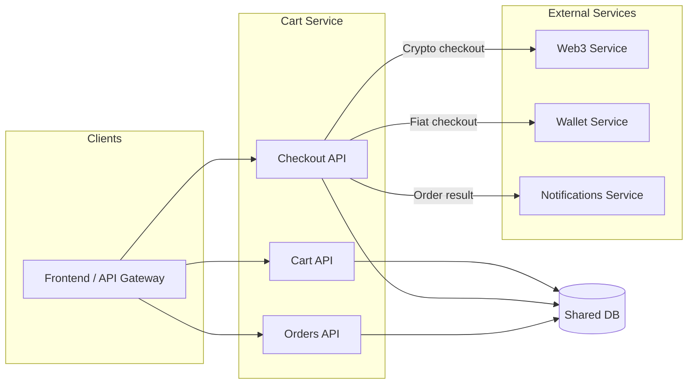
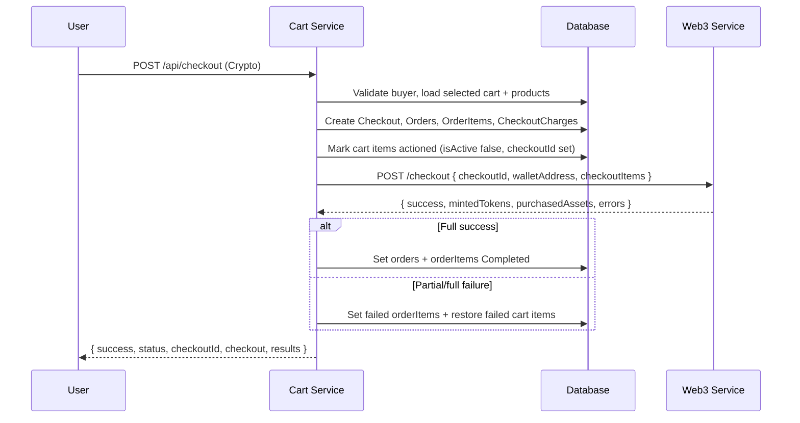

# KAMI Platform Cart Service

A TypeScript/Next.js API service for shopping cart, checkout, and order management in the KAMI NFT platform. It manages cart items (products/playlists), creates checkouts and orders from selected cart items, applies charges, and for **Crypto** payment delegates blockchain operations (deploy, mint, transfer) to the **Web3 service**.

---

## Table of Contents

1. [Overview](#overview)
2. [Architecture](#architecture)
3. [Operation Flows](#operation-flows)
4. [API Reference](#api-reference)
5. [Environment](#environment)
6. [Installation & Usage](#installation--usage)
7. [Error Handling](#error-handling)
8. [Security Notes](#security-notes)

---

## Overview

### What this service does

- **Cart**: Add, list, update, and remove cart items (by `walletAddress`). Items are products or playlists with quantity and optional selection for checkout.
- **Checkout**: Create a checkout from **selected** cart items: validate buyer and stock, group by seller, compute subtotals and charges, create a `Checkout` and one `Order` per seller with `OrderItem` snapshots.
- **Payment routing**:
  - **Crypto**: Build a `checkoutItems` payload (mint path: `voucherId` / productId; buy path: `assetId`) and call the Web3 service to perform deploy/mint/buy. Then update order and order-item status from the Web3 result; on full or partial failure, restore affected cart items.
  - **Fiat**: Call the Wallet service for a payment URL and set orders to `Pending`; status updates happen via `PUT /api/checkout` (e.g. when payment completes).
- **Orders**: List orders by buyer or seller wallet; get checkout or order by ID.

### Key concepts

| Concept | Description |
|--------|-------------|
| **Cart item** | A line in the cart: product (or playlist), quantity, `checkoutAction`, `isSelected`. Only selected items are included in checkout. |
| **Checkout** | A single purchase session: one `Checkout` record, multiple `Order` records (one per seller), each with `OrderItem` lines. Identified by `checkoutId`. |
| **Order** | Per-seller grouping within a checkout: buyer, seller, amount, status (`New` → `Pending` → `Completed` or `Failed`). |
| **Mint vs buy** | For Crypto, each product line is either **mint** (product has voucher: new token minted) or **buy** (product has asset: existing token transferred). The cart service sends the appropriate payload to Web3. |

---

## Architecture

This service sits between the frontend (or API gateway) and the shared database, and for Crypto checkout it calls the Web3 service. It does **not** talk to the blockchain directly.



- **Cart API**: cart items only; reads/writes `cartItems` and product/collection/voucher/asset data.
- **Checkout API**: creates `checkout`, `order`, `orderItem`, and `checkoutCharge`; for Crypto, calls Web3 then updates order/orderItem status and optionally restores cart items.
- **Orders API**: read-only queries on `order` (and related checkout/orderItem/product).

---

## Operation Flows

### Cart to checkout (high level)

1. User adds items to cart (`POST /api/cart/items`).
2. User selects which items to buy (`PUT /api/cart/items/[id]` with `isSelected: true`).
3. User initiates checkout with `POST /api/checkout`: body includes `fromWalletAddress`, `paymentType`, `currency` (if Crypto), and `items: [{ productId, quantity }]`. The `items` must match **selected** cart lines (same productIds and quantities within availability).
4. Service validates buyer and that selected cart items exist and are in stock; groups by seller; computes charges; creates one `Checkout` and one `Order` per seller with `OrderItem` rows; then:
   - **Crypto**: Calls Web3 with `checkoutItems`, then updates order/orderItem status and optionally notifies the user.
   - **Fiat**: Calls Wallet service for payment URL and sets orders to `Pending`; later updates via `PUT /api/checkout`.



### Checkout POST (Crypto): payload to Web3

For each order item, the service builds a checkout item from the product:

- **Mint path** (product has voucher): `{ collectionId, productId, voucherId, tokenId, quantity, charges }`. Web3 will deploy (if needed) and mint; for ERC721AC, quantity can be &gt; 1.
- **Buy path** (product has asset): `{ collectionId, assetId, tokenId, quantity, charges }`. Quantity must be 1 for ERC721AC buy; the service enforces this before calling Web3.

ERC721AC buy with quantity &gt; 1 is rejected early with a clear error. See the Web3 service docs for full NFT/quantity rules.

### Order status (Fiat)

For Fiat, after checkout the orders move to `Pending`. Status transitions are done via `PUT /api/checkout`:

- `New` → `Pending`: body `{ checkoutId }`.
- `Pending` → `Completed`: body `{ checkoutId, paymentId }`.
- `Pending` → `Failed`: body `{ checkoutId, isFailed: true }`.

---

## API Reference

### Cart items

| Method | Path | Description |
|--------|------|-------------|
| **GET** | `/api/cart/items?walletAddress=<address>` | List active cart items for the wallet, grouped by collection. Unlists selection for items whose product is no longer available (`consumerAction: None`). |
| **POST** | `/api/cart/items` | Add or merge item. Body: `{ walletAddress, productId?, playlistId?, quantity?, checkoutAction }`. Validates stock and consumerAction. |
| **PUT** | `/api/cart/items/[id]` | Update cart item. Body: `{ walletAddress, quantity?, checkoutAction?, isSelected? }`. Validates stock and consumerAction. |
| **DELETE** | `/api/cart/items` | Soft-delete cart items. Body: `{ walletAddress, ids: number[] }`. |

**Check availability (optional)**

- **GET** `/api/cart/items/check?walletAddress=...&productId=...&quantity=...` — Returns `{ canAdd, reason? }` for adding a given product quantity (considering already-in-cart quantity).

---

### Checkout

| Method | Path | Description |
|--------|------|-------------|
| **POST** | `/api/checkout` | Create checkout and orders from selected cart items. Body: `{ fromWalletAddress, paymentType, currency?, items: [{ productId, quantity }] }`. For Crypto, calls Web3 and then updates order/orderItem status and optionally restores failed cart items. |
| **PUT** | `/api/checkout` | Update order status for a checkout (Fiat flow). Body: `{ checkoutId }` or `{ checkoutId, paymentId }` or `{ checkoutId, isFailed: true }`. |
| **GET** | `/api/checkout?walletAddress=<address>` | List checkouts for the wallet (with orders and orderItems). |
| **GET** | `/api/checkout/[id]` | Get one checkout by ID (with orders, orderItems, checkoutCharges). |

**POST /api/checkout request body (summary)**

```json
{
  "fromWalletAddress": "0x...",
  "paymentType": "Crypto",
  "currency": "USDC",
  "items": [
    { "productId": 13, "quantity": 1 }
  ]
}
```

- `paymentType`: `"Crypto"` or `"Fiat"`.
- `currency`: Required when `paymentType` is `"Crypto"`.
- `items`: At least one; each must match a **selected** cart line for that buyer; quantity must not exceed available stock.

---

### Orders

| Method | Path | Description |
|--------|------|-------------|
| **GET** | `/api/orders?buyerWalletAddress=<address>` | List orders where the wallet is the buyer. |
| **GET** | `/api/orders?sellerWalletAddress=<address>` | List orders where the wallet is the seller. |
| **GET** | `/api/orders/[id]` | Get one order by ID (with orderItems, product, collection, buyer, seller). |

Exactly one of `buyerWalletAddress` or `sellerWalletAddress` is required for the list endpoint.

---

## Environment

Configure in `.env` (see `env.example`):

| Variable | Description |
|----------|-------------|
| `PORT` | Server port (default 3000). |
| `NODE_ENV` | `development` / `production`. |
| `WALLET_SERVICE_URL` | Base URL of the wallet service (Fiat payment URL). |
| `WEB3_SERVICE_URL` | Base URL of the web3 service (Crypto checkout: deploy/mint/buy). |

Database connection is via the shared Prisma schema (e.g. `kami-platform-v1-schema`); ensure `DATABASE_URL` or equivalent is set where Prisma is run.

---

## Installation & Usage

### Prerequisites

- Node.js (v18+)
- pnpm
- Access to the shared database and (for full flows) Web3 and Wallet services

### Install

```bash
pnpm install
cp env.example .env
# Edit .env with PORT, NODE_ENV, WALLET_SERVICE_URL, WEB3_SERVICE_URL
```

### Development

```bash
pnpm run dev
```

### Production

```bash
pnpm run build
pnpm start
```

### Watch mode

```bash
pnpm run dev:watch
```

---

## Error Handling

Responses use standard HTTP status codes. JSON bodies:

- **Validation / business rule errors** (e.g. product not found, quantity exceeds stock, ERC721AC buy qty &gt; 1):

  ```json
  { "error": "Human-readable message" }
  ```

  Or for Zod validation on checkout:

  ```json
  { "error": "Validation failed", "fields": { "fieldName": ["message"] } }
  ```

- **Checkout (Crypto)** may return `status: "partial"` or `"failed"` with `results.errors` and/or updated `checkout`; failed cart items are restored in the database.

---

## Security Notes

- Do not commit secrets or private keys; use environment variables for service URLs and DB.
- Validate all inputs; the service validates buyer, cart selection, stock, and (for Crypto) NFT quantity rules before calling Web3.
- Use HTTPS in production.
- Ensure the shared database and downstream services (Web3, Wallet, Notifications) are only reachable from trusted networks.

---

## License

MIT
