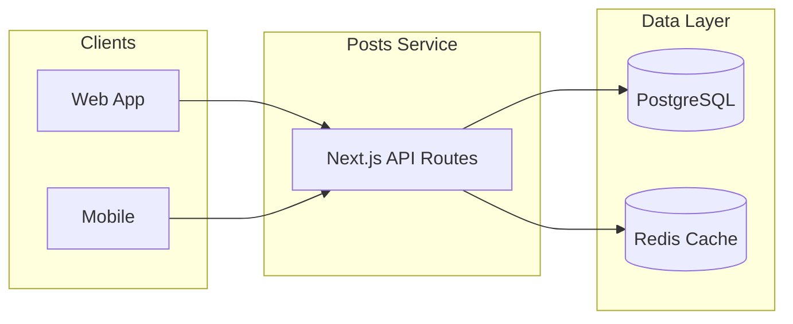
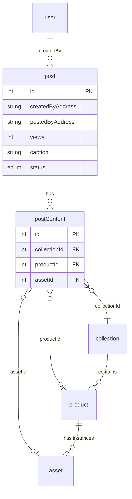
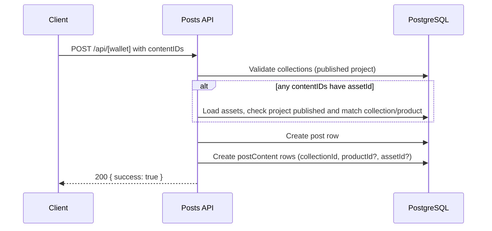
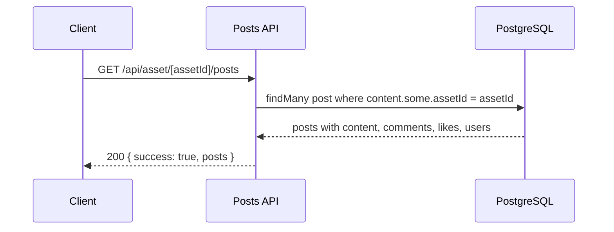

# KAMI Platform Posts Service

Backend API service for the KAMI platform that manages **posts**: social content linked to collections, products, and specific assets (e.g. NFTs). Built with Next.js App Router, Prisma, and PostgreSQL. Optional Redis caching is applied to selected models.

## Overview

The service exposes REST-style endpoints to:

- List and create posts (optionally tied to collections, products, or a specific asset).
- Fetch a single post by id (public or scoped by creator wallet).
- Update posts (e.g. like), delete, repost, and increment view count.
- List posts by creator wallet or by asset id.

All responses are JSON. The service uses the shared **kami-platform-v1-schema** (Prisma schema in the `kami-platform-v1-schema` submodule) and expects a compatible PostgreSQL database and, if enabled, a Redis instance.

---

## Architecture



- **API**: Next.js App Router route handlers under `src/app/api/`.
- **PostgreSQL**: Primary store; schema and migrations live in `kami-platform-v1-schema/prisma/`.
- **Redis**: Optional; used by Prisma middleware to cache reads for `user` and `tag` (see `src/lib/db.ts`).

---

## API Reference

Base path: `/api`. All listed routes return JSON.

### Post listing and creation

| Method | Path | Description |
|--------|------|-------------|
| **GET** | `/api` | List **all** posts (with comments, content, likes, users). Force-dynamic (no cache). |
| **GET** | `/api/[walletAddress]` | List posts **created by** the given wallet. |
| **POST** | `/api/[walletAddress]` | **Create** a new post for that wallet. Body: `contentIDs`, optional `comment`, `status`. |

**POST body (create post):**

```json
{
  "contentIDs": [
    { "collectionId": 1, "productId": 10, "assetId": 100 }
  ],
  "comment": "Optional caption",
  "status": "Published"
}
```

- `contentIDs`: array of `{ collectionId, productId?, assetId? }`. `collectionId` required; `productId` and `assetId` optional. When `assetId` is set, the asset must exist, match the collection (and product if provided), and belong to a published project. Any user can post about any asset (no ownership check).
- `status`: `"Published"` (default) or `"Draft"`.

### Single post (by id)

| Method | Path | Description |
|--------|------|-------------|
| **GET** | `/api/post/[id]` | Fetch one post by id (public). Query: optional `walletAddress` to set `likedByMe` on post and comments. |
| **GET** | `/api/[walletAddress]/[id]` | Fetch one post by id **and** creator wallet (both must match). |
| **DELETE** | `/api/[walletAddress]/[id]` | Delete the post by id (no wallet check). |
| **PUT** | `/api/[walletAddress]/[id]` | Update post. Body: `{ like?: boolean }` — `like: true` creates a like from path `walletAddress`. |
| **POST** | `/api/[walletAddress]/[id]` | **Repost**: create a new post that references this one as parent. Body: optional `comment`. |
| **POST** | `/api/[walletAddress]/[id]/addView` | Increment the post’s view count by 1. Path `walletAddress` is not used. |

### Posts by asset

| Method | Path | Description |
|--------|------|-------------|
| **GET** | `/api/asset/[assetId]/posts` | List all posts that reference the given asset (at least one content item with that `assetId`). |

### Response shapes

- **List endpoints**: `{ success: true, posts: PostData[] }` or `{ success: false, error: string }`.
- **Single post (GET /api/post/[id])**: `{ success: true, posts: [SinglePostData] }` (aggregated counts, `likedByMe`, etc.).
- **Create post**: `{ success: true }` or error with message.
- **Add view**: `{ success: true, post: post }` or `{ success: false, error: string }`.

Post payloads include relations such as `comments` (with likes/replies), `content` (collection, product with assets/voucher, and optional specific `asset` when `assetId` is set), `likes`, `createdBy`, `postedBy`, `sharedBy`, `parentPost`, `childPosts` where applicable.

---

## Data model (relevant parts)

Posts are stored in the shared v1 schema. Key concepts:



- **post**: One row per post; `createdByAddress` / `postedByAddress` point to `user`; optional `parentPostId` for reposts.
- **postContent**: Links a post to content. Each row has `collectionId` (required), optional `productId`, and optional `assetId`. When `assetId` is set, the post is “about” that specific asset (e.g. one NFT); otherwise it’s about the product/collection in general.
- **collection**, **product**, **asset**: From the shared schema; asset is the on-chain instance (e.g. token id); product is the listing; collection groups products.

---

## Request flow (high level)

**Create post (with optional asset):**



**List posts by asset:**



---

## Environment and configuration

| Variable | Description |
|----------|-------------|
| `DATABASE_URL` | PostgreSQL connection string (required for Prisma). |
| `REDIS_URL` | Redis connection string; required if the app uses the Redis cache middleware (see `src/lib/db.ts`). |

The Prisma schema path is set in `package.json`:

```json
"prisma": {
  "schema": "kami-platform-v1-schema/prisma/schema.prisma"
}
```

Migrations live under `kami-platform-v1-schema/prisma/migrations/`. Apply them from the submodule or your normal migration process; the posts service only runs `prisma generate` against that schema.

---

## Running the service

### Prerequisites

- Node.js (e.g. 20+)
- pnpm (recommended; or npm/yarn)
- PostgreSQL (schema and migrations from `kami-platform-v1-schema`)
- Redis (optional, for caching)

### Install and generate client

```bash
pnpm install
pnpm prisma generate
```

Ensure `DATABASE_URL` (and `REDIS_URL` if used) are set, e.g. in `.env`.

### Development

```bash
pnpm dev
```

Runs the Next.js dev server (default port 3000).

### Build and start (production)

```bash
pnpm run build
pnpm start
```

### Lint

```bash
pnpm lint
```

---

## Docker

The repo includes a multi-stage `Dockerfile` that:

1. Installs dependencies and runs `prisma generate` (using the v1 schema path).
2. Builds the Next.js app.
3. Produces a minimal runtime image that runs `pnpm start`.

Build (from repo root):

```bash
docker build -t kami-platform-posts-service .
```

Run (replace with your env or use an env file):

```bash
docker run -p 3000:3000 -e DATABASE_URL="..." -e REDIS_URL="..." kami-platform-posts-service
```

The app listens on port 3000 inside the container.

---

## CI/CD

GitHub Actions workflows under `.github/workflows/`:

- **amd64.yml** / **arm64.yml**: On push to `main`, checkout (with submodules), build the Docker image with Docker Buildx, and push to Docker Hub with tags such as `staging` and `staging-<VERSION>.<run_number>`. They expect secrets (e.g. `CI_TOKEN`, `REGISTRY_USERNAME`, `REGISTRY_PASSWORD`) and a self-hosted runner for the corresponding architecture.

---

## Project layout

```
├── kami-platform-v1-schema/     # Submodule: Prisma schema and migrations
│   └── prisma/
│       ├── schema.prisma
│       └── migrations/
├── src/
│   ├── app/api/                 # API routes
│   │   ├── route.ts             # GET /api — list all posts
│   │   ├── [walletAddress]/     # By-wallet and single-post CRUD + repost, addView
│   │   ├── post/[id]/           # GET /api/post/:id (public single post)
│   │   └── asset/[assetId]/posts/  # GET posts by asset
│   └── lib/
│       ├── db.ts                # Prisma client + Redis cache middleware
│       └── types.ts             # PostData, SinglePostData, Success, Fail
├── prisma/                      # Local stub schema (datasource only; not used for posts)
├── Dockerfile
├── package.json
└── README.md
```

---

## Summary

| Area | Details |
|------|---------|
| **Purpose** | CRUD and listing for posts tied to collections, products, and optional specific assets. |
| **Stack** | Next.js 14 (App Router), Prisma, PostgreSQL, optional Redis. |
| **Schema** | Shared `kami-platform-v1-schema`; `postContent` has `collectionId`, optional `productId`, optional `assetId`. |
| **Auth** | No built-in auth; wallet addresses are path/body parameters. Any user can post about any asset. |
| **Deploy** | Docker image; CI builds and pushes on push to `main`. |
