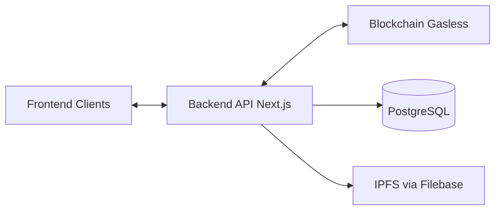

# KAMI Platform Web3 Service

A comprehensive gasless NFT backend service providing multi-chain support, lazy minting, and Web2-like developer experience for building NFT marketplaces.

## Features

-   **Gasless Operations** — Platform pays all gas fees for a truly frictionless experience
-   **Multi-Chain Support** — Deploy on Base, Soneium, Ethereum and more
-   **Multi-Token Types** — KAMI721C (unique), KAMI721AC (editions), KAMI1155C (multi-token)
-   **Lazy Minting** — Defer blockchain costs until first purchase
-   **Complete API** — RESTful endpoints for all NFT operations
-   **Database-Driven Config** — Dynamic chain configuration via PostgreSQL

## Quick Start

```bash
# Install dependencies
pnpm install

# Configure environment
cp env.example .env.local
# Edit .env.local with your settings

# Generate Prisma client
npx prisma generate

# Deploy gasless infrastructure (first time only)
pnpm tsx scripts/setup-gasless-infrastructure.ts 84532 0x<your-private-key>

# Start development server
pnpm dev
```

## Documentation

### Business

-   **[Overview](./docs/OVERVIEW.md)** — What is KAMI, token types, business models

### Technical — Client Development

-   **[API Reference](./docs/api/API_REFERENCE.md)** — Complete API endpoint documentation
-   **[Client Integration Guide](./docs/api/CLIENT_INTEGRATION.md)** — Frontend integration with flows and diagrams

### Technical — Module Development

-   **[Architecture](./docs/development/ARCHITECTURE.md)** — System design and data flows
-   **[Development Guide](./docs/development/DEVELOPMENT.md)** — Setup, coding standards, testing
-   **[Database Schema](./docs/development/DATABASE_SCHEMA.md)** — Complete data model reference
-   **[Gasless NFT Library](./docs/development/GASLESS_NFT.md)** — Blockchain operations

### Reference

-   **[Changelog](./docs/CHANGELOG.md)** — Version history and migration guides

---

## Architecture



## Token Types

| Type          | Contract | Supply                       | Use Case                 |
| ------------- | -------- | ---------------------------- | ------------------------ |
| **KAMI721C**  | ERC721C  | 1 per product                | Unique artworks          |
| **KAMI721AC** | ERC721AC | Multiple (limited/unlimited) | Music, tickets, editions |
| **KAMI1155C** | ERC1155C | Fungible quantities          | Gaming items, passes     |

## Core API Endpoints

### Publishing

-   `POST /api/publish` — Create product with lazy minting

### Products

-   `GET /api/product` — List products with filters
-   `GET /api/product/{id}` — Get product details
-   `POST /api/product/{id}/setPrice` — Update pricing
-   `PUT /api/product/{id}/audience` — Update product audience

### Assets

-   `GET /api/asset` — List assets (pagination, filters)
-   `GET /api/asset/{assetId}` — Get asset details
-   `POST /api/asset/{assetId}/setPrice` — Set asset sale price
-   `POST /api/asset/{assetId}/setAudience` — Set asset audience
-   `POST /api/asset/{assetId}/setConsumerAction` — Set consumer action

### Checkout

-   `POST /api/checkout` — Deploy, mint, or buy tokens (sync)
-   `POST /api/checkout?async=true` — Start async checkout (returns 202 + checkoutId)
-   `GET /api/checkout/{checkoutId}/status` — Poll checkout status
-   `GET /api/checkout/{checkoutId}/stream` — SSE stream for live progress

### Blockchain

-   `POST /api/blockchain/deploy` — Deploy NFT contract
-   `POST /api/blockchain/deployAndMint` — Deploy and mint in one call
-   `POST /api/blockchain/mint` — Mint tokens
-   `POST /api/blockchain/setTokenPrice` — Set token price
-   `GET /api/blockchain/nft` — Get NFT metadata
-   `GET /api/blockchain/getTotalSupply` — Get contract total supply
-   `GET /api/blockchain/getTotalMinted` — Get minted count
-   `GET /api/blockchain/{walletAddress}/getTokenBalance` — Get wallet token balance
-   `POST /api/blockchain/{walletAddress}/sponsoredPaymentTokenTransfer` — Sponsored payment transfer

### IPFS & NFT

-   `POST /api/ipfs/upload` — Upload file to IPFS (via Filebase; body: `{ url }`)
-   `POST /api/nft/{productId}/stopMinting` — Stop minting for product

## Technology Stack

| Component  | Technology                                      |
| ---------- | ----------------------------------------------- |
| Framework  | Next.js 14+ (App Router)                        |
| Language   | TypeScript                                      |
| Database   | PostgreSQL + Prisma (schema in git submodule)   |
| Blockchain | viem + @paulstinchcombe/gasless-nft-tx          |
| Storage    | IPFS via Filebase (S3-compatible)               |
| Testing    | Vitest (unit, integration, e2e)                 |
| Optional   | Redis (caching), AWS Secrets Manager (key fallback) |

## Supported Chains

| Network        | Chain ID | Environment |
| -------------- | -------- | ----------- |
| Base           | 8453     | Production  |
| Base Sepolia   | 84532    | Testnet     |
| Soneium        | 1947     | Production  |
| Soneium Minato | 1946     | Testnet     |
| Ethereum       | 1        | Production  |
| Sepolia        | 11155111 | Testnet     |

## Infrastructure Setup

Deploy the gasless infrastructure on a new chain:

```bash
# Complete setup (recommended)
pnpm tsx scripts/setup-gasless-infrastructure.ts <chainId> <privateKey>

# Or deploy individually:
pnpm deploy:simpleaccount <chainId> <privateKey>
pnpm deploy:contractdeployer <chainId> <simpleAccountAddress>
pnpm deploy:libraries <chainId>
```

## Development

```bash
# Run development server
pnpm dev

# Build for production
pnpm build

# Run linting
pnpm lint

# Database migrations
npx prisma migrate dev --name <migration_name>
npx prisma generate
```

## Environment Variables

Required (see [env.example](env.example) for full list):

-   **DATABASE_URL** — PostgreSQL connection string
-   **DEFAULT_CHAIN_ID** — Default chain (hex, e.g. `0x14a34`); must exist in `blockchain` table
-   **ENCRYPTION_KEY** — 64-char hex (32 bytes) to decrypt DB-stored private keys; generate with `openssl rand -hex 32`

Optional: **ETHEREUM_SALT** (deterministic wallets), **AWS_SECRET_NAME** (key fallback), **FILEBASE_ACCESS_KEY/SECRET_KEY/BUCKET** (for `/api/ipfs/upload`), **REDIS_URL** (caching). Blockchain config (RPC, platform addresses, payment tokens) is stored in the database, not in env.

## Project Structure

```
src/
├── app/api/                    # API routes
│   ├── publish/                # NFT publishing
│   ├── checkout/               # Purchase processing (sync + async status/stream)
│   ├── product/                # Product management + audience
│   ├── asset/                  # Asset list, details, setPrice/setAudience/setConsumerAction
│   ├── ipfs/upload/            # IPFS upload (Filebase)
│   ├── nft/[productId]/stopMinting/
│   └── blockchain/             # Deploy, mint, setTokenPrice, nft, getTotalSupply/Minted,
│                                # [walletAddress]/getTokenBalance, sponsoredPaymentTokenTransfer
├── lib/                        # Core libraries
│   ├── gasless-nft.ts          # Gasless operations facade
│   ├── gasless-nft/            # Deploy, mint, sell, operations, signatures
│   ├── checkout-processor/      # Checkout orchestration (deploy/mint/buy)
│   ├── checkout-job.ts         # Async checkout job
│   ├── db.ts                   # Prisma client
│   ├── redis.ts                # Optional Redis
│   └── record-activity.ts
├── services/                   # Business logic
│   ├── SupplyService.ts
│   ├── ProductService.ts
│   ├── CheckoutService.ts
│   └── EthereumAccountService.ts
└── scripts/                    # Deployment and setup scripts
```

Schema: `kami-platform-v1-schema/prisma/schema.prisma` (git submodule). See [Database Schema](./docs/development/DATABASE_SCHEMA.md).

## Development Practices

-   **Testing**: Vitest for unit (`tests/unit`), integration (`tests/integration`), and e2e (`tests/checkout-e2e.test.ts`, `publish-checkout-e2e.test.ts`). Run with `pnpm test`.
-   **Async checkout**: Long-running checkout can run with `?async=true`; clients poll `GET /api/checkout/{checkoutId}/status` or use SSE `GET .../stream`. See [checkout-processor README](./src/lib/checkout-processor/README.md) for contract and proxy (NGINX/gateway) notes.
-   **Gasless library**: Optional [pnpm patch](./patches/README.md) for `@paulstinchcombe/gasless-nft-tx` when local-sign transport is needed on public RPCs.
-   **Cursor rules**: `.cursor/rules/` contains blockchain and gasless context for AI-assisted editing.

## License

Proprietary — KAMI Platform. All rights reserved.

## Support

1. Check the [documentation](./docs/)
2. Review [API Reference](./docs/api/API_REFERENCE.md)
3. Contact the development team

---

**Version**: 1.0.0 | **Updated**: February 2026 | **Gasless Library**: see [package.json](package.json) (`@paulstinchcombe/gasless-nft-tx`)
