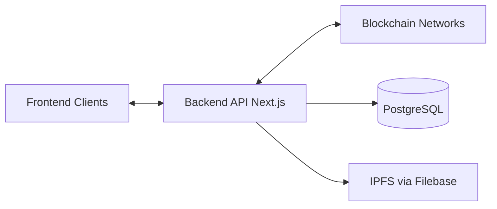
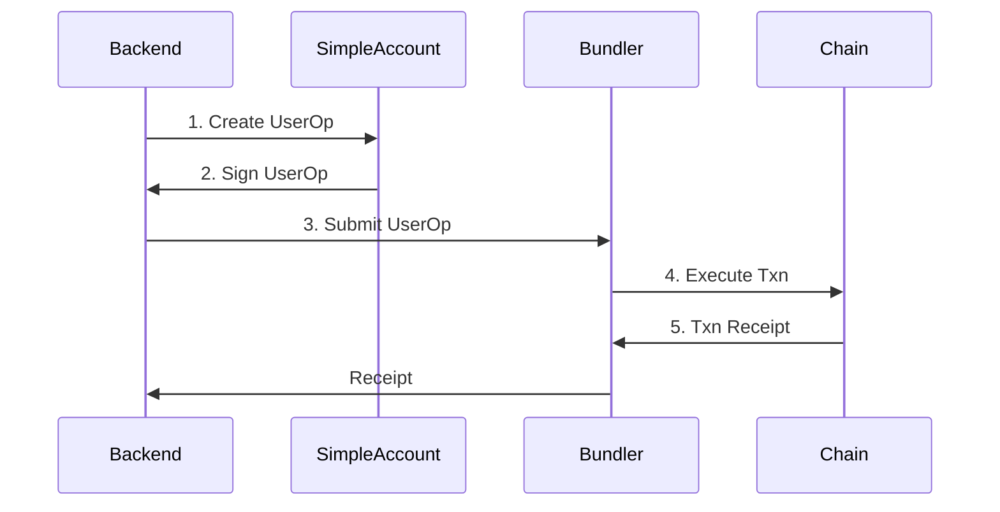
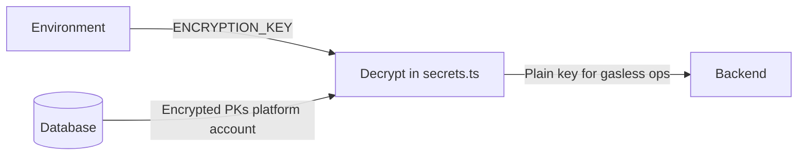
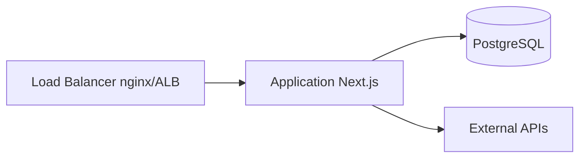

# KAMI Platform Web3 Service - Architecture

## System Overview

The KAMI Web3 Service is a Next.js-based backend that provides gasless NFT operations, multi-chain support, and API endpoints for NFT marketplace functionality.



---

## Project Structure

```
kami-platform-web3-service/
├── src/
│   ├── app/
│   │   ├── api/                        # API Routes (Next.js App Router)
│   │   │   ├── publish/                # NFT publishing
│   │   │   ├── checkout/               # Checkout (sync + async status/stream)
│   │   │   │   └── [checkoutId]/status, stream
│   │   │   ├── product/                # Product management + [productId]/audience, setPrice
│   │   │   ├── asset/                  # Asset list, [assetId] details, setPrice, setAudience, setConsumerAction
│   │   │   ├── ipfs/upload/            # IPFS upload (Filebase)
│   │   │   ├── nft/[productId]/stopMinting/
│   │   │   └── blockchain/             # deploy, deployAndMint, mint, setTokenPrice, nft, getTotalSupply/Minted
│   │   │       └── [walletAddress]/    # getTokenBalance, sponsoredPaymentTokenTransfer
│   │   └── utils/secrets.ts            # Secret management (decrypt DB-stored keys)
│   │
│   ├── lib/                            # Core library functions
│   │   ├── gasless-nft.ts              # Gasless operations facade
│   │   ├── gasless-nft/                # Deploy, mint, sell, operations, signatures
│   │   ├── checkout-processor/         # Checkout orchestration (deploy/mint/buy phases)
│   │   ├── checkout-job.ts              # Async checkout job
│   │   ├── db.ts                       # Prisma database client
│   │   ├── redis.ts                    # Optional Redis
│   │   ├── record-activity.ts
│   │   ├── types.ts                    # TypeScript type definitions
│   │   ├── ipfs.ts                     # IPFS integration
│   │   ├── ipfs2.ts                    # Filebase (S3-compatible) IPFS upload
│   │   ├── kami-config.ts              # KAMI library configuration
│   │   └── gasless-config.ts          # Gasless config (from database)
│   │
│   └── services/                       # Business logic services
│       ├── SupplyService.ts            # Supply management
│       ├── ProductService.ts           # Product operations
│       ├── CheckoutService.ts          # Checkout logic
│       ├── EthereumAccountService.ts   # Wallet generation
│       └── index.ts                    # Service exports
│
├── scripts/                            # Deployment & setup scripts
│   ├── setup-gasless-infrastructure.ts # Full infrastructure setup
│   ├── deploy-simpleaccount.ts         # SimpleAccount deployment
│   ├── deploy-contractdeployer.ts       # ContractDeployer deployment
│   ├── deploy-libraries.ts             # KAMI library deployment
│   └── encrypt-key.ts                  # Key encryption utility
│
├── kami-platform-v1-schema/            # Database schema (Git submodule)
│   └── prisma/
│       └── schema.prisma               # Prisma schema definition
│
├── docs/                               # Documentation
│   ├── OVERVIEW.md                     # Business overview
│   ├── CHANGELOG.md                    # Version history
│   ├── development/                    # Developer documentation
│   │   ├── ARCHITECTURE.md             # This file
│   │   ├── DEVELOPMENT.md              # Development guide
│   │   ├── DATABASE_SCHEMA.md          # Database schema (see also README)
│   │   └── GASLESS_NFT.md              # Gasless library docs
│   └── api/                            # API documentation
│       ├── API_REFERENCE.md            # Full API reference
│       └── CLIENT_INTEGRATION.md       # Frontend integration
```

---

## Core Components

### 1. API Layer (`src/app/api/`)

Next.js App Router API routes that handle HTTP requests.

**Key Routes**:

-   `/api/publish` — Create products and vouchers
-   `/api/checkout` — Process purchases (sync); `?async=true` returns 202; `GET .../status` and `.../stream` for async
-   `/api/product` — Product queries, `[productId]/setPrice`, `[productId]/audience`
-   `/api/asset` — Asset list, details, setPrice, setAudience, setConsumerAction
-   `/api/ipfs/upload` — Upload to IPFS via Filebase
-   `/api/nft/[productId]/stopMinting` — Stop minting for product
-   `/api/blockchain/*` — deploy, deployAndMint, mint, setTokenPrice, nft, getTotalSupply/Minted, `[walletAddress]/getTokenBalance`, `sponsoredPaymentTokenTransfer`

**Pattern**:

```typescript
// src/app/api/[resource]/route.ts
import { NextRequest, NextResponse } from 'next/server';
import { prisma } from '@/lib/db';

export async function GET(request: NextRequest) {
	try {
		const data = await prisma.resource.findMany();
		return NextResponse.json({ success: true, data });
	} catch (error) {
		return NextResponse.json({ success: false, error: error.message }, { status: 500 });
	}
}
```

### 2. Service Layer (`src/services/`)

Business logic abstracted from API routes for reusability and testing.

**Services**:

-   `SupplyService` - Supply calculations (unlimited vs limited)
-   `ProductService` - Product operations and queries
-   `CheckoutService` - Checkout validation and routing
-   `EthereumAccountService` - Deterministic wallet generation

**Pattern**:

```typescript
// src/services/ExampleService.ts
export class ExampleService {
	static async operation(param: Type): Promise<Result> {
		// Business logic here
	}
}
```

### 3. Library Layer (`src/lib/`)

Core utilities and integrations.

**Key Libraries**:

-   `gasless-nft.ts` and `gasless-nft/` — Gasless blockchain operations (deploy, mint, sell, setPrice, setTokenURI; EIP-712 and legacy signatures)
-   `checkout-processor/` — Orchestrates checkout: validation, categorisation (toDeploy/toMint/toBuy), then deploy → mint → buy phases. See [checkout-processor README](../../src/lib/checkout-processor/README.md) for async contract and proxy notes.
-   `checkout-job.ts` — Async checkout job (background processing)
-   `db.ts` — Prisma client singleton
-   `redis.ts` — Optional Redis (caching)
-   `types.ts` — Shared TypeScript types
-   `ipfs.ts` / `ipfs2.ts` — IPFS upload (ipfs2 uses Filebase S3-compatible API)

### 4. Database Layer (Prisma)

PostgreSQL database accessed through Prisma ORM.

**Schema Location**: `kami-platform-v1-schema/prisma/schema.prisma` (git submodule). See [Database Schema](./DATABASE_SCHEMA.md) for full data model.

**Key Models**: user, project, collection, product, asset, voucher, transaction, platform, blockchain, payment_token

---

## Data Flow

### Publishing Flow

```
┌─────────────────────────────────────────────────────────────────────────────┐
│                           PUBLISH DATA FLOW                                  │
└─────────────────────────────────────────────────────────────────────────────┘

POST /api/publish
        │
        ▼
┌───────────────────┐
│  Validate Input   │──────────────────┐
│  - Project exists │                  │
│  - Collection     │                  ▼
│  - Quantity       │          Error Response
└─────────┬─────────┘
          │
          ▼
┌───────────────────┐
│ Create Collection │ (if new)
│ - symbol, name    │
│ - chainId         │
│ - contractType    │
└─────────┬─────────┘
          │
          ▼
┌───────────────────┐
│  $transaction     │
│  ┌─────────────┐  │
│  │ Create      │  │
│  │ Product     │  │
│  └──────┬──────┘  │
│         ▼         │
│  ┌─────────────┐  │
│  │ Create      │  │
│  │ Voucher     │  │
│  └──────┬──────┘  │
│         ▼         │
│  ┌─────────────┐  │
│  │ Update      │  │
│  │ Project     │  │
│  └─────────────┘  │
└─────────┬─────────┘
          │
          ▼
┌───────────────────┐
│ shouldDeploy?     │
│   │               │
│   ├─ true ────────┼──► Deploy + Mint (gasless)
│   │               │
│   └─ false ───────┼──► Return Response (lazy mint)
└───────────────────┘
```

### Checkout Flow

```
┌─────────────────────────────────────────────────────────────────────────────┐
│                          CHECKOUT DATA FLOW                                  │
└─────────────────────────────────────────────────────────────────────────────┘

POST /api/checkout
        │
        ▼
┌───────────────────┐
│ Validate Charges  │
│ - Balance check   │
└─────────┬─────────┘
          │
          ▼
┌───────────────────┐
│ Categorize Items  │
│                   │
│ ┌───────────────┐ │
│ │  toDeploy[]   │─┼──► Collections needing deployment
│ ├───────────────┤ │
│ │  toMint[]     │─┼──► Vouchers to mint
│ ├───────────────┤ │
│ │  toBuy[]      │─┼──► Assets to transfer
│ └───────────────┘ │
└─────────┬─────────┘
          │
          ▼
┌───────────────────┐
│ Process Each      │
│                   │
│ 1. Deploy         │──► deployGaslessCollection()
│ 2. Mint           │──► mintGaslessNFT()
│ 3. Buy            │──► sellKamiToken()
└─────────┬─────────┘
          │
          ▼
┌───────────────────┐
│ Update Database   │
│ - Create assets   │
│ - Update product  │
│ - Track txns      │
└─────────┬─────────┘
          │
          ▼
    Response JSON
```

### Async Checkout Flow

For long-running checkout (e.g. cart-service or UI that must not block), use async mode:

1. **Start**: `POST /api/checkout?async=true` with body `{ checkoutId, checkoutItems, walletAddress }` → returns **202 Accepted** and `{ success: true, checkoutId, status: 'pending' }`.
2. **Poll status**: `GET /api/checkout/{checkoutId}/status` → returns `status` (`pending` | `processing` | `completed` | `failed`), `progress`, `stage`, and when finished `result` or `error`/`errors`.
3. **Or stream**: `GET /api/checkout/{checkoutId}/stream` — Server-Sent Events for live progress until `complete` or `error`.

See [checkout-processor README](../../src/lib/checkout-processor/README.md) for the full contract, NGINX/gateway configuration (proxy buffering off, timeouts), and cart-service integration.

---

## Gasless Architecture

### How Gasless Works

Gasless configuration (RPC URL, SimpleAccount address, platform funding key, payment tokens) is **database-driven** via `platform` and `blockchain` tables — not environment variables. Optional: `USE_ENTRY_POINT_FOR_EXECUTE` and `USE_ENTRYPOINT_FOR_DEPLOYMENT` use EntryPoint.handleOps (UserOp); the SimpleAccount must then have an EntryPoint deposit. See [GASLESS_NFT.md](./GASLESS_NFT.md) and [env.example](../../env.example).



### Key Components

1. **SimpleAccount** — Smart contract wallet that executes transactions (address and key from DB)
2. **ContractDeployer** — Factory for deploying NFT contracts
3. **KAMI Libraries** — On-chain libraries for NFT operations
4. **Bundler/Relayer** — Submits UserOperations to the chain (config from DB)

### Platform Database

```sql
-- Required blockchain configuration
model platform {
  chainId                         String @id
  simpleAccountAddress            String  -- UserOp execution
  contractDeployerAddress         String  -- Contract factory
  platformFundingWalletAddress    String  -- Gas funding wallet
  platformFundingWalletPrivateKey String  -- Signing key
  platformAddress                 String  -- Platform fees
  kamiNFTCoreLibraryAddress       String  -- Core NFT logic
  kamiPlatformLibraryAddress      String  -- Platform logic
  kamiRoyaltyLibraryAddress       String  -- Royalty handling
  kamiRentalLibraryAddress        String  -- Rental logic
  kamiTransferLibraryAddress      String  -- Transfer logic
}
```

---

## Multi-Chain Support

### Supported Networks

| Network        | Chain ID (Hex) | Chain ID (Dec) | Configuration |
| -------------- | -------------- | -------------- | ------------- |
| Base Mainnet   | 0x2105         | 8453           | Production    |
| Base Sepolia   | 0x14a34        | 84532          | Testnet       |
| Soneium        | 0x79b          | 1947           | Production    |
| Soneium Minato | 0x79a          | 1946           | Testnet       |
| Ethereum       | 0x1            | 1              | Production    |
| Sepolia        | 0xaa36a7       | 11155111       | Testnet       |

### Database-Driven Configuration

```sql
-- Blockchain network configuration
model blockchain {
  chainId       String @id
  name          String
  rpcUrl        String
  logoUrl       String?
  paymentTokens payment_token[]
}

-- Payment tokens per chain
model payment_token {
  id              Int    @id
  chainId         String
  contractAddress String
  symbol          String
  decimals        Int
}
```

---

## Security Architecture

### Secret Management



- **ENCRYPTION_KEY** (env, required) — 64-char hex; used to decrypt private keys stored in DB (platform, account). AES-256-GCM in [secrets.ts](../../src/app/utils/secrets.ts).
- **Database** — Encrypted keys in `platform.platformFundingWalletPrivateKey` and `account.pk`.
- **Optional**: AWS Secrets Manager fallback via `AWS_SECRET_NAME`.

### Access Control

1. **API Level**: No authentication (public API) - implement at gateway
2. **Wallet Level**: Private keys encrypted in database
3. **Contract Level**: Owner roles for administrative functions

---

## Error Handling

### Standard Error Response

```typescript
interface ErrorResponse {
	success: false;
	error: string;
	errors?: Array<{
		collectionId?: number;
		tokenId?: number | null;
		quantity?: number | null;
		error: string;
	}>;
}
```

### Error Categories

| Category   | HTTP Status | Example                  |
| ---------- | ----------- | ------------------------ |
| Validation | 400         | Invalid quantity         |
| Not Found  | 404         | Product not found        |
| Auth       | 401/403     | Insufficient permissions |
| Blockchain | 500         | Transaction failed       |
| Server     | 500         | Database error           |

---

## Performance Considerations

### Database Optimization

-   Indexed queries on frequently accessed fields
-   Prisma query optimization with `select` and `include`
-   Connection pooling for concurrent requests

### Blockchain Optimization

-   Batch operations where possible
-   Retry logic with exponential backoff
-   Transaction confirmation polling

### API Optimization

-   90-second timeout for blockchain operations
-   Parallel processing of independent items
-   Efficient JSON serialization

---

## Deployment

### Infrastructure Requirements



- Load balancer: SSL/TLS, rate limiting, 90s timeout for long operations.
- Application: Node.js 18+, Docker, multiple pods; see [env.example](../../env.example).
- External: RPC providers, IPFS/Filebase, bundler/relayer (config from DB).

### Environment Variables

See [env.example](../../env.example) for the full list. Required: **DATABASE_URL**, **DEFAULT_CHAIN_ID**, **ENCRYPTION_KEY** (64-char hex for decrypting DB-stored keys). Optional: ETHEREUM_SALT, AWS_SECRET_NAME, FILEBASE_* (IPFS upload), REDIS_URL, EntryPoint-related vars for deployment scripts.

---

## Testing Strategy

### Unit Tests

-   Service layer functions
-   Utility functions
-   Type validations

### Integration Tests

-   API endpoint testing
-   Database operations
-   External service mocks

### E2E Tests

-   Full workflow testing
-   Multi-chain operations
-   Error scenarios

---

**Version**: 1.0.0  
**Last Updated**: February 2026
