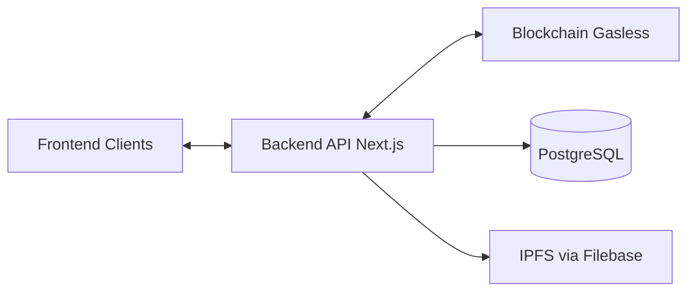
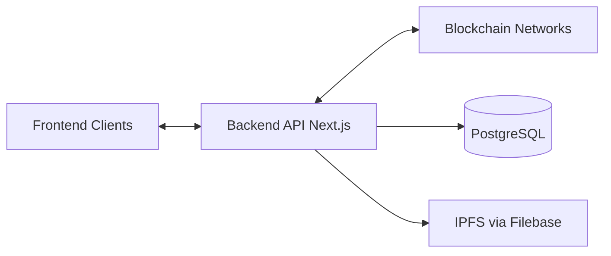
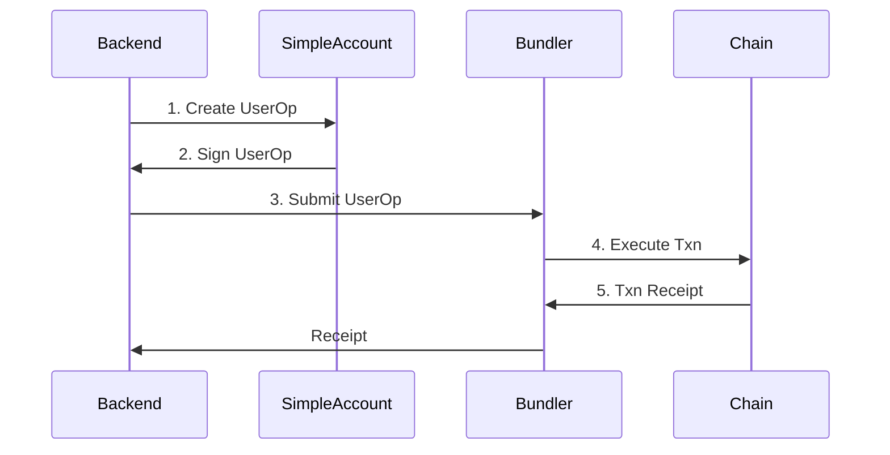
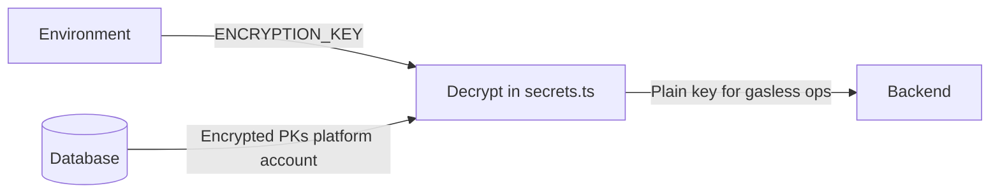
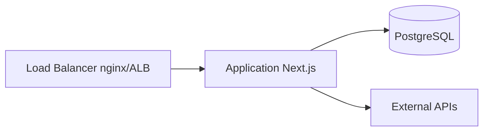

# KAMI Platform Web3 Service
## Full Documentation
*Generated: 2026-02-08*
---


# Part: Project Overview (README)

# KAMI Platform Web3 Service

A comprehensive gasless NFT backend service providing multi-chain support, lazy minting, and Web2-like developer experience for building NFT marketplaces.

## Features

-   **Gasless Operations** — Platform pays all gas fees for a truly frictionless experience
-   **Multi-Chain Support** — Deploy on Base, Soneium, Ethereum and more
-   **Multi-Token Types** — KAMI721C (unique), KAMI721AC (editions), KAMI1155C (multi-token)
-   **Lazy Minting** — Defer blockchain costs until first purchase
-   **Complete API** — RESTful endpoints for all NFT operations
-   **Database-Driven Config** — Dynamic chain configuration via PostgreSQL

## Quick Start

```bash
# Install dependencies
pnpm install

# Configure environment
cp env.example .env.local
# Edit .env.local with your settings

# Generate Prisma client
npx prisma generate

# Deploy gasless infrastructure (first time only)
pnpm tsx scripts/setup-gasless-infrastructure.ts 84532 0x<your-private-key>

# Start development server
pnpm dev
```

## Documentation

### Business

-   **[Overview](./docs/OVERVIEW.md)** — What is KAMI, token types, business models

### Technical — Client Development

-   **[API Reference](./docs/api/API_REFERENCE.md)** — Complete API endpoint documentation
-   **[Client Integration Guide](./docs/api/CLIENT_INTEGRATION.md)** — Frontend integration with flows and diagrams

### Technical — Module Development

-   **[Architecture](./docs/development/ARCHITECTURE.md)** — System design and data flows
-   **[Development Guide](./docs/development/DEVELOPMENT.md)** — Setup, coding standards, testing
-   **[Database Schema](./docs/development/DATABASE_SCHEMA.md)** — Complete data model reference
-   **[Gasless NFT Library](./docs/development/GASLESS_NFT.md)** — Blockchain operations

### Reference

-   **[Changelog](./docs/CHANGELOG.md)** — Version history and migration guides

---

## Architecture



## Token Types

| Type          | Contract | Supply                       | Use Case                 |
| ------------- | -------- | ---------------------------- | ------------------------ |
| **KAMI721C**  | ERC721C  | 1 per product                | Unique artworks          |
| **KAMI721AC** | ERC721AC | Multiple (limited/unlimited) | Music, tickets, editions |
| **KAMI1155C** | ERC1155C | Fungible quantities          | Gaming items, passes     |

## Core API Endpoints

### Publishing

-   `POST /api/publish` — Create product with lazy minting

### Products

-   `GET /api/product` — List products with filters
-   `GET /api/product/{id}` — Get product details
-   `POST /api/product/{id}/setPrice` — Update pricing
-   `PUT /api/product/{id}/audience` — Update product audience

### Assets

-   `GET /api/asset` — List assets (pagination, filters)
-   `GET /api/asset/{assetId}` — Get asset details
-   `POST /api/asset/{assetId}/setPrice` — Set asset sale price
-   `POST /api/asset/{assetId}/setAudience` — Set asset audience
-   `POST /api/asset/{assetId}/setConsumerAction` — Set consumer action

### Checkout

-   `POST /api/checkout` — Deploy, mint, or buy tokens (sync)
-   `POST /api/checkout?async=true` — Start async checkout (returns 202 + checkoutId)
-   `GET /api/checkout/{checkoutId}/status` — Poll checkout status
-   `GET /api/checkout/{checkoutId}/stream` — SSE stream for live progress

### Blockchain

-   `POST /api/blockchain/deploy` — Deploy NFT contract
-   `POST /api/blockchain/deployAndMint` — Deploy and mint in one call
-   `POST /api/blockchain/mint` — Mint tokens
-   `POST /api/blockchain/setTokenPrice` — Set token price
-   `GET /api/blockchain/nft` — Get NFT metadata
-   `GET /api/blockchain/getTotalSupply` — Get contract total supply
-   `GET /api/blockchain/getTotalMinted` — Get minted count
-   `GET /api/blockchain/{walletAddress}/getTokenBalance` — Get wallet token balance
-   `POST /api/blockchain/{walletAddress}/sponsoredPaymentTokenTransfer` — Sponsored payment transfer

### IPFS & NFT

-   `POST /api/ipfs/upload` — Upload file to IPFS (via Filebase; body: `{ url }`)
-   `POST /api/nft/{productId}/stopMinting` — Stop minting for product

## Technology Stack

| Component  | Technology                                      |
| ---------- | ----------------------------------------------- |
| Framework  | Next.js 14+ (App Router)                        |
| Language   | TypeScript                                      |
| Database   | PostgreSQL + Prisma (schema in git submodule)   |
| Blockchain | viem + @paulstinchcombe/gasless-nft-tx          |
| Storage    | IPFS via Filebase (S3-compatible)               |
| Testing    | Vitest (unit, integration, e2e)                 |
| Optional   | Redis (caching), AWS Secrets Manager (key fallback) |

## Supported Chains

| Network        | Chain ID | Environment |
| -------------- | -------- | ----------- |
| Base           | 8453     | Production  |
| Base Sepolia   | 84532    | Testnet     |
| Soneium        | 1947     | Production  |
| Soneium Minato | 1946     | Testnet     |
| Ethereum       | 1        | Production  |
| Sepolia        | 11155111 | Testnet     |

## Infrastructure Setup

Deploy the gasless infrastructure on a new chain:

```bash
# Complete setup (recommended)
pnpm tsx scripts/setup-gasless-infrastructure.ts <chainId> <privateKey>

# Or deploy individually:
pnpm deploy:simpleaccount <chainId> <privateKey>
pnpm deploy:contractdeployer <chainId> <simpleAccountAddress>
pnpm deploy:libraries <chainId>
```

## Development

```bash
# Run development server
pnpm dev

# Build for production
pnpm build

# Run linting
pnpm lint

# Database migrations
npx prisma migrate dev --name <migration_name>
npx prisma generate
```

## Environment Variables

Required (see [env.example](env.example) for full list):

-   **DATABASE_URL** — PostgreSQL connection string
-   **DEFAULT_CHAIN_ID** — Default chain (hex, e.g. `0x14a34`); must exist in `blockchain` table
-   **ENCRYPTION_KEY** — 64-char hex (32 bytes) to decrypt DB-stored private keys; generate with `openssl rand -hex 32`

Optional: **ETHEREUM_SALT** (deterministic wallets), **AWS_SECRET_NAME** (key fallback), **FILEBASE_ACCESS_KEY/SECRET_KEY/BUCKET** (for `/api/ipfs/upload`), **REDIS_URL** (caching). Blockchain config (RPC, platform addresses, payment tokens) is stored in the database, not in env.

## Project Structure

```
src/
├── app/api/                    # API routes
│   ├── publish/                # NFT publishing
│   ├── checkout/               # Purchase processing (sync + async status/stream)
│   ├── product/                # Product management + audience
│   ├── asset/                  # Asset list, details, setPrice/setAudience/setConsumerAction
│   ├── ipfs/upload/            # IPFS upload (Filebase)
│   ├── nft/[productId]/stopMinting/
│   └── blockchain/             # Deploy, mint, setTokenPrice, nft, getTotalSupply/Minted,
│                                # [walletAddress]/getTokenBalance, sponsoredPaymentTokenTransfer
├── lib/                        # Core libraries
│   ├── gasless-nft.ts          # Gasless operations facade
│   ├── gasless-nft/            # Deploy, mint, sell, operations, signatures
│   ├── checkout-processor/      # Checkout orchestration (deploy/mint/buy)
│   ├── checkout-job.ts         # Async checkout job
│   ├── db.ts                   # Prisma client
│   ├── redis.ts                # Optional Redis
│   └── record-activity.ts
├── services/                   # Business logic
│   ├── SupplyService.ts
│   ├── ProductService.ts
│   ├── CheckoutService.ts
│   └── EthereumAccountService.ts
└── scripts/                    # Deployment and setup scripts
```

Schema: `kami-platform-v1-schema/prisma/schema.prisma` (git submodule). See [Database Schema](./docs/development/DATABASE_SCHEMA.md).

## Development Practices

-   **Testing**: Vitest for unit (`tests/unit`), integration (`tests/integration`), and e2e (`tests/checkout-e2e.test.ts`, `publish-checkout-e2e.test.ts`). Run with `pnpm test`.
-   **Async checkout**: Long-running checkout can run with `?async=true`; clients poll `GET /api/checkout/{checkoutId}/status` or use SSE `GET .../stream`. See [checkout-processor README](./src/lib/checkout-processor/README.md) for contract and proxy (NGINX/gateway) notes.
-   **Gasless library**: Optional [pnpm patch](./patches/README.md) for `@paulstinchcombe/gasless-nft-tx` when local-sign transport is needed on public RPCs.
-   **Cursor rules**: `.cursor/rules/` contains blockchain and gasless context for AI-assisted editing.

## License

Proprietary — KAMI Platform. All rights reserved.

## Support

1. Check the [documentation](./docs/)
2. Review [API Reference](./docs/api/API_REFERENCE.md)
3. Contact the development team

---

**Version**: 1.0.0 | **Updated**: February 2026 | **Gasless Library**: see [package.json](package.json) (`@paulstinchcombe/gasless-nft-tx`)


---


# Part: Business Overview

# KAMI Platform Web3 Service - Business Overview

## What is KAMI?

KAMI is a next-generation NFT platform that enables creators to publish and sell digital assets with a completely gasless experience. The platform abstracts away blockchain complexity, providing a Web2-like experience for both creators and collectors while leveraging the security and transparency of blockchain technology.

## Value Proposition

### For Creators
- **Zero Gas Fees**: Publish and manage NFTs without paying blockchain gas fees
- **Flexible Pricing Models**: Set prices, royalties, and revenue splits
- **Multi-Edition Support**: Create unique 1:1 pieces or unlimited editions
- **Retain Ownership**: Keep ownership of concepts while selling individual tokens

### For Collectors
- **Simple Purchasing**: Buy NFTs like any e-commerce product
- **No Wallet Setup Required**: Platform handles blockchain interactions
- **Transparent Ownership**: Blockchain-verified ownership of digital assets
- **Secondary Market**: Resell tokens on the marketplace

### For Platform Operators
- **Complete Backend Solution**: Full API for building NFT marketplaces
- **Multi-Chain Support**: Deploy on multiple blockchain networks
- **Scalable Architecture**: Handle high transaction volumes
- **Comprehensive Analytics**: Track sales, minting, and user activity

---

## Token Types

KAMI supports three distinct token types, each designed for specific use cases:

### KAMI721C (Standard ERC721)

**Use Case**: Unique, one-of-a-kind digital assets

| Characteristic | Description |
|----------------|-------------|
| **Supply** | 1 token per product |
| **Ownership** | Transfers to buyer on sale |
| **Best For** | Unique artworks, collectibles, certificates |

**Example**: A digital artist creates a unique piece. When sold, the buyer becomes the sole owner of that specific NFT.

### KAMI721AC (Claimable ERC721)

**Use Case**: Multi-edition releases with controlled or unlimited supply

| Characteristic | Description |
|----------------|-------------|
| **Supply** | Multiple tokens per product (limited or unlimited) |
| **Ownership** | Creator retains product ownership; buyers own individual tokens |
| **Best For** | Music releases, event tickets, merchandise, memberships |

**Example**: A musician releases an album as 1,000 limited edition NFTs. Each buyer owns their individual token, but the artist retains the master product listing.

**Supply Options**:
- **Limited**: Set a maximum quantity (e.g., 100 editions)
- **Unlimited**: No cap on minting (`maxQuantity = 0`)

### KAMI1155C (ERC1155 Multi-Token)

**Use Case**: Fungible or semi-fungible tokens

| Characteristic | Description |
|----------------|-------------|
| **Supply** | Multiple tokens with quantities |
| **Ownership** | Quantity-based ownership |
| **Best For** | Gaming items, access passes, utility tokens |

**Example**: A game studio creates in-game items where players can own multiple copies of the same item type.

---

## Core Workflows

### 1. Publishing (Creator Flow)

```
┌──────────────────────────────────────────────────────────────────┐
│                      PUBLISHING WORKFLOW                          │
└──────────────────────────────────────────────────────────────────┘

 Creator          Platform API          Database         Blockchain
    │                  │                   │                  │
    │  Upload Content  │                   │                  │
    ├─────────────────►│                   │                  │
    │                  │  Create Product   │                  │
    │                  ├──────────────────►│                  │
    │                  │                   │                  │
    │                  │  Create Voucher   │                  │
    │                  ├──────────────────►│                  │
    │                  │                   │                  │
    │  Listed ✓        │                   │                  │
    │◄─────────────────┤                   │                  │
    │                  │                   │                  │
    │                  │      (Lazy Minting - No blockchain    │
    │                  │       interaction until first sale)   │
    │                  │                   │                  │
```

**Key Points**:
- Content is uploaded and listed without blockchain fees
- "Lazy minting" defers on-chain operations until purchase
- Creator sets price, quantity, and royalty structure

### 2. Purchasing (Collector Flow)

```
┌──────────────────────────────────────────────────────────────────┐
│                      PURCHASING WORKFLOW                          │
└──────────────────────────────────────────────────────────────────┘

 Buyer            Platform API          Database         Blockchain
    │                  │                   │                  │
    │  Add to Cart     │                   │                  │
    ├─────────────────►│                   │                  │
    │                  │                   │                  │
    │  Checkout        │                   │                  │
    ├─────────────────►│                   │                  │
    │                  │                   │                  │
    │                  │              First Purchase?          │
    │                  │                   │                  │
    │                  │  ┌────────────────┼────────────────┐ │
    │                  │  │ YES            │            NO  │ │
    │                  │  ▼                │                ▼ │
    │                  │  Deploy Contract  │    Transfer    │ │
    │                  │  + Mint Token     │    Token       │ │
    │                  ├──────────────────────────────────►│ │
    │                  │                   │                  │
    │                  │  Create Asset     │                  │
    │                  ├──────────────────►│                  │
    │                  │                   │                  │
    │  Owned ✓         │                   │                  │
    │◄─────────────────┤                   │                  │
    │                  │                   │                  │
```

**Key Points**:
- Platform handles all blockchain interactions
- Smart contracts deployed automatically on first sale
- Buyer receives on-chain ownership proof

---

## Business Models Supported

### Direct Sales
- Fixed price listings
- Immediate purchase and transfer
- Platform commission on sales

### Edition Drops
- Limited quantity releases
- FIFO (first-in-first-out) minting
- Scarcity-driven pricing

### Open Editions
- Unlimited minting during a time period
- Time-based scarcity
- Lower barriers to entry

### Secondary Market
- Peer-to-peer token transfers
- Creator royalties on resales
- Price discovery through market

### Subscriptions & Memberships
- Token-gated access
- Recurring revenue for creators
- Community building tools

---

## Revenue Streams

### Platform Revenue
| Revenue Type | Description |
|--------------|-------------|
| **Primary Sales Commission** | Percentage of initial sales |
| **Secondary Sales Commission** | Percentage of resales |
| **Gas Fee Margin** | Spread between actual gas cost and charged fee |
| **Premium Features** | Advanced listing options, analytics |

### Creator Revenue
| Revenue Type | Description |
|--------------|-------------|
| **Primary Sales** | Direct sales proceeds minus platform commission |
| **Royalties** | Percentage of secondary sales |
| **Tips** | Direct contributions from collectors |
| **Subscriptions** | Recurring payments for exclusive content |

---

## Supported Blockchains

| Network | Chain ID | Status | Use Case |
|---------|----------|--------|----------|
| **Base Mainnet** | 8453 | Production | Primary mainnet deployment |
| **Base Sepolia** | 84532 | Testnet | Development and testing |
| **Soneium** | 1947 | Production | Asian market expansion |
| **Soneium Minato** | 1946 | Testnet | Soneium testing |
| **Ethereum Mainnet** | 1 | Production | High-value assets |
| **Ethereum Sepolia** | 11155111 | Testnet | Ethereum testing |

---

## Key Metrics & Analytics

### Creator Metrics
- Total sales volume
- Number of unique collectors
- Average sale price
- Royalty earnings

### Collector Metrics
- Portfolio value
- Collection size
- Purchase history

### Platform Metrics
- Total transactions
- Gas fees sponsored
- Active users (DAU/MAU)
- Revenue by chain

---

## Competitive Advantages

1. **True Gasless Experience**: Platform pays all gas fees, not users
2. **Multi-Chain Flexibility**: Deploy on the chain that fits your needs
3. **Web2 Simplicity**: No wallet management required for users
4. **Comprehensive API**: Build any NFT experience with our backend
5. **Creator-Friendly**: Flexible pricing, royalties, and revenue splits
6. **Scalable Infrastructure**: Handle enterprise-level transaction volumes

---

## Getting Started

### For Business Integration
Contact the KAMI team for:
- API access and documentation
- Custom deployment options
- Enterprise licensing
- Technical support SLAs

### For Developers
See the technical documentation:
- [API Reference](./api/API_REFERENCE.md) - Complete API documentation
- [Client Integration Guide](./api/CLIENT_INTEGRATION.md) - Frontend development guide
- [Development Guide](./development/DEVELOPMENT.md) - Module development

---

## Glossary

| Term | Definition |
|------|------------|
| **Asset** | An on-chain minted token owned by a wallet |
| **Collection** | A group of products deployed to the same smart contract |
| **Gasless** | Operations where the platform pays blockchain transaction fees |
| **Lazy Minting** | Deferring on-chain minting until the first purchase |
| **Product** | The master record representing an NFT listing |
| **Voucher** | Metadata template used for lazy minting |
| **Primary Sale** | First sale of an NFT from creator to collector |
| **Secondary Sale** | Resale of an NFT between collectors |
| **Royalty** | Percentage of sales paid to the original creator |

---

**See also**: [README](../README.md) (quick start, API list, tech stack) | [API Reference](api/API_REFERENCE.md) | [Architecture](development/ARCHITECTURE.md) | [Database Schema](development/DATABASE_SCHEMA.md)

**Version**: 1.0.0  
**Last Updated**: February 2026


---


# Part: API Reference

# KAMI Platform Web3 Service - API Reference

## Table of Contents

1. [Overview](#overview)
2. [Authentication](#authentication)
3. [Core Endpoints](#core-endpoints)
4. [Blockchain Endpoints](#blockchain-endpoints)
5. [Product Management](#product-management)
6. [Asset API](#asset-api)
7. [Checkout & Payments](#checkout--payments)
8. [Checkout Async (status & stream)](#checkout-async-status--stream)
9. [IPFS Upload](#ipfs-upload)
10. [NFT Stop Minting](#nft-stop-minting)
11. [Sponsored Payment Token Transfer](#sponsored-payment-token-transfer)
12. [Error Handling](#error-handling)
13. [Rate Limiting](#rate-limiting)
14. [Examples](#examples)

## Overview

The KAMI Platform Web3 Service provides a comprehensive REST API for gasless NFT operations, multi-chain support, and Web2-centric frontend integration. All operations are completely gasless, with the platform paying all gas fees.

**Base URL**: `http://localhost:3000` (development) or your deployed domain

**Content-Type**: `application/json`

## Authentication

Currently, the API does not require authentication for most endpoints. Some endpoints may require wallet address parameters for personalized responses.

## Core Endpoints

### POST /api/publish

Publish NFT collections and vouchers with gasless deployment.

**Description**: Creates a new NFT collection, deploys the contract gaslessly, and sets up all necessary database records.

**Request Body**:

```json
{
	"name": "Collection Name",
	"symbol": "SYMBOL",
	"description": "Collection description",
	"mediaUrl": "https://example.com/image.jpg",
	"metadata": {
		"name": "NFT Name",
		"description": "NFT description",
		"image": "https://example.com/image.jpg",
		"animation_url": "https://example.com/animation.mp4",
		"attributes": [
			{
				"trait_type": "Color",
				"value": "Blue"
			},
			{
				"trait_type": "Rarity",
				"value": "Common"
			}
		],
		"properties": {
			"bundle": [
				{
					"uri": "https://example.com/bundle.json",
					"type": "application/json",
					"name": "Bundle Name",
					"description": "Bundle description",
					"cover_url": "https://example.com/cover.jpg",
					"owner_description": "Owner description",
					"category": "Art"
				}
			],
			"creators": [
				{
					"address": "0x1234567890123456789012345678901234567890",
					"name": "Creator Name",
					"share": 70,
					"role": "Artist",
					"profile_url": "https://example.com/profile"
				}
			],
			"project_creator": {
				"address": "0x1234567890123456789012345678901234567890",
				"name": "Project Creator",
				"profile_url": "https://example.com/profile"
			}
		}
	},
	"quantity": 100,
	"price": "1000000000000000000",
	"projectId": 1,
	"collectionId": 1,
	"collaborators": [
		{
			"walletAddress": "0x1234567890123456789012345678901234567890",
			"role": "Artist",
			"primaryShare": 0.7,
			"secondaryShare": 0.3,
			"writeAccess": true
		}
	]
}
```

**Response**:

```json
{
	"success": true,
	"data": {
		"collectionId": 1,
		"contractAddress": "0x1234567890123456789012345678901234567890",
		"tokenId": 1,
		"transactionHash": "0xabcdef1234567890abcdef1234567890abcdef1234567890abcdef1234567890"
	}
}
```

**Error Response**:

```json
{
	"success": false,
	"error": "Quantity must be between 1 and 100000"
}
```

### GET /api/product/{id}

Get detailed product information including metadata, creator details, and social interactions.

**Parameters**:

-   `id` (path): Product ID (integer)

**Query Parameters**:

-   `walletAddress` (optional): User's wallet address for personalized data

**Response**:

```json
{
	"id": 1,
	"name": "Product Name",
	"description": "Product description",
	"type": "Standard",
	"price": "1000000000000000000",
	"availableQuantity": 1,
	"ownerWalletAddress": "0x1234567890123456789012345678901234567890",
	"canSubscribe": false,
	"subscriptionValue": null,
	"forSale": true,
	"audience": "Public",
	"consumerAction": "Buy",
	"whitelist": null,
	"spotlight": false,
	"projectId": 1,
	"collectionId": 1,
	"createdAt": 1703001600,
	"collection": {
		"collectionId": 1,
		"projectId": 1,
		"name": "Collection Name",
		"symbol": "SYMBOL",
		"description": "Collection description",
		"avatarUrl": "https://example.com/avatar.jpg",
		"bannerUrl": "https://example.com/banner.jpg",
		"chainId": "0x14a34",
		"contractAddress": "0x1234567890123456789012345678901234567890",
		"contractType": "ERC721C",
		"ownerWalletAddress": "0x1234567890123456789012345678901234567890",
		"createdAt": 1703001600
	},
	"creator": {
		"walletAddress": "0x1234567890123456789012345678901234567890",
		"userName": "creator",
		"tagLine": "Digital Artist",
		"description": "Creator description",
		"avatarUrl": "https://example.com/avatar.jpg"
	},
	"collaborators": [
		{
			"id": 1,
			"projectId": 1,
			"userWalletAddress": "0x1234567890123456789012345678901234567890",
			"role": "Artist",
			"status": "Accepted",
			"primaryShare": 0.7,
			"secondaryShare": 0.3,
			"writeAccess": true,
			"userProfile": {
				"avatarUrl": "https://example.com/avatar.jpg",
				"userName": "collaborator",
				"tagLine": "Digital Artist",
				"description": "Collaborator description"
			}
		}
	],
	"owner": {
		"walletAddress": "0x1234567890123456789012345678901234567890",
		"userName": "owner",
		"tagLine": "NFT Collector",
		"description": "Owner description",
		"avatarUrl": "https://example.com/avatar.jpg"
	},
	"tags": [
		{
			"tag": "Digital Art",
			"type": "Asset"
		},
		{
			"tag": "Rare",
			"type": "Other"
		}
	],
	"likes": 10,
	"likedBy": ["0x1234567890123456789012345678901234567890", "0x0987654321098765432109876543210987654321"],
	"likedByMe": false,
	"shares": 5,
	"sharedBy": ["0x1234567890123456789012345678901234567890"],
	"tip": "500000000000000000",
	"mentions": []
}
```

### PUT /api/product/[productId]/audience

Update the audience setting for a product (e.g. Public, Private, Whitelist).

**Request Body**: JSON with `audience` (and optional `whitelist` for Whitelist audience).

**Response**: `{ "success": true }` or error.

## Asset API

### GET /api/asset

List assets with pagination and filters. Query parameters: `page`, `perPage`, `sort` (e.g. `createdAt,desc`), plus filter params (e.g. `walletAddress`, `collectionId`, `contractType`, `audience`, `consumerAction`, `priceMin`/`priceMax`, `tag`, `collectionName`, `projectName`). See route implementation for full filter and sort options.

**Response**: Paginated list of asset objects (id, walletAddress, contractAddress, tokenId, metadata, price, audience, consumerAction, collection, product, etc.).

### GET /api/asset/[assetId]

Get a single asset by ID. Optional query: `walletAddress` for personalized data.

**Response**: Asset object with collection, product, owner, and related details.

### POST /api/asset/[assetId]/setPrice

Set the sale price for an asset. Request body: `{ "price": "weiAmount" }`.

### POST /api/asset/[assetId]/setAudience

Set the audience for an asset. Request body: `{ "audience": "Public" | "Private" | "Whitelist" | ... }` and optionally `whitelist`.

### POST /api/asset/[assetId]/setConsumerAction

Set the consumer action for an asset. Request body: `{ "consumerAction": "Buy" | "Subscribe" | "Rent" | "Claim" | "None" }`.

## Blockchain Endpoints

### POST /api/blockchain/deploy

Deploy KAMI NFT contracts gaslessly.

**Request Body**:

```json
{
	"chainId": "0x14a34",
	"contractType": "ERC721C",
	"name": "Collection Name",
	"symbol": "SYMBOL",
	"baseTokenURI": "https://api.example.com/metadata/",
	"initialMintPrice": "1000000000000000000",
	"platformCommissionPercentage": 5
}
```

**Response**:

```json
{
	"success": true,
	"contractAddress": "0x1234567890123456789012345678901234567890",
	"transactionHash": "0xabcdef1234567890abcdef1234567890abcdef1234567890abcdef1234567890"
}
```

### POST /api/blockchain/mint

Mint NFTs to existing contracts.

**Request Body**:

```json
{
	"chainId": "0x14a34",
	"contractAddress": "0x1234567890123456789012345678901234567890",
	"contractType": "ERC721C",
	"to": "0x1234567890123456789012345678901234567890",
	"tokenId": 1,
	"quantity": 1
}
```

**Response**:

```json
{
	"success": true,
	"transactionHash": "0xabcdef1234567890abcdef1234567890abcdef1234567890abcdef1234567890"
}
```

### POST /api/blockchain/setTokenPrice

Set token prices for existing NFTs.

**Note:**

-   For **KAMI721AC**: Sets per-token sale price using `setSalePrice()` (token owner only)
-   For **KAMI721C/KAMI1155C**: Sets token price using `setPrice()` (OWNER_ROLE only)

**Request Body**:

```json
{
	"chainId": "0x14a34",
	"contractAddress": "0x1234567890123456789012345678901234567890",
	"contractType": "ERC721C",
	"tokenId": 1,
	"price": "2000000000000000000"
}
```

**Response**:

```json
{
	"success": true
}
```

**KAMI721AC Pricing Model:**

KAMI721AC contracts use a dual pricing model:

-   **Global Mint Price**: Set using `setMintPrice()` (applies to all tokens, OWNER_ROLE only)
-   **Per-Token Sale Price**: Set using `setTokenPrice()` (token owner only, for individual token sales)

When minting KAMI721AC tokens, the mint price is read from the contract's global `mintPrice` variable, not from the `tokenPrice` parameter.

### GET /api/blockchain/nft

Get NFT metadata and information.

**Query Parameters**:

-   `chainId`: Blockchain chain ID
-   `contractAddress`: Contract address
-   `tokenId`: Token ID
-   `type`: Contract type (ERC721C, ERC721AC, ERC1155C)
-   `walletAddress` (optional): User's wallet address

**Response**:

```json
{
	"type": "ERC721C",
	"name": "NFT Name",
	"description": "NFT description",
	"image": "https://example.com/image.jpg",
	"animation_url": "https://example.com/animation.mp4",
	"token_id": "1",
	"contract_address": "0x1234567890123456789012345678901234567890",
	"chain_id": "0x14a34",
	"total_supply": 100,
	"balance": 1,
	"attributes": [
		{
			"trait_type": "Color",
			"value": "Blue"
		}
	],
	"properties": {
		"bundle": [
			{
				"uri": "https://example.com/bundle.json",
				"type": "application/json",
				"name": "Bundle Name",
				"description": "Bundle description",
				"cover_url": "https://example.com/cover.jpg",
				"owner_description": "Owner description",
				"category": "Art"
			}
		],
		"creators": [
			{
				"address": "0x1234567890123456789012345678901234567890",
				"name": "Creator Name",
				"share": "70",
				"role": "Artist",
				"profile_url": "https://example.com/profile"
			}
		],
		"project_creator": {
			"address": "0x1234567890123456789012345678901234567890",
			"name": "Project Creator",
			"profile_url": "https://example.com/profile"
		}
	}
}
```

### GET /api/blockchain/getTotalSupply

Get total supply of a contract.

**Query Parameters**:

-   `chainId`: Blockchain chain ID
-   `contractAddress`: Contract address
-   `type`: Contract type (ERC721C, ERC721AC, ERC1155C)
-   `tokenId`: Token ID (required for ERC1155C)

**Response**:

```json
{
	"success": true,
	"totalSupply": 100
}
```

### GET /api/blockchain/getTotalMinted

Get total minted count of a contract. Uses the `getTotalMinted` method from the gasless-nft-tx library.

**Query Parameters**:

-   `chainId`: Blockchain chain ID
-   `contractAddress`: Contract address
-   `type`: Contract type (ERC721C, ERC721AC, ERC1155C)
-   `tokenId`: Token ID (required for ERC1155C, optional for ERC721C/ERC721AC)

**Response**:

```json
{
	"success": true,
	"totalMinted": 75
}
```

**Error Response**:

```json
{
	"success": false,
	"error": "Token ID is required for ERC1155C"
}
```

### GET /api/blockchain/[walletAddress]/getTokenBalance

Get token balance for a wallet.

**Parameters**:

-   `walletAddress` (path): Wallet address

**Query Parameters**:

-   `contractAddress`: Contract address
-   `tokenId`: Token ID
-   `type`: Contract type (ERC721C, ERC721AC, ERC1155C)
-   `chainId`: Blockchain chain ID

**Response**:

```json
{
	"success": true,
	"balance": 5
}
```

### POST /api/blockchain/deployAndMint

Deploy a collection (if not yet deployed) and mint the first token for a voucher in one call.

**Request Body**:

```json
{
	"voucherId": 1,
	"toWalletAddress": "0x1234567890123456789012345678901234567890"
}
```

**Response**: `{ "success": true, "contractAddress": "0x..." }` or error.

### POST /api/blockchain/[walletAddress]/sponsoredPaymentTokenTransfer

Platform-sponsored transfer of payment token (e.g. USDC) from one wallet to another. The platform pays gas. See [PRD-sponsored-payment-token-transfer](../reference/PRD-sponsored-payment-token-transfer.md) for details.

**Request Body**:

```json
{
	"chainId": "0x14a34",
	"fromWalletAddress": "0x...",
	"toWalletAddress": "0x...",
	"quantity": "100",
	"symbol": "USDC"
}
```

**Response**: `{ "success": true, "transactionHash": "0x..." }` or error.

## Checkout & Payments

### POST /api/checkout

Process checkout for multiple items. Supports batch minting for ERC721AC NFTs when multiple items share the same voucherId.

**Request Body**:

```json
{
	"checkoutId": "optional-checkout-id",
	"checkoutItems": [
		{
			"collectionId": 1,
			"tokenId": 1,
			"quantity": 1,
			"voucherId": 1,
			"assetId": null,
			"charges": 0
		},
		{
			"collectionId": 1,
			"tokenId": 1,
			"quantity": 4,
			"voucherId": 1,
			"assetId": null,
			"charges": 0
		},
		{
			"collectionId": 2,
			"tokenId": 2,
			"quantity": 1,
			"voucherId": 2,
			"assetId": null,
			"charges": 0
		}
	],
	"walletAddress": "0x1234567890123456789012345678901234567890"
}
```

**Note:** For ERC721AC collections, items with the same `voucherId` and `collectionId` are automatically grouped and their quantities are summed for efficient batch minting. In the example above, the first two items (both with `voucherId: 1`) will be combined into a single batch mint of 5 tokens (1 + 4).

**Checkout item resolution:**
- An item may have **tokenId** without **assetId**. The server looks up the asset table by contractAddress + tokenId (collection chainId is normalized to hex for the lookup). If the token exists → **buy** (transfer existing NFT); if not found → **mint** (item must include productId or voucherId).
- **productId** and **assetId** (or a tokenId that resolves to an asset) may both be present; the server chooses **buy** in that case.

**Logging:** Each request is logged with prefix `[checkout] Request` (checkoutId, walletAddress, item count, and per-item fields) so integrators (e.g. cart-service) can verify payloads in server logs.

**Response**:

```json
{
	"success": true,
	"checkoutId": "uuid-checkout-id",
	"deployedCollections": [
		{
			"collectionId": 1,
			"contractAddress": "0x1234567890123456789012345678901234567890",
			"checkoutId": "uuid-checkout-id"
		}
	],
	"mintedTokens": [
		{
			"voucherId": 1,
			"tokenId": 1,
			"quantity": 5,
			"tokenIds": [1, 2, 3, 4, 5],
			"assetId": 123,
			"contractAddress": "0x1234567890123456789012345678901234567890",
			"checkoutId": "uuid-checkout-id"
		},
		{
			"voucherId": 2,
			"tokenId": 10,
			"assetId": 124,
			"contractAddress": "0x9876543210987654321098765432109876543210",
			"checkoutId": "uuid-checkout-id"
		}
	],
	"purchasedAssets": [],
	"errors": []
}
```

**Response Fields:**

-   `mintedTokens` - Array of minted token information:
    -   `voucherId` - Voucher ID that was minted
    -   `tokenId` - Primary token ID (first token for batch mints)
    -   `quantity` - Number of tokens minted (only present for batch mints with quantity > 1)
    -   `tokenIds` - Array of all token IDs minted (only present for batch mints)
    -   `assetId` - Asset ID created in database
    -   `contractAddress` - Contract address where tokens were minted
    -   `checkoutId` - Checkout ID for tracking

**Validation:**

-   For ERC721AC Minting: Validates that `quantity <= availableQuantity` from product
-   For ERC721AC Minting: Validates that `currentTotalSupply + quantity <= maxQuantity` from contract
-   For ERC721AC Buying: Quantity must be exactly 1 (enforced by API)
-   For ERC721C: Quantity must be exactly 1 (mint and buy)
-   ERC1155C: Deploy and mint are not supported in checkout; only buy (transfer) is supported. Items that would require ERC1155C deploy or mint are rejected with a clear error.
-   Returns error if validation fails

**Quantity rules and supported contract types:**

| Contract type | Mint (voucher) | Buy (existing asset) | Deploy (gasless) |
|---------------|----------------|----------------------|------------------|
| ERC721C       | qty = 1 only   | qty = 1 only         | Supported        |
| ERC721AC      | qty ≥ 1 (batch)| qty = 1 only         | Supported        |
| ERC1155C      | Not supported  | Supported (transfer) | Not supported    |

Rules are centralised in `src/lib/checkout-processor/nft-rules.ts`; when adding new NFT types, update that module and validation/categorisation.

**KAMI721AC Quantity Rules:**

1. **Minting**: Multiple tokens can be minted in a single transaction (`quantity > 1` allowed)

    - Items with the same `voucherId` are automatically grouped for batch minting
    - System validates against `maxQuantity` from contract before minting
    - If `maxQuantity = 0` (unlimited), validation is skipped

2. **Buying**: Only 1 token can be purchased per transaction (`quantity = 1` enforced)
    - Attempting to buy with `quantity > 1` will result in an error
    - Users can make multiple separate purchases to acquire multiple tokens
    - There is no limit on how many tokens a single user can own

**Error Response**:

```json
{
	"success": false,
	"errors": [
		{
			"collectionId": 1,
			"tokenId": 1,
			"quantity": 1,
			"voucherId": 1,
			"assetId": 1,
			"error": "Collection not found"
		}
	]
}
```

## Checkout Async (status & stream)

For long-running checkout, use async mode so the client does not block.

**Start async checkout**: `POST /api/checkout?async=true` with the same body as sync (checkoutId, checkoutItems, walletAddress). Returns **202 Accepted** with `{ "success": true, "checkoutId": "...", "status": "pending", "message": "..." }`.

**Poll status**: `GET /api/checkout/[checkoutId]/status` returns `status` (`pending` | `processing` | `completed` | `failed`), `progress`, `stage`, and when finished either `result` (full checkout result) or `error`/`errors`.

**Stream progress**: `GET /api/checkout/[checkoutId]/stream` — Server-Sent Events: events `progress`, `status`, then `complete` (with result) or `error` (with error/errors). Proxies and load balancers must disable buffering and use long timeouts (e.g. 300s). See [checkout-processor README](../../src/lib/checkout-processor/README.md) for NGINX and gateway configuration.

## IPFS Upload

### POST /api/ipfs/upload

Upload a file to IPFS via Filebase (S3-compatible). Requires FILEBASE_ACCESS_KEY, FILEBASE_SECRET_KEY, and FILEBASE_BUCKET to be configured.

**Request Body**: `{ "url": "https://example.com/file.jpg" }` — the service fetches the file from the URL and uploads it to Filebase.

**Response**: `{ "success": true, "cid": "...", "url": "ipfs://..." }` or `{ "success": false, "error": "..." }`.

## NFT Stop Minting

### POST /api/nft/[productId]/stopMinting

Stop minting for a product (e.g. set max quantity to current supply). Path parameter: product ID.

**Response**: `{ "success": true }` or error.

## Sponsored Payment Token Transfer

Platform-sponsored payment token (e.g. USDC) transfer. Documented under [Blockchain Endpoints](#blockchain-endpoints) (POST /api/blockchain/[walletAddress]/sponsoredPaymentTokenTransfer): `POST /api/blockchain/[walletAddress]/sponsoredPaymentTokenTransfer`. See [PRD-sponsored-payment-token-transfer](../reference/PRD-sponsored-payment-token-transfer.md) for full specification.

## Error Handling

### HTTP Status Codes

-   `200` - Success
-   `400` - Bad Request (invalid parameters)
-   `404` - Not Found (resource doesn't exist)
-   `500` - Internal Server Error

### Error Response Format

```json
{
	"success": false,
	"error": "Error message describing what went wrong"
}
```

### Common Error Messages

-   `"Quantity must be between 1 and 100000"` - Invalid quantity parameter
-   `"No media URL provided in metadata"` - Missing required media URL
-   `"Requested quantity (X) exceeds available quantity (Y)"` - Requested quantity exceeds product's available quantity
-   `"Requested quantity (X) would exceed maxQuantity limit. Current totalSupply: Y, MaxQuantity: Z, Would result in: W"` - Batch mint would exceed contract's maxQuantity limit
-   `"Quantity must be 1 for ERC721C Collection"` - ERC721C collections only support quantity of 1
-   `"Collection not found"` - Collection ID doesn't exist
-   `"Failed to create voucher"` - Database error during voucher creation
-   `"Invalid creator shares"` - Collaborator shares don't add up to 100%
-   `"Failed to deploy gasless collection"` - Blockchain deployment failed
-   `"Failed to mint gasless NFT"` - NFT minting failed

## Rate Limiting

Currently, there are no rate limits implemented. However, it's recommended to:

-   Implement reasonable delays between requests
-   Batch operations when possible
-   Handle rate limit responses gracefully

## KAMI721AC Quantity Rules

KAMI721AC contracts have specific rules governing deployment, minting, and buying operations:

### Deployment Rules

1. **Max Quantity Setting**:

    - During deployment via `/api/blockchain/deploy` or `deployGaslessCollection()`, the `maxQuantity` is automatically read from the first voucher's `maxQuantity` field
    - If `voucher.maxQuantity` is `null` or `undefined`, the contract's `maxQuantity` is set to `0` (unlimited)
    - The value is set on the contract after deployment using `setTotalSupply()`
    - This establishes the maximum number of tokens that can ever be minted

2. **Available Quantity Initialization**:

    - After deployment, `availableQuantity` is set to `maxQuantity` for all products in the collection
    - `availableQuantity` tracks the number of tokens **available for minting** (not for buying)
    - If `maxQuantity = 0` (unlimited), `availableQuantity` is left unchanged (preserves existing value)

3. **Unlimited Collections**:
    - When `maxQuantity = 0`, there is no limit on the number of tokens that can be minted
    - This is the default if no `maxQuantity` is specified in the voucher

### Minting Rules

1. **Multiple Tokens Per Transaction**:

    - Users can mint multiple tokens in a single transaction by specifying `quantity > 1` in the checkout request
    - Items with the same `voucherId` are automatically grouped and their quantities are summed for batch minting
    - This enables efficient batch minting to the same recipient

2. **Max Quantity Validation**:

    - Before minting, the system validates: `currentTotalSupply + quantity <= maxQuantity`
    - If `maxQuantity > 0` and the validation fails, minting is rejected with an error
    - If `maxQuantity = 0` (unlimited), validation is skipped

3. **Available Quantity Check**:

    - The system validates that `quantity <= availableQuantity` from the product
    - This ensures users don't mint more tokens than are available for minting
    - `availableQuantity` represents the remaining mint capacity

4. **Available Quantity Decrement**:
    - After successful minting, `availableQuantity` is decremented by the quantity minted
    - Formula: `availableQuantity = max(0, availableQuantity - quantityMinted)`
    - This tracks how many tokens are still available to mint

### Buying Rules

1. **Creator Minting vs Buyer Transfer**:

    - When a checkout item includes an `assetId` or a `tokenId` that resolves to an existing asset (server looks up asset table by contractAddress + tokenId), the system intelligently determines whether to mint or transfer:
        - **If seller is creator AND availableQuantity > 0**: Route to MINT
            - Creator can mint multiple tokens (up to `availableQuantity`)
            - Uses existing voucher associated with the product
            - Quantity is validated against `availableQuantity`
            - Allows batch minting (quantity > 1)
        - **If seller is NOT creator OR availableQuantity = 0**: Route to BUY/transfer
            - Only allows quantity = 1 per transaction
            - Transfers ownership of an already-minted token
            - Error if quantity > 1: `"Quantity must be 1 for ERC721AC buy operations. Each token must be purchased separately."`
    - This allows creators to continue minting directly even after initial minting, as long as `availableQuantity > 0`

2. **Single Token Per Purchase (Non-Creators)**:

    - Non-creators can only purchase **1 token at a time** when buying existing tokens
    - The checkout API enforces `quantity = 1` for ERC721AC buy operations by non-creators
    - Attempting to buy with `quantity > 1` will result in an error

3. **Unlimited Ownership**:

    - While only 1 token can be purchased per transaction (for non-creators), there is **no limit** on how many tokens a single user can own
    - Users can make multiple separate purchases to acquire multiple tokens

4. **Available Quantity Behavior**:
    - **Important**: Buying/transferring does NOT affect `availableQuantity`
    - `availableQuantity` tracks tokens available for **minting**, not for buying
    - Buying only transfers ownership of an already-minted token, so it does not change the mint capacity
    - The `availableQuantity` remains unchanged after a purchase/transfer
    - Creator minting DOES decrement `availableQuantity` by the quantity minted

### Smart Contract Validation and Auto-Correction

During the minting process, the system automatically validates that smart contract values match the database values. If discrepancies are detected, the database is automatically corrected to match the contract state. **The smart contract is always the source of truth.**

#### Validation Process

1. **When Validation Occurs**:

    - Validation runs automatically after each successful mint operation via the `/api/checkout` endpoint
    - Applies to ERC721AC collections only
    - Validation occurs both in the checkout API route and in the underlying `mintGaslessNFT()` library function

2. **Values Compared**:

    - **`totalSupply`** (contract) vs **`maxQuantity`** (database)
        - The contract's `totalSupply` should equal the database's `maxQuantity`
    - **`totalSupply - totalMinted`** (contract) vs **`availableQuantity`** (database)
        - The contract's calculated available quantity should equal the database's `availableQuantity`

3. **Auto-Correction Behavior**:
   When mismatches are detected, the system automatically synchronizes the database:

    - **`product.maxQuantity`** = `totalSupply` (from contract)
    - **`product.availableQuantity`** = `totalSupply - totalMinted` (calculated from contract)
    - **`voucher.maxQuantity`** = `totalSupply` (if voucher exists)

4. **Warning Logs**:
   When a mismatch is detected and corrected, a highlighted warning is logged to the server console showing:

    - Contract values (source of truth)
    - Database values before correction
    - Database values after correction
    - All corrections applied

5. **Benefits**:

    - Ensures database always reflects the true contract state
    - Prevents inventory discrepancies
    - Automatically corrects any drift between contract and database
    - Provides visibility into corrections through server logs

6. **Edge Cases**:
    - **Unlimited Collections**: Validation is skipped for collections with `maxQuantity = 0` (unlimited)
    - **Contract Read Failures**: If reading from the contract fails, an error is logged but the mint operation continues
    - **Database Update Failures**: If database correction fails, an error is logged but the mint operation continues

### Summary Table

| Operation                               | Quantity Allowed        | Max Quantity Check             | AvailableQuantity Behavior     | Notes                                     |
| --------------------------------------- | ----------------------- | ------------------------------ | ------------------------------ | ----------------------------------------- |
| **Deploy**                              | N/A                     | Set from `voucher.maxQuantity` | Set to `maxQuantity`           | 0 = unlimited                             |
| **Mint** (voucher)                      | Multiple (batch)        | ✅ Validated                   | Decremented by quantity minted | `totalSupply + quantity <= maxQuantity`   |
| **Mint** (creator with assetId)         | Up to availableQuantity | ✅ Validated                   | Decremented by quantity minted | Creator can mint if availableQuantity > 0 |
| **Buy** (non-creator)                   | 1 only                  | N/A                            | **No change**                  | No limit on total ownership               |
| **Buy** (creator, no availableQuantity) | 1 only                  | N/A                            | **No change**                  | Creator buys when availableQuantity = 0   |

## Examples

### Complete NFT Creation Flow

1. **Create Project** (handled by frontend)
2. **Publish Collection**:

    ```bash
    curl -X POST http://localhost:3000/api/publish \
      -H "Content-Type: application/json" \
      -d '{
        "name": "My Collection",
        "symbol": "MC",
        "description": "A collection of digital art",
        "mediaUrl": "https://example.com/collection.jpg",
        "metadata": {
          "name": "Digital Art #1",
          "description": "First piece in the collection",
          "image": "https://example.com/art1.jpg",
          "attributes": [
            {"trait_type": "Color", "value": "Blue"},
            {"trait_type": "Rarity", "value": "Common"}
          ]
        },
        "quantity": 100,
        "price": "1000000000000000000",
        "projectId": 1,
        "collectionId": 1
      }'
    ```

3. **Get Product Details**:
    ```bash
    curl "http://localhost:3000/api/product/1?walletAddress=0x1234567890123456789012345678901234567890"
    ```

### Gasless Minting

```bash
curl -X POST http://localhost:3000/api/blockchain/mint \
  -H "Content-Type: application/json" \
  -d '{
    "chainId": "0x14a34",
    "contractAddress": "0x1234567890123456789012345678901234567890",
    "contractType": "ERC721C",
    "to": "0x1234567890123456789012345678901234567890",
    "tokenId": 1,
    "quantity": 1
  }'
```

### Get Total Minted Count

```bash
# For ERC721C/ERC721AC (tokenId optional)
curl "http://localhost:3000/api/blockchain/getTotalMinted?chainId=84532&contractAddress=0x1234567890123456789012345678901234567890&type=ERC721AC"

# For ERC1155C (tokenId required)
curl "http://localhost:3000/api/blockchain/getTotalMinted?chainId=84532&contractAddress=0x1234567890123456789012345678901234567890&type=ERC1155C&tokenId=1"
```

### Checkout Process

```bash
curl -X POST http://localhost:3000/api/checkout \
  -H "Content-Type: application/json" \
  -d '{
    "checkoutItems": [
      {
        "collectionId": 1,
        "tokenId": 1,
        "quantity": 1,
        "voucherId": 1,
        "checkoutAction": "BuyAndMint"
      }
    ],
    "walletAddress": "0x1234567890123456789012345678901234567890"
  }'
```

---

**Version**: 1.0.0  
**Last Updated**: February 2026  
**Gasless Library**: See [package.json](../../package.json) (`@paulstinchcombe/gasless-nft-tx`)


---


# Part: Client Integration Guide

# KAMI NFT Platform - Frontend Integration Guide

This document provides detailed information for frontend developers building e-commerce style client interfaces for the KAMI NFT platform. It covers the publish and checkout flows, API specifications, and database impacts.

## Table of Contents

1. [Overview](#overview)
2. [Token Types](#token-types)
3. [Publish Flow](#publish-flow)
4. [Checkout Flow](#checkout-flow)
5. [Product APIs](#product-apis)
6. [Database Schema](#database-schema)
7. [Flow Diagrams](#flow-diagrams)
8. [Error Handling](#error-handling)
9. [Code Examples](#code-examples)

---

## Overview

The KAMI platform supports three token types with different workflows:

| Token Type | Contract | Use Case | Supply |
|------------|----------|----------|--------|
| **KAMI721C** | ERC721C | Unique 1:1 NFTs | Single token per product |
| **KAMI721AC** | ERC721AC | Multi-edition NFTs | Multiple tokens per product (limited or unlimited) |
| **KAMI1155C** | ERC1155C | Fungible/semi-fungible | Quantity-based; buy/transfer supported in checkout |

### Key Concepts

- **Product**: The master record representing an NFT listing
- **Collection**: A group of products deployed to the same smart contract
- **Voucher**: Metadata template used for lazy minting
- **Asset**: An on-chain minted token owned by a wallet

---

## Token Types

### KAMI721C (Standard - ERC721C)

- **1:1 relationship**: One product = one token
- **Ownership transfer**: Creator loses ownership when sold
- **Voucher consumed**: Voucher is deleted after minting
- **Use case**: Unique artworks, collectibles

### KAMI721AC (Claimable - ERC721AC)

- **1:many relationship**: One product = multiple tokens
- **Creator retains concept**: Creator keeps ownership of the product
- **Voucher persists**: Voucher acts as a template for future mints
- **Supply control**: Limited or unlimited editions
- **Use case**: Music releases, event tickets, merchandise

---

## Publish Flow

The publish flow creates a new NFT listing in the marketplace.

### POST `/api/publish`

Creates a new product with associated voucher and optionally deploys to blockchain.

#### Request Body

```typescript
interface PublishRequest {
  walletAddress: string;           // Creator's wallet address
  projectId: number;               // Project ID (required)
  
  // Collection - use ONE of these options:
  collectionId?: number;           // Existing collection ID
  newCollection?: {                // Create new collection
    symbol: string;                // e.g., "KAMI"
    name: string;                  // e.g., "My Collection"
    description?: string;
    type: 'ERC721C' | 'ERC721AC' | 'ERC1155C';
    chainId?: string;              // e.g., "0x14a34" (Base Sepolia)
  };
  
  // Product details
  metadata: {
    name: string;
    description?: string;
    image?: string;                // Media URL
    animation_url?: string;        // For video/audio
    token_id?: string;
    properties?: {
      bundle?: Array<{             // Bundled content
        uri: string;
        name: string;
        description?: string;
        category?: string;
        cover_url?: string;
        owner_description?: string;
        type: string;              // Mimetype
      }>;
      creators?: Array<{           // Revenue sharing
        address: string;
        share: number;             // Percentage (0-100)
      }>;
      project_creator?: {
        address: string;
        name: string;
      };
    };
  };
  
  // Pricing
  price: number;
  currency: string;                // e.g., "USDC"
  
  // Product type
  type: 'Standard' | 'Claimable' | 'Series';
  
  // Supply (for Claimable/Series)
  quantity?: number;               // 0 or undefined = unlimited
  
  // Optional settings
  audience?: 'Public' | 'Private' | 'Whitelist';
  consumerAction?: 'Buy' | 'Subscribe' | 'Rent' | 'Claim' | 'None';
  spotlight?: boolean;
  tags?: string[];
  shouldDeploy?: boolean;          // Deploy & mint immediately
}
```

#### Response

```typescript
interface PublishResponse {
  success: true;
  projectId: number;
  collectionId: number;
  productId: number;
  product: {
    id: number;
    name: string;
    // ... full product details
  };
  voucher: {
    id: number;
    tokenId: string;
    // ... full voucher details
  };
}
```

### Publish Flow Diagram

```
┌─────────────────────────────────────────────────────────────────────────────┐
│                              PUBLISH FLOW                                    │
└─────────────────────────────────────────────────────────────────────────────┘

┌──────────┐     POST /api/publish      ┌──────────────┐
│ Frontend │ ─────────────────────────▶ │   Backend    │
│  Client  │                            │    Server    │
└──────────┘                            └──────┬───────┘
                                               │
                                               ▼
                                    ┌─────────────────────┐
                                    │  Validate Request   │
                                    │  - Check quantity   │
                                    │  - Verify project   │
                                    └──────────┬──────────┘
                                               │
                            ┌──────────────────┼──────────────────┐
                            ▼                  │                  ▼
                  ┌─────────────────┐          │         ┌─────────────────┐
                  │ Use Existing    │          │         │ Create New      │
                  │ Collection      │          │         │ Collection      │
                  └────────┬────────┘          │         └────────┬────────┘
                           │                   │                  │
                           └───────────────────┼──────────────────┘
                                               ▼
                                    ┌─────────────────────┐
                                    │   $transaction      │
                                    │   ┌─────────────┐   │
                                    │   │Create Product│  │
                                    │   │- name       │   │
                                    │   │- price      │   │
                                    │   │- quantity   │   │
                                    │   │- maxQuantity│   │
                                    │   └──────┬──────┘   │
                                    │          ▼          │
                                    │   ┌─────────────┐   │
                                    │   │Create Voucher│  │
                                    │   │- metadata   │   │
                                    │   │- mediaUrl   │   │
                                    │   └──────┬──────┘   │
                                    │          ▼          │
                                    │   ┌─────────────┐   │
                                    │   │Update Project│  │
                                    │   │- status     │   │
                                    │   └─────────────┘   │
                                    └──────────┬──────────┘
                                               │
                            ┌──────────────────┼──────────────────┐
                            │ shouldDeploy?    │                  │
                            ▼ true             │                  ▼ false
                  ┌─────────────────┐          │         ┌─────────────────┐
                  │ Deploy Contract │          │         │ Return Response │
                  │ + Mint Token    │          │         │ (lazy mint)     │
                  └────────┬────────┘          │         └─────────────────┘
                           │                   │
                           └───────────────────┘

```

### Database Impact (Publish)

```
┌─────────────────────────────────────────────────────────────────────────────┐
│                         DATABASE CHANGES ON PUBLISH                          │
└─────────────────────────────────────────────────────────────────────────────┘

                         ┌─────────────────────┐
                         │     collection      │
                         ├─────────────────────┤
                         │ collectionId (PK)   │◄──────── Created if new
                         │ projectId (FK)      │
                         │ name                │
                         │ symbol              │
                         │ contractType        │
                         │ chainId             │
                         │ contractAddress     │◄──────── NULL until deployed
                         └─────────┬───────────┘
                                   │
                                   │ 1:N
                                   ▼
┌─────────────────────┐   ┌─────────────────────┐   ┌─────────────────────┐
│      project        │   │      product        │   │      voucher        │
├─────────────────────┤   ├─────────────────────┤   ├─────────────────────┤
│ id (PK)             │◄──│ projectId (FK)      │──▶│ projectId (FK)      │
│ status ────────────────▶│ id (PK)             │◄──│ productId (FK)      │
│ (updated to Publish)│   │ name                │   │ id (PK)             │
│ draft               │   │ price               │   │ tokenId             │
└─────────────────────┘   │ availableQuantity   │   │ metadata (JSON)     │
                          │ maxQuantity         │◄──│ maxQuantity         │
                          │ ownerWalletAddress  │   │ walletAddress       │
                          │ type                │   │ mediaUrl            │
                          │ collectionId (FK)───┼───│ collectionId (FK)   │
                          └─────────────────────┘   └─────────────────────┘

┌─────────────────────────────────────────────────────────────────────────────┐
│                     SUPPLY CONFIGURATION BY TOKEN TYPE                       │
├─────────────────────────────────────────────────────────────────────────────┤
│                                                                              │
│  KAMI721C (Standard):                                                        │
│    - maxQuantity: NULL (not applicable)                                      │
│    - availableQuantity: 1                                                    │
│                                                                              │
│  KAMI721AC (Claimable) - Limited Supply:                                     │
│    - maxQuantity: N (e.g., 100)                                              │
│    - availableQuantity: N (decrements on mint)                               │
│                                                                              │
│  KAMI721AC (Claimable) - Unlimited Supply:                                   │
│    - maxQuantity: 0 (sentinel for unlimited)                                 │
│    - availableQuantity: 0 (sentinel - never decremented)                     │
│                                                                              │
└─────────────────────────────────────────────────────────────────────────────┘
```

---

## Checkout Flow

The checkout flow handles purchasing, minting, and transferring NFTs.

### POST `/api/checkout`

Processes one or more checkout items, handling deployment, minting, and buying.

#### Request Body

```typescript
interface CheckoutRequest {
  checkoutId: string;              // Unique checkout identifier
  walletAddress: string;           // Buyer's wallet address
  checkoutItems: Array<{
    collectionId: number;          // Required
    
    // Identify what to purchase (at least one required):
    productId?: number;            // For KAMI721AC minting; can be sent with assetId/tokenId (buy wins)
    voucherId?: number;            // For KAMI721C minting (legacy)
    assetId?: number;              // For buying existing token
    tokenId?: number | null;       // For buy: server looks up asset by contractAddress+tokenId. If found → buy; if not → mint (requires productId or voucherId)
    
    quantity?: number | null;      // For KAMI721AC batch minting
    charges?: number | null;       // Payment amount
  }>;
}
```

#### Response

```typescript
interface CheckoutResponse {
  success: boolean;
  deployedCollections: Array<{
    collectionId: number;
    contractAddress: string;
    checkoutId?: string;
  }>;
  mintedTokens: Array<{
    voucherId: number;
    tokenId: number;
    quantity?: number;             // For batch mints
    assetId?: number;
    contractAddress?: string;
    checkoutId?: string;
    tokenIds?: number[];           // All minted token IDs
  }>;
  purchasedAssets: Array<{
    collectionId: number;
    tokenId: number;
    checkoutId?: string;
  }>;
  errors: Array<{
    collectionId: number;
    tokenId: number | null;
    quantity: number | null;
    error: string;
  }>;
}
```

#### Checkout item contract and quantity rules

Each checkout item is either a **mint** (voucher) or **buy** (existing asset) path:

- **Mint path**: `{ collectionId, productId?, voucherId?, quantity?, charges? }` — or `{ collectionId, tokenId, productId?, voucherId?, quantity?, charges? }` when that token is not yet in the asset table (server resolves and mints).
- **Buy path**: `{ collectionId, assetId, quantity?, charges? }` or `{ collectionId, tokenId, quantity?, charges? }` when that token exists in the asset table (server looks up by contractAddress+tokenId and buys). Sending `productId` in addition is allowed; the server treats it as buy when an asset is identified (assetId or tokenId lookup found).

Quantity rules depend on the collection’s contract type:

| Contract type | Mint (voucher) | Buy (existing asset) | Deploy (gasless) |
|---------------|----------------|----------------------|------------------|
| **ERC721C** (KAMI721C) | quantity must be 1 | quantity must be 1 | Supported |
| **ERC721AC** (KAMI721AC) | quantity ≥ 1 (batch mint) | quantity must be 1 only | Supported |
| **ERC1155C** | Not supported in checkout | Supported (transfer) | Not supported in checkout |

- **ERC721C**: Non-fungible; mint and buy always quantity 1.
- **ERC721AC**: Only type that allows multiple quantity on **mint**. On **buy** (purchasing an existing token), quantity must be 1; each token is purchased separately. If the seller is the creator and supply is available, the server may convert a buy to a mint.
- **ERC1155C**: Deploy and mint are not supported in checkout (gasless). Only buy (transfer) is supported. Use ERC721C or ERC721AC for mint in checkout.

When adding new NFT/contract types, the central rules are defined in the web3 service (`checkout-processor/nft-rules.ts`); validation and categorisation use these rules.

### Checkout Flow Diagram

```
┌─────────────────────────────────────────────────────────────────────────────┐
│                             CHECKOUT FLOW                                    │
└─────────────────────────────────────────────────────────────────────────────┘

┌──────────┐     POST /api/checkout     ┌──────────────┐
│ Frontend │ ─────────────────────────▶ │   Backend    │
│  Client  │                            │    Server    │
└──────────┘                            └──────┬───────┘
                                               │
                                               ▼
                                    ┌─────────────────────┐
                                    │  Validate Charges   │
                                    │  (check balance)    │
                                    └──────────┬──────────┘
                                               │
                                               ▼
                                    ┌─────────────────────┐
                                    │  Process Each Item  │
                                    └──────────┬──────────┘
                                               │
                    ┌──────────────────────────┼──────────────────────────┐
                    │                          │                          │
                    ▼                          ▼                          ▼
         ┌─────────────────┐       ┌─────────────────┐       ┌─────────────────┐
         │   Has Voucher?  │       │   Has Asset/    │       │  productId      │
         │   (mint path)   │       │   TokenId?      │       │  provided?      │
         └────────┬────────┘       │   (buy path)    │       └────────┬────────┘
                  │                └────────┬────────┘                │
                  │                         │                         │
                  │                         ▼                         ▼
                  │                ┌─────────────────┐       ┌─────────────────┐
                  │                │ ERC721AC +      │       │ Resolve to      │
                  │                │ Seller=Creator? │       │ Voucher ID      │
                  │                └────────┬────────┘       └────────┬────────┘
                  │                         │                         │
                  │            ┌────────────┴────────────┐            │
                  │            ▼                         ▼            │
                  │   ┌─────────────────┐       ┌─────────────────┐   │
                  │   │ Yes + Available │       │ No / Sold Out   │   │
                  │   │ → Mint New      │       │ → Buy Existing  │   │
                  │   └────────┬────────┘       └────────┬────────┘   │
                  │            │                         │            │
                  └────────────┴─────────────────────────┴────────────┘
                                               │
                    ┌──────────────────────────┼──────────────────────────┐
                    │                          │                          │
                    ▼                          ▼                          ▼
         ┌─────────────────┐       ┌─────────────────┐       ┌─────────────────┐
         │     DEPLOY      │       │      MINT       │       │      BUY        │
         │  (if needed)    │       │                 │       │                 │
         └────────┬────────┘       └────────┬────────┘       └────────┬────────┘
                  │                         │                         │
                  ▼                         ▼                         ▼
         ┌─────────────────┐       ┌─────────────────┐       ┌─────────────────┐
         │ Deploy Contract │       │ Call Gasless    │       │ Transfer Token  │
         │ via Gasless     │       │ Mint Function   │       │ via Gasless     │
         └────────┬────────┘       └────────┬────────┘       └────────┬────────┘
                  │                         │                         │
                  │                         ▼                         │
                  │                ┌─────────────────┐                │
                  │                │ Create Asset(s) │                │
                  │                │ in Database     │                │
                  │                └────────┬────────┘                │
                  │                         │                         │
                  │                         ▼                         │
                  │                ┌─────────────────┐                │
                  │                │ Update Product  │◄───────────────┤
                  │                │ availableQty    │                │
                  │                └─────────────────┘                │
                  │                                                   │
                  └───────────────────────────────────────────────────┘
                                               │
                                               ▼
                                    ┌─────────────────────┐
                                    │   Return Response   │
                                    │   (results/errors)  │
                                    └─────────────────────┘
```

**Note:** When an item has `tokenId` but no `assetId`, the server looks up the asset table (contractAddress + tokenId). If the token exists → buy (transfer); if not → mint (item must include productId or voucherId). Sending both `productId` and `assetId` (or a tokenId that resolves to an asset) is valid; the server treats it as buy.

### Database Impact (Checkout)

```
┌─────────────────────────────────────────────────────────────────────────────┐
│                     DATABASE CHANGES ON CHECKOUT                             │
└─────────────────────────────────────────────────────────────────────────────┘

┌─────────────────────────────────────────────────────────────────────────────┐
│                              DEPLOY OPERATION                                │
├─────────────────────────────────────────────────────────────────────────────┤
│                                                                              │
│  collection table:                                                           │
│    UPDATE SET contractAddress = '0x...'                                      │
│                                                                              │
└─────────────────────────────────────────────────────────────────────────────┘

┌─────────────────────────────────────────────────────────────────────────────┐
│                          MINT OPERATION (KAMI721C)                           │
├─────────────────────────────────────────────────────────────────────────────┤
│                                                                              │
│  product table:                                                              │
│    UPDATE SET ownerWalletAddress = buyer                                     │
│    UPDATE SET consumerAction = 'None'                                        │
│                                                                              │
│  asset table:                                                                │
│    INSERT new asset record                                                   │
│    - walletAddress = buyer                                                   │
│    - tokenId from blockchain                                                 │
│    - productId linked                                                        │
│                                                                              │
│  voucher table:                                                              │
│    DELETE voucher (consumed)                                                 │
│                                                                              │
└─────────────────────────────────────────────────────────────────────────────┘

┌─────────────────────────────────────────────────────────────────────────────┐
│                         MINT OPERATION (KAMI721AC)                           │
├─────────────────────────────────────────────────────────────────────────────┤
│                                                                              │
│  product table:                                                              │
│    UPDATE SET availableQuantity = availableQuantity - quantity               │
│    (Skip if unlimited: maxQuantity = 0)                                      │
│    UPDATE SET consumerAction = 'None'                                        │
│    NOTE: ownerWalletAddress stays with creator                               │
│                                                                              │
│  asset table:                                                                │
│    INSERT N new asset records (one per token minted)                         │
│    - walletAddress = buyer                                                   │
│    - tokenId = sequential from startTokenId                                  │
│    - productId linked (same product for all)                                 │
│                                                                              │
│  voucher table:                                                              │
│    KEEP voucher (template for future mints)                                  │
│                                                                              │
└─────────────────────────────────────────────────────────────────────────────┘

┌─────────────────────────────────────────────────────────────────────────────┐
│                             BUY OPERATION                                    │
├─────────────────────────────────────────────────────────────────────────────┤
│                                                                              │
│  asset table:                                                                │
│    UPDATE SET walletAddress = buyer                                          │
│                                                                              │
│  product table (KAMI721C only):                                              │
│    UPDATE SET ownerWalletAddress = buyer                                     │
│    UPDATE SET consumerAction = 'None'                                        │
│                                                                              │
│  NOTE: Buy does NOT decrement availableQuantity                              │
│        (it transfers existing token, not mint new)                           │
│                                                                              │
└─────────────────────────────────────────────────────────────────────────────┘
```

### Checkout Decision Tree

```
┌─────────────────────────────────────────────────────────────────────────────┐
│                        CHECKOUT ROUTING DECISION TREE                        │
└─────────────────────────────────────────────────────────────────────────────┘

                              ┌───────────────┐
                              │ Checkout Item │
                              └───────┬───────┘
                                      │
                    ┌─────────────────┼─────────────────┐
                    │                 │                 │
                    ▼                 ▼                 ▼
             ┌────────────┐    ┌────────────┐    ┌────────────┐
             │ productId  │    │ voucherId  │    │  assetId/  │
             │ provided   │    │ provided   │    │  tokenId   │
             └─────┬──────┘    └─────┬──────┘    └─────┬──────┘
                   │                 │                 │
                   ▼                 │                 │
         ┌─────────────────┐         │                 │
         │ Resolve Product │         │                 │
         │ → Get Voucher   │         │                 │
         └────────┬────────┘         │                 │
                  │                  │                 │
                  └──────────────────┤                 │
                                     │                 │
                                     ▼                 │
                          ┌─────────────────┐          │
                          │ Contract        │          │
                          │ Deployed?       │          │
                          └────────┬────────┘          │
                                   │                   │
                    ┌──────────────┴──────────────┐    │
                    │ No                          │ Yes│
                    ▼                             ▼    │
           ┌─────────────────┐           ┌────────────┴────┐
           │ DEPLOY then     │           │      MINT       │
           │ MINT            │           │                 │
           └─────────────────┘           └─────────────────┘
                                                           │
                                     ┌─────────────────────┤
                                     │                     │
                                     ▼                     ▼
                          ┌─────────────────┐    ┌─────────────────┐
                          │  ERC721AC &     │    │ Find Asset by   │
                          │  Seller=Creator │    │ assetId/tokenId │
                          │  & Available?   │    └────────┬────────┘
                          └────────┬────────┘             │
                                   │                      │
                    ┌──────────────┴──────────────┐       │
                    │ Yes                         │ No    │
                    ▼                             ▼       │
           ┌─────────────────┐           ┌───────────────┐│
           │ MINT (creator   │           │     BUY       ││
           │ mints new)      │           │ (transfer     │◄┘
           └─────────────────┘           │ existing)     │
                                         └───────────────┘
```

---

## Product APIs

### GET `/api/product`

Retrieves a paginated list of products with filtering and sorting.

#### Query Parameters

| Parameter | Type | Description |
|-----------|------|-------------|
| `page` | number | Page number (default: 1) |
| `perPage` | number | Items per page (max: 100, default: 10) |
| `sort` | string | Sort fields (e.g., "spotlight,desc;createdAt,desc") |
| `type` | enum | Standard, Claimable, Series |
| `ownerWalletAddress` | string | Filter by owner |
| `creatorWalletAddress` | string | Filter by creator |
| `collectionId` | number | Filter by collection |
| `priceMin` / `priceMax` | number | Price range |
| `forSale` | boolean | Available for purchase |
| `spotlight` | boolean | Featured products |
| `tag` | string | Filter by tag |
| `includeBlockchain` | boolean | Include blockchain metadata |

#### Response

```typescript
interface ProductListResponse {
  data: Array<{
    id: number;
    name: string;
    description: string | null;
    type: 'Standard' | 'Claimable' | 'Series';
    price: string;
    currency: string | null;
    availableQuantity: number;
    maxQuantity: number | null;     // 0 = unlimited
    totalMinted: number;            // Count of assets
    isUnlimited: boolean;           // maxQuantity === 0
    mediaUrl: string | null;
    animationUrl: string | null;
    
    project: {
      projectId: number;
      name: string;
    };
    
    collection: {
      collectionId: number;
      name: string;
      chainId: string;
    } | null;
    
    creator: {
      walletAddress: string;
      userName: string;
    };
    
    owner: {
      walletAddress: string;
      userName: string;
    };
    
    tags: Array<{ tag: string; type: string }>;
    
    // Optional
    blockchain?: { chainId: string; name: string; ... };
    likeCount?: number;
    followCount?: number;
  }>;
  
  meta: {
    pagination: {
      page: number;
      perPage: number;
      total: number;
      totalPages: number;
    };
    filters: { ... };
    sort: { ... };
  };
}
```

### GET `/api/product/{productId}`

Retrieves detailed information about a specific product.

#### Response

```typescript
interface ProductDetailResponse {
  id: number;
  name: string;
  description: string | null;
  type: 'Standard' | 'Claimable' | 'Series';
  tokenType: 'KAMI721C' | 'KAMI721AC' | 'KAMI1155C';
  
  // Supply information
  maxQuantity: number | null;
  availableQuantity: number;
  totalMinted: number;
  isUnlimited: boolean;
  
  // Pricing
  price: number;
  currencySymbol: string | null;
  
  // Status
  forSale: boolean;
  consumerAction: 'Buy' | 'Subscribe' | 'Rent' | 'Claim' | 'None';
  audience: 'Public' | 'Private' | 'Whitelist';
  
  // Assets (minted tokens)
  assets: Array<{
    id: number;
    tokenId: string;
    walletAddress: string;
    contractAddress: string;
    mediaUrl: string | null;
  }>;
  
  // Voucher (for unminted/template)
  voucher: {
    id: number;
    tokenId: string;
    metadata: object;
    mediaUrl: string | null;
  } | null;
  
  // Collection
  collection: {
    collectionId: number;
    name: string;
    contractAddress: string | null;
    chainId: string;
    contractType: 'ERC721C' | 'ERC721AC' | 'ERC1155C';
  };
  
  // Creator & Owner
  creator: { walletAddress: string; userName: string; ... };
  owner: { walletAddress: string; userName: string; ... };
  collaborators: Array<{ ... }>;
  
  // Social
  likes: number;
  likedBy: string[];
  likedByMe: boolean;
  shares: number;
  sharedBy: string[];
  mentions: Array<{ ... }>;
  
  // Content
  bundle: Array<{ url: string; name: string; type: string; ... }>;
  tags: Array<{ tag: string; type: string }>;
}
```

---

## Database Schema

### Entity Relationship Diagram

```
┌─────────────────────────────────────────────────────────────────────────────┐
│                           ENTITY RELATIONSHIPS                               │
└─────────────────────────────────────────────────────────────────────────────┘

┌─────────────┐       ┌─────────────┐       ┌─────────────┐
│   project   │──1:1──│  collection │──1:N──│   product   │
└─────────────┘       └──────┬──────┘       └──────┬──────┘
                             │                     │
                             │ 1:N                 │ 1:1 (KAMI721C)
                             │                     │ 1:N (KAMI721AC)
                             ▼                     ▼
                      ┌─────────────┐       ┌─────────────┐
                      │   voucher   │──1:1──│             │
                      │  (template) │       │   product   │
                      └─────────────┘       └──────┬──────┘
                             │                     │
                             │                     │ 1:N
                             │                     ▼
                             │              ┌─────────────┐
                             └──────────────│    asset    │
                                on mint     │ (on-chain)  │
                                            └─────────────┘

                      ┌─────────────────────────────────────┐
                      │                user                 │
                      │  (owner of products, assets, etc.)  │
                      └─────────────────────────────────────┘
```

### Key Tables

#### `product`

| Column | Type | Description |
|--------|------|-------------|
| `id` | int | Primary key |
| `name` | string | Product name |
| `type` | enum | Standard, Claimable, Series |
| `price` | decimal | Listing price |
| `availableQuantity` | int | Remaining mintable (0 = sentinel for unlimited) |
| `maxQuantity` | int? | Max supply (0 = unlimited, NULL for KAMI721C) |
| `ownerWalletAddress` | string | Current owner |
| `collectionId` | int | Foreign key to collection |
| `projectId` | int | Foreign key to project |

#### `collection`

| Column | Type | Description |
|--------|------|-------------|
| `collectionId` | int | Primary key |
| `name` | string | Collection name |
| `symbol` | string | Token symbol |
| `contractType` | enum | ERC721C, ERC721AC, ERC1155C |
| `chainId` | string | Blockchain chain ID |
| `contractAddress` | string? | Deployed contract address |
| `projectId` | int | Foreign key to project |

#### `voucher`

| Column | Type | Description |
|--------|------|-------------|
| `id` | int | Primary key |
| `tokenId` | string | Reserved token ID |
| `metadata` | json | NFT metadata |
| `mediaUrl` | string | Media file URL |
| `maxQuantity` | int? | Copied from product |
| `productId` | int | Foreign key to product (unique for KAMI721C) |
| `collectionId` | int | Foreign key to collection |

#### `asset`

| Column | Type | Description |
|--------|------|-------------|
| `id` | int | Primary key |
| `tokenId` | string | On-chain token ID |
| `walletAddress` | string | Current owner |
| `contractAddress` | string | Smart contract address |
| `chainId` | string | Blockchain chain ID |
| `productId` | int? | Foreign key to product |
| `collectionId` | int? | Foreign key to collection |

---

## Flow Diagrams

### Complete User Journey

```
┌─────────────────────────────────────────────────────────────────────────────┐
│                          COMPLETE USER JOURNEY                               │
└─────────────────────────────────────────────────────────────────────────────┘

┌──────────────────────────────────────────────────────────────────────────────┐
│                              CREATOR FLOW                                    │
│                                                                              │
│  ┌─────────┐    ┌─────────┐    ┌─────────┐    ┌─────────┐    ┌─────────┐   │
│  │ Upload  │───▶│ Set     │───▶│ Choose  │───▶│ Publish │───▶│ Listed  │   │
│  │ Content │    │ Price   │    │ Type    │    │ (POST)  │    │ Product │   │
│  └─────────┘    └─────────┘    └─────────┘    └─────────┘    └─────────┘   │
│                                     │                                        │
│                    ┌────────────────┴────────────────┐                       │
│                    ▼                                 ▼                       │
│             ┌─────────────┐                   ┌─────────────┐                │
│             │  KAMI721C   │                   │  KAMI721AC  │                │
│             │  Standard   │                   │  Claimable  │                │
│             │  (1:1 NFT)  │                   │  (Editions) │                │
│             └─────────────┘                   └─────────────┘                │
│                                                                              │
└──────────────────────────────────────────────────────────────────────────────┘

┌──────────────────────────────────────────────────────────────────────────────┐
│                              BUYER FLOW                                      │
│                                                                              │
│  ┌─────────┐    ┌─────────┐    ┌─────────┐    ┌─────────┐    ┌─────────┐   │
│  │ Browse  │───▶│ Select  │───▶│ Add to  │───▶│Checkout │───▶│ Own     │   │
│  │ Products│    │ Product │    │ Cart    │    │ (POST)  │    │ Token   │   │
│  └─────────┘    └─────────┘    └─────────┘    └─────────┘    └─────────┘   │
│       │                                            │                         │
│       ▼                                            │                         │
│  GET /api/product                   ┌──────────────┴──────────────┐          │
│  GET /api/product/{id}              │                             │          │
│                              ┌──────▼──────┐              ┌───────▼──────┐   │
│                              │  First Buy  │              │  Secondary   │   │
│                              │  (Mint)     │              │  (Transfer)  │   │
│                              └─────────────┘              └──────────────┘   │
│                                                                              │
└──────────────────────────────────────────────────────────────────────────────┘
```

---

## Error Handling

### Common Error Responses

```typescript
// Validation Error
{
  "success": false,
  "errors": [
    {
      "collectionId": 123,
      "tokenId": null,
      "quantity": 5,
      "error": "Requested quantity (5) exceeds available quantity (3)"
    }
  ]
}

// Insufficient Balance
{
  "success": false,
  "error": "Insufficient balance to cover charges"
}

// Not Found
{
  "success": false,
  "error": "Product not found: 456"
}

// Publish Error
{
  "success": false,
  "error": "Failed to create voucher: Collection already exists for this project..."
}
```

### Error Codes

| Error | Description | Resolution |
|-------|-------------|------------|
| `Quantity exceeds available` | Requested mint quantity > available | Reduce quantity or wait for restock |
| `Insufficient balance` | Not enough payment tokens | Add funds to wallet |
| `Voucher not found` | Invalid voucherId | Verify product is still available |
| `Asset not found` | Invalid assetId/tokenId | Token may have been transferred |
| `Contract not deployed` | Collection not on-chain | System will auto-deploy |
| `Quantity must be 1 for ERC721C Collection` | Mint/buy with quantity > 1 for ERC721C | Use quantity 1 |
| `Quantity must be 1 for ERC721AC buy operations` | Buying existing token with quantity > 1 | Buy tokens individually (quantity 1 per item) |
| `ERC1155C deploy/mint is not supported in checkout` | Checkout item is ERC1155C mint or deploy | Only ERC721C and ERC721AC are supported for mint; use buy path for ERC1155C transfers only |

---

## Code Examples

### Publishing a KAMI721AC Product (Unlimited)

```typescript
const response = await fetch('/api/publish', {
  method: 'POST',
  headers: { 'Content-Type': 'application/json' },
  body: JSON.stringify({
    walletAddress: '0x...',
    projectId: 1,
    newCollection: {
      symbol: 'MUSIC',
      name: 'My Music Collection',
      type: 'ERC721AC',
      chainId: '0x14a34'
    },
    metadata: {
      name: 'Track #1',
      description: 'My first track',
      image: 'https://storage.example.com/cover.jpg',
      animation_url: 'https://storage.example.com/track.mp3'
    },
    price: 10,
    currency: 'USDC',
    type: 'Claimable',
    quantity: 0,  // 0 = unlimited supply
  })
});
```

### Publishing a KAMI721C Product (Unique)

```typescript
const response = await fetch('/api/publish', {
  method: 'POST',
  headers: { 'Content-Type': 'application/json' },
  body: JSON.stringify({
    walletAddress: '0x...',
    projectId: 1,
    collectionId: 123,  // Existing collection
    metadata: {
      name: 'Unique Artwork #1',
      description: 'One of a kind',
      image: 'https://storage.example.com/artwork.jpg'
    },
    price: 100,
    currency: 'USDC',
    type: 'Standard',
    // quantity not needed for Standard type
  })
});
```

### Purchasing (Minting) Multiple KAMI721AC Tokens

```typescript
const response = await fetch('/api/checkout', {
  method: 'POST',
  headers: { 'Content-Type': 'application/json' },
  body: JSON.stringify({
    checkoutId: 'checkout-123',
    walletAddress: '0x...',  // Buyer's wallet
    checkoutItems: [
      {
        collectionId: 123,
        productId: 456,      // Using productId for KAMI721AC
        quantity: 5,         // Mint 5 tokens
        charges: 50          // 5 tokens × $10 each
      }
    ]
  })
});

// Response includes all minted tokenIds
// { success: true, mintedTokens: [{ tokenIds: [1, 2, 3, 4, 5], ... }] }
```

### Buying an Existing Token (Secondary Sale)

```typescript
const response = await fetch('/api/checkout', {
  method: 'POST',
  headers: { 'Content-Type': 'application/json' },
  body: JSON.stringify({
    checkoutId: 'checkout-789',
    walletAddress: '0x...',  // Buyer's wallet
    checkoutItems: [
      {
        collectionId: 123,
        assetId: 999,        // Specific asset to buy
        quantity: 1,         // Must be 1 for buy operations
        charges: 15          // Resale price
      }
    ]
  })
});
```

### Fetching Products for Storefront

```typescript
// Get featured products
const featured = await fetch(
  '/api/product?spotlight=true&forSale=true&sort=createdAt,desc&perPage=10'
);

// Get products by creator
const byCreator = await fetch(
  '/api/product?creatorWalletAddress=0x...&type=Claimable'
);

// Get product details
const product = await fetch(
  '/api/product/123?walletAddress=0x...'  // Include wallet for likedByMe
);
```

---

## Best Practices

### For Storefronts

1. **Display supply info**: Show `totalMinted` / `maxQuantity` for limited editions
2. **Handle unlimited**: When `isUnlimited=true`, display "Open Edition"
3. **Check availability**: Use `availableQuantity > 0` or `isUnlimited` before showing buy button
4. **Show token type**: Display KAMI721C as "1/1" and KAMI721AC as "Edition"

### For Checkout

1. **Validate before submit**: Check `availableQuantity` against requested quantity
2. **Handle partial success**: Process `errors` array even when `success=true`
3. **Track minted tokens**: Store `tokenIds` array for multi-mint operations
4. **Implement retry logic**: Blockchain operations can timeout (90s max)

### For Creators

1. **Choose type wisely**: Use KAMI721C for unique items, KAMI721AC for editions, KAMI1155C for fungible/semi-fungible
2. **Set unlimited carefully**: `quantity: 0` means infinite supply (KAMI721AC)
3. **Price appropriately**: Consider gas costs in pricing

---

**See also**: [API Reference](API_REFERENCE.md) (all endpoints, including Asset API, async checkout, IPFS upload) | [Overview](../OVERVIEW.md) (business context) | [Architecture](../development/ARCHITECTURE.md) | [Database Schema](../development/DATABASE_SCHEMA.md)


---


# Part: Architecture

# KAMI Platform Web3 Service - Architecture

## System Overview

The KAMI Web3 Service is a Next.js-based backend that provides gasless NFT operations, multi-chain support, and API endpoints for NFT marketplace functionality.



---

## Project Structure

```
kami-platform-web3-service/
├── src/
│   ├── app/
│   │   ├── api/                        # API Routes (Next.js App Router)
│   │   │   ├── publish/                # NFT publishing
│   │   │   ├── checkout/               # Checkout (sync + async status/stream)
│   │   │   │   └── [checkoutId]/status, stream
│   │   │   ├── product/                # Product management + [productId]/audience, setPrice
│   │   │   ├── asset/                  # Asset list, [assetId] details, setPrice, setAudience, setConsumerAction
│   │   │   ├── ipfs/upload/            # IPFS upload (Filebase)
│   │   │   ├── nft/[productId]/stopMinting/
│   │   │   └── blockchain/             # deploy, deployAndMint, mint, setTokenPrice, nft, getTotalSupply/Minted
│   │   │       └── [walletAddress]/    # getTokenBalance, sponsoredPaymentTokenTransfer
│   │   └── utils/secrets.ts            # Secret management (decrypt DB-stored keys)
│   │
│   ├── lib/                            # Core library functions
│   │   ├── gasless-nft.ts              # Gasless operations facade
│   │   ├── gasless-nft/                # Deploy, mint, sell, operations, signatures
│   │   ├── checkout-processor/         # Checkout orchestration (deploy/mint/buy phases)
│   │   ├── checkout-job.ts              # Async checkout job
│   │   ├── db.ts                       # Prisma database client
│   │   ├── redis.ts                    # Optional Redis
│   │   ├── record-activity.ts
│   │   ├── types.ts                    # TypeScript type definitions
│   │   ├── ipfs.ts                     # IPFS integration
│   │   ├── ipfs2.ts                    # Filebase (S3-compatible) IPFS upload
│   │   ├── kami-config.ts              # KAMI library configuration
│   │   └── gasless-config.ts          # Gasless config (from database)
│   │
│   └── services/                       # Business logic services
│       ├── SupplyService.ts            # Supply management
│       ├── ProductService.ts           # Product operations
│       ├── CheckoutService.ts          # Checkout logic
│       ├── EthereumAccountService.ts   # Wallet generation
│       └── index.ts                    # Service exports
│
├── scripts/                            # Deployment & setup scripts
│   ├── setup-gasless-infrastructure.ts # Full infrastructure setup
│   ├── deploy-simpleaccount.ts         # SimpleAccount deployment
│   ├── deploy-contractdeployer.ts       # ContractDeployer deployment
│   ├── deploy-libraries.ts             # KAMI library deployment
│   └── encrypt-key.ts                  # Key encryption utility
│
├── kami-platform-v1-schema/            # Database schema (Git submodule)
│   └── prisma/
│       └── schema.prisma               # Prisma schema definition
│
├── docs/                               # Documentation
│   ├── OVERVIEW.md                     # Business overview
│   ├── CHANGELOG.md                    # Version history
│   ├── development/                    # Developer documentation
│   │   ├── ARCHITECTURE.md             # This file
│   │   ├── DEVELOPMENT.md              # Development guide
│   │   ├── DATABASE_SCHEMA.md          # Database schema (see also README)
│   │   └── GASLESS_NFT.md              # Gasless library docs
│   └── api/                            # API documentation
│       ├── API_REFERENCE.md            # Full API reference
│       └── CLIENT_INTEGRATION.md       # Frontend integration
```

---

## Core Components

### 1. API Layer (`src/app/api/`)

Next.js App Router API routes that handle HTTP requests.

**Key Routes**:

-   `/api/publish` — Create products and vouchers
-   `/api/checkout` — Process purchases (sync); `?async=true` returns 202; `GET .../status` and `.../stream` for async
-   `/api/product` — Product queries, `[productId]/setPrice`, `[productId]/audience`
-   `/api/asset` — Asset list, details, setPrice, setAudience, setConsumerAction
-   `/api/ipfs/upload` — Upload to IPFS via Filebase
-   `/api/nft/[productId]/stopMinting` — Stop minting for product
-   `/api/blockchain/*` — deploy, deployAndMint, mint, setTokenPrice, nft, getTotalSupply/Minted, `[walletAddress]/getTokenBalance`, `sponsoredPaymentTokenTransfer`

**Pattern**:

```typescript
// src/app/api/[resource]/route.ts
import { NextRequest, NextResponse } from 'next/server';
import { prisma } from '@/lib/db';

export async function GET(request: NextRequest) {
	try {
		const data = await prisma.resource.findMany();
		return NextResponse.json({ success: true, data });
	} catch (error) {
		return NextResponse.json({ success: false, error: error.message }, { status: 500 });
	}
}
```

### 2. Service Layer (`src/services/`)

Business logic abstracted from API routes for reusability and testing.

**Services**:

-   `SupplyService` - Supply calculations (unlimited vs limited)
-   `ProductService` - Product operations and queries
-   `CheckoutService` - Checkout validation and routing
-   `EthereumAccountService` - Deterministic wallet generation

**Pattern**:

```typescript
// src/services/ExampleService.ts
export class ExampleService {
	static async operation(param: Type): Promise<Result> {
		// Business logic here
	}
}
```

### 3. Library Layer (`src/lib/`)

Core utilities and integrations.

**Key Libraries**:

-   `gasless-nft.ts` and `gasless-nft/` — Gasless blockchain operations (deploy, mint, sell, setPrice, setTokenURI; EIP-712 and legacy signatures)
-   `checkout-processor/` — Orchestrates checkout: validation, categorisation (toDeploy/toMint/toBuy), then deploy → mint → buy phases. See [checkout-processor README](../../src/lib/checkout-processor/README.md) for async contract and proxy notes.
-   `checkout-job.ts` — Async checkout job (background processing)
-   `db.ts` — Prisma client singleton
-   `redis.ts` — Optional Redis (caching)
-   `types.ts` — Shared TypeScript types
-   `ipfs.ts` / `ipfs2.ts` — IPFS upload (ipfs2 uses Filebase S3-compatible API)

### 4. Database Layer (Prisma)

PostgreSQL database accessed through Prisma ORM.

**Schema Location**: `kami-platform-v1-schema/prisma/schema.prisma` (git submodule). See [Database Schema](./DATABASE_SCHEMA.md) for full data model.

**Key Models**: user, project, collection, product, asset, voucher, transaction, platform, blockchain, payment_token

---

## Data Flow

### Publishing Flow

```
┌─────────────────────────────────────────────────────────────────────────────┐
│                           PUBLISH DATA FLOW                                  │
└─────────────────────────────────────────────────────────────────────────────┘

POST /api/publish
        │
        ▼
┌───────────────────┐
│  Validate Input   │──────────────────┐
│  - Project exists │                  │
│  - Collection     │                  ▼
│  - Quantity       │          Error Response
└─────────┬─────────┘
          │
          ▼
┌───────────────────┐
│ Create Collection │ (if new)
│ - symbol, name    │
│ - chainId         │
│ - contractType    │
└─────────┬─────────┘
          │
          ▼
┌───────────────────┐
│  $transaction     │
│  ┌─────────────┐  │
│  │ Create      │  │
│  │ Product     │  │
│  └──────┬──────┘  │
│         ▼         │
│  ┌─────────────┐  │
│  │ Create      │  │
│  │ Voucher     │  │
│  └──────┬──────┘  │
│         ▼         │
│  ┌─────────────┐  │
│  │ Update      │  │
│  │ Project     │  │
│  └─────────────┘  │
└─────────┬─────────┘
          │
          ▼
┌───────────────────┐
│ shouldDeploy?     │
│   │               │
│   ├─ true ────────┼──► Deploy + Mint (gasless)
│   │               │
│   └─ false ───────┼──► Return Response (lazy mint)
└───────────────────┘
```

### Checkout Flow

```
┌─────────────────────────────────────────────────────────────────────────────┐
│                          CHECKOUT DATA FLOW                                  │
└─────────────────────────────────────────────────────────────────────────────┘

POST /api/checkout
        │
        ▼
┌───────────────────┐
│ Validate Charges  │
│ - Balance check   │
└─────────┬─────────┘
          │
          ▼
┌───────────────────┐
│ Categorize Items  │
│                   │
│ ┌───────────────┐ │
│ │  toDeploy[]   │─┼──► Collections needing deployment
│ ├───────────────┤ │
│ │  toMint[]     │─┼──► Vouchers to mint
│ ├───────────────┤ │
│ │  toBuy[]      │─┼──► Assets to transfer
│ └───────────────┘ │
└─────────┬─────────┘
          │
          ▼
┌───────────────────┐
│ Process Each      │
│                   │
│ 1. Deploy         │──► deployGaslessCollection()
│ 2. Mint           │──► mintGaslessNFT()
│ 3. Buy            │──► sellKamiToken()
└─────────┬─────────┘
          │
          ▼
┌───────────────────┐
│ Update Database   │
│ - Create assets   │
│ - Update product  │
│ - Track txns      │
└─────────┬─────────┘
          │
          ▼
    Response JSON
```

### Async Checkout Flow

For long-running checkout (e.g. cart-service or UI that must not block), use async mode:

1. **Start**: `POST /api/checkout?async=true` with body `{ checkoutId, checkoutItems, walletAddress }` → returns **202 Accepted** and `{ success: true, checkoutId, status: 'pending' }`.
2. **Poll status**: `GET /api/checkout/{checkoutId}/status` → returns `status` (`pending` | `processing` | `completed` | `failed`), `progress`, `stage`, and when finished `result` or `error`/`errors`.
3. **Or stream**: `GET /api/checkout/{checkoutId}/stream` — Server-Sent Events for live progress until `complete` or `error`.

See [checkout-processor README](../../src/lib/checkout-processor/README.md) for the full contract, NGINX/gateway configuration (proxy buffering off, timeouts), and cart-service integration.

---

## Gasless Architecture

### How Gasless Works

Gasless configuration (RPC URL, SimpleAccount address, platform funding key, payment tokens) is **database-driven** via `platform` and `blockchain` tables — not environment variables. Optional: `USE_ENTRY_POINT_FOR_EXECUTE` and `USE_ENTRYPOINT_FOR_DEPLOYMENT` use EntryPoint.handleOps (UserOp); the SimpleAccount must then have an EntryPoint deposit. See [GASLESS_NFT.md](./GASLESS_NFT.md) and [env.example](../../env.example).



### Key Components

1. **SimpleAccount** — Smart contract wallet that executes transactions (address and key from DB)
2. **ContractDeployer** — Factory for deploying NFT contracts
3. **KAMI Libraries** — On-chain libraries for NFT operations
4. **Bundler/Relayer** — Submits UserOperations to the chain (config from DB)

### Platform Database

```sql
-- Required blockchain configuration
model platform {
  chainId                         String @id
  simpleAccountAddress            String  -- UserOp execution
  contractDeployerAddress         String  -- Contract factory
  platformFundingWalletAddress    String  -- Gas funding wallet
  platformFundingWalletPrivateKey String  -- Signing key
  platformAddress                 String  -- Platform fees
  kamiNFTCoreLibraryAddress       String  -- Core NFT logic
  kamiPlatformLibraryAddress      String  -- Platform logic
  kamiRoyaltyLibraryAddress       String  -- Royalty handling
  kamiRentalLibraryAddress        String  -- Rental logic
  kamiTransferLibraryAddress      String  -- Transfer logic
}
```

---

## Multi-Chain Support

### Supported Networks

| Network        | Chain ID (Hex) | Chain ID (Dec) | Configuration |
| -------------- | -------------- | -------------- | ------------- |
| Base Mainnet   | 0x2105         | 8453           | Production    |
| Base Sepolia   | 0x14a34        | 84532          | Testnet       |
| Soneium        | 0x79b          | 1947           | Production    |
| Soneium Minato | 0x79a          | 1946           | Testnet       |
| Ethereum       | 0x1            | 1              | Production    |
| Sepolia        | 0xaa36a7       | 11155111       | Testnet       |

### Database-Driven Configuration

```sql
-- Blockchain network configuration
model blockchain {
  chainId       String @id
  name          String
  rpcUrl        String
  logoUrl       String?
  paymentTokens payment_token[]
}

-- Payment tokens per chain
model payment_token {
  id              Int    @id
  chainId         String
  contractAddress String
  symbol          String
  decimals        Int
}
```

---

## Security Architecture

### Secret Management



- **ENCRYPTION_KEY** (env, required) — 64-char hex; used to decrypt private keys stored in DB (platform, account). AES-256-GCM in [secrets.ts](../../src/app/utils/secrets.ts).
- **Database** — Encrypted keys in `platform.platformFundingWalletPrivateKey` and `account.pk`.
- **Optional**: AWS Secrets Manager fallback via `AWS_SECRET_NAME`.

### Access Control

1. **API Level**: No authentication (public API) - implement at gateway
2. **Wallet Level**: Private keys encrypted in database
3. **Contract Level**: Owner roles for administrative functions

---

## Error Handling

### Standard Error Response

```typescript
interface ErrorResponse {
	success: false;
	error: string;
	errors?: Array<{
		collectionId?: number;
		tokenId?: number | null;
		quantity?: number | null;
		error: string;
	}>;
}
```

### Error Categories

| Category   | HTTP Status | Example                  |
| ---------- | ----------- | ------------------------ |
| Validation | 400         | Invalid quantity         |
| Not Found  | 404         | Product not found        |
| Auth       | 401/403     | Insufficient permissions |
| Blockchain | 500         | Transaction failed       |
| Server     | 500         | Database error           |

---

## Performance Considerations

### Database Optimization

-   Indexed queries on frequently accessed fields
-   Prisma query optimization with `select` and `include`
-   Connection pooling for concurrent requests

### Blockchain Optimization

-   Batch operations where possible
-   Retry logic with exponential backoff
-   Transaction confirmation polling

### API Optimization

-   90-second timeout for blockchain operations
-   Parallel processing of independent items
-   Efficient JSON serialization

---

## Deployment

### Infrastructure Requirements



- Load balancer: SSL/TLS, rate limiting, 90s timeout for long operations.
- Application: Node.js 18+, Docker, multiple pods; see [env.example](../../env.example).
- External: RPC providers, IPFS/Filebase, bundler/relayer (config from DB).

### Environment Variables

See [env.example](../../env.example) for the full list. Required: **DATABASE_URL**, **DEFAULT_CHAIN_ID**, **ENCRYPTION_KEY** (64-char hex for decrypting DB-stored keys). Optional: ETHEREUM_SALT, AWS_SECRET_NAME, FILEBASE_* (IPFS upload), REDIS_URL, EntryPoint-related vars for deployment scripts.

---

## Testing Strategy

### Unit Tests

-   Service layer functions
-   Utility functions
-   Type validations

### Integration Tests

-   API endpoint testing
-   Database operations
-   External service mocks

### E2E Tests

-   Full workflow testing
-   Multi-chain operations
-   Error scenarios

---

**Version**: 1.0.0  
**Last Updated**: February 2026


---


# Part: Development Guide

# KAMI Platform Web3 Service - Development Guide

## Table of Contents

1. [Getting Started](#getting-started)
2. [Project Structure](#project-structure)
3. [Development Environment](#development-environment)
4. [API Development](#api-development)
5. [Testing](#testing)
6. [Code Style](#code-style)
7. [Debugging](#debugging)
8. [Contributing](#contributing)

## Getting Started

### Prerequisites

-   Node.js 18+ (recommended: use nvm)
-   PostgreSQL 13+
-   pnpm (recommended) or npm/yarn
-   Git

### Initial Setup

```bash
# Clone the repository
git clone <repository-url>
cd kami-platform-web3-service

# Install dependencies
pnpm install

# Deploy gasless infrastructure
pnpm tsx scripts/setup-gasless-infrastructure.ts 84532 0x1234...

# Start development server
pnpm dev
```

## Project Structure

```
src/
├── app/
│   └── api/                    # API routes (Next.js App Router)
│       ├── publish/            # NFT publishing
│       ├── checkout/           # Checkout (sync + async status/stream)
│       ├── product/            # Product management + audience, setPrice
│       ├── asset/              # Asset list, details, setPrice, setAudience, setConsumerAction
│       ├── ipfs/upload/        # IPFS upload (Filebase)
│       ├── nft/[productId]/stopMinting/
│       └── blockchain/        # deploy, deployAndMint, mint, setTokenPrice, nft, getTotalSupply/Minted, [walletAddress]/getTokenBalance, sponsoredPaymentTokenTransfer
├── lib/                        # Library functions
│   ├── gasless-nft.ts          # Gasless operations facade
│   ├── gasless-nft/            # Deploy, mint, sell, operations, signatures
│   ├── checkout-processor/    # Checkout orchestration (deploy/mint/buy)
│   ├── checkout-job.ts         # Async checkout job
│   ├── db.ts                   # Database connection
│   ├── redis.ts                # Optional Redis
│   ├── types.ts                # TypeScript definitions
│   ├── ipfs.ts / ipfs2.ts      # IPFS integration (ipfs2 = Filebase)
│   ├── kami-config.ts          # KAMI configuration
│   └── gasless-config.ts       # Gasless configuration (from database)
└── scripts/                    # Deployment scripts
    ├── setup-gasless-infrastructure.ts
    ├── deploy-simpleaccount.ts
    ├── deploy-contractdeployer.ts
    └── deploy-libraries.ts

kami-platform-v1-schema/       # Git submodule
└── prisma/
    └── schema.prisma          # Database schema (run prisma from repo root)

docs/                          # Documentation
├── OVERVIEW.md                # Business overview
├── development/
│   ├── ARCHITECTURE.md        # System design and data flows
│   ├── DEVELOPMENT.md         # This file
│   ├── DATABASE_SCHEMA.md     # Data model reference
│   └── GASLESS_NFT.md         # Gasless library docs
├── api/
│   ├── API_REFERENCE.md       # Full API reference
│   └── CLIENT_INTEGRATION.md  # Frontend integration
└── CHANGELOG.md
```

## Development Environment

### IDE Setup

Recommended VS Code extensions:

-   Prisma
-   TypeScript Importer
-   ESLint
-   Prettier
-   REST Client (for testing APIs)

### TypeScript Configuration

The project uses multiple TypeScript configurations:

-   `tsconfig.json` - Main configuration
-   `tsconfig.minimal.json` - Minimal configuration for scripts
-   `tsconfig.test.json` - Test configuration

### Database Schema

The database schema is in the **git submodule** `kami-platform-v1-schema/prisma/schema.prisma`. Run `npx prisma generate` and migrations from the repo root (see [package.json](../../package.json) `prisma.schema` path). See [DATABASE_SCHEMA.md](./DATABASE_SCHEMA.md) for the full data model. Key models include:

-   **user** - User profiles and wallet information
-   **project** - Project management
-   **collection** - NFT collection contracts
-   **product** - Product definitions
-   **asset** - Individual NFT assets
-   **voucher** - Lazy minting vouchers
-   **transaction** - Blockchain transaction records

## API Development

### Creating New Endpoints

1. Create a new route file in `src/app/api/`
2. Export HTTP method functions (GET, POST, PUT, DELETE)
3. Use Prisma for database operations
4. Use gasless-nft functions for blockchain operations
5. Return proper NextResponse objects

Example:

```typescript
// src/app/api/example/route.ts
import { NextRequest, NextResponse } from 'next/server';
import { prisma } from '@/lib/db';

export async function GET(request: NextRequest) {
	try {
		const data = await prisma.example.findMany();
		return NextResponse.json({ success: true, data });
	} catch (error) {
		return NextResponse.json({ success: false, error: 'Failed to fetch data' }, { status: 500 });
	}
}

export async function POST(request: NextRequest) {
	try {
		const body = await request.json();
		const data = await prisma.example.create({ data: body });
		return NextResponse.json({ success: true, data });
	} catch (error) {
		return NextResponse.json({ success: false, error: 'Failed to create data' }, { status: 500 });
	}
}
```

### Error Handling

Always use try-catch blocks and return consistent error responses:

```typescript
try {
	// Your code here
	return NextResponse.json({ success: true, data });
} catch (error) {
	console.error('Error:', error);
	return NextResponse.json(
		{
			success: false,
			error: error instanceof Error ? error.message : 'Unknown error',
		},
		{ status: 500 }
	);
}
```

### Validation

Use TypeScript types and runtime validation:

```typescript
import { z } from 'zod';

const schema = z.object({
	name: z.string().min(1),
	price: z.string().regex(/^\d+$/),
	quantity: z.number().min(1).max(100000),
});

export async function POST(request: NextRequest) {
	try {
		const body = await request.json();
		const validatedData = schema.parse(body);
		// Use validatedData
	} catch (error) {
		return NextResponse.json({ success: false, error: 'Invalid input data' }, { status: 400 });
	}
}
```

## Testing

### Unit Testing

```bash
# Run TypeScript compilation
npx tsc --project tsconfig.test.json

# Run compiled tests
node dist/tests/yourTestFile.js
```

### API Testing

Use the provided Postman collection or REST client:

```bash
# Test with curl
curl -X POST http://localhost:3000/api/publish \
  -H "Content-Type: application/json" \
  -d '{"name": "Test Collection", "symbol": "TEST"}'
```

### Integration Testing

```bash
# Test specific functions
pnpm tsx -e "import { deployKami721CContract } from './src/lib/gasless-nft'; console.log('Test passed');"
```

### Test Files

Create test files in the `tests/` directory:

```typescript
// tests/gasless-nft.test.ts
import { describe, it, expect } from 'vitest';
import { deployKami721CContract } from '../src/lib/gasless-nft';

describe('Gasless NFT Operations', () => {
	it('should deploy contract successfully', async () => {
		// Test implementation
	});
});
```

## Code Style

### TypeScript

-   Use strict TypeScript configuration
-   Define proper types for all functions and variables
-   Use interfaces for complex objects
-   Avoid `any` type unless absolutely necessary

### Naming Conventions

-   Use camelCase for variables and functions
-   Use PascalCase for classes and interfaces
-   Use UPPER_CASE for constants
-   Use descriptive names

### File Organization

-   Group related functions together
-   Use barrel exports (`index.ts`) for clean imports
-   Keep files focused on a single responsibility
-   Use meaningful file names

### Comments

```typescript
/**
 * Deploy a KAMI721C contract gaslessly
 * @param chainId - The blockchain chain ID
 * @param params - Deployment parameters
 * @returns Promise with deployment result
 */
export async function deployKami721CContract(chainId: string, params: DeployParams): Promise<DeployResult> {
	// Implementation
}
```

## Debugging

### Enable Debug Logging

Set environment variable:

```bash
NODE_ENV=development
```

### Prisma Debugging

Enable query logging in `src/lib/db.ts`:

```typescript
export const prisma = new PrismaClient({
	log: ['query', 'info', 'warn', 'error'],
});
```

### Console Logging

Use structured logging:

```typescript
console.log('Deploying contract:', {
	chainId,
	contractType,
	name,
	symbol,
});
```

### Error Tracking

Always log errors with context:

```typescript
try {
	// Your code
} catch (error) {
	console.error('Failed to deploy contract:', {
		error: error instanceof Error ? error.message : error,
		chainId,
		contractType,
		timestamp: new Date().toISOString(),
	});
	throw error;
}
```

## Contributing

### Git Workflow

1. Create a feature branch: `git checkout -b feature/your-feature`
2. Make your changes
3. Test your changes thoroughly
4. Commit with descriptive messages: `git commit -m "Add new API endpoint for user profiles"`
5. Push to your branch: `git push origin feature/your-feature`
6. Create a pull request

### Commit Messages

Use conventional commit format:

-   `feat:` - New features
-   `fix:` - Bug fixes
-   `docs:` - Documentation changes
-   `style:` - Code style changes
-   `refactor:` - Code refactoring
-   `test:` - Test additions/changes
-   `chore:` - Build process or auxiliary tool changes

Examples:

```
feat: add user profile API endpoint
fix: resolve database connection timeout issue
docs: update API reference with new endpoints
```

### Code Review

Before submitting a PR:

1. Ensure all tests pass
2. Check for TypeScript errors
3. Verify API endpoints work correctly
4. Update documentation if needed
5. Test with different blockchain networks

### Pull Request Template

```markdown
## Description

Brief description of changes

## Type of Change

-   [ ] Bug fix
-   [ ] New feature
-   [ ] Breaking change
-   [ ] Documentation update

## Testing

-   [ ] Unit tests pass
-   [ ] Integration tests pass
-   [ ] Manual testing completed

## Checklist

-   [ ] Code follows style guidelines
-   [ ] Self-review completed
-   [ ] Documentation updated
-   [ ] No breaking changes (or documented)
```

## Troubleshooting

### Common Issues

#### Database Connection

```bash
# Check if PostgreSQL is running
pg_ctl status

# Test connection
psql -h localhost -U username -d kami_platform
```

#### Prisma Issues

```bash
# Regenerate Prisma client
npx prisma generate

# Reset database
npx prisma migrate reset
```

#### Blockchain Issues

```bash
# Check RPC URL
curl -X POST https://sepolia.base.org \
  -H "Content-Type: application/json" \
  -d '{"jsonrpc":"2.0","method":"eth_blockNumber","params":[],"id":1}'
```

#### IPFS Issues

```bash
# Test IPFS service
curl -X POST http://ipfs-service/api/upload \
  -F "file=@test.jpg"
```

### Getting Help

1. Check the [Architecture](./ARCHITECTURE.md)
2. Review the [API Reference](../api/API_REFERENCE.md)
3. Check the [Database Schema](./DATABASE_SCHEMA.md)
4. Check existing issues in the repository
5. Contact the development team

---

**Version**: 1.0.0  
**Last Updated**: January 2026


---


# Part: Database Schema

# KAMI Platform Web3 Service - Database Schema

## Table of Contents

1. [Overview](#overview)
2. [Core Models](#core-models)
3. [User Management](#user-management)
4. [Project & Product Management](#project--product-management)
5. [Blockchain & Transactions](#blockchain--transactions)
6. [Social Features](#social-features)
7. [E-commerce](#e-commerce)
8. [Administration](#administration)
9. [Relationships](#relationships)
10. [Indexes](#indexes)

## Overview

The KAMI Platform database schema is designed to support a comprehensive NFT marketplace with gasless operations, multi-chain support, and social features. The schema uses PostgreSQL with Prisma ORM for type-safe database operations.

### Key Design Principles

-   **Normalization**: Proper database normalization to avoid data redundancy
-   **Relationships**: Well-defined relationships between entities
-   **Indexing**: Strategic indexing for optimal query performance
-   **Constraints**: Data integrity through proper constraints
-   **Extensibility**: Schema designed for future enhancements

The schema lives in the git submodule `kami-platform-v1-schema/prisma/schema.prisma`. See [Architecture](./ARCHITECTURE.md) for system design and [README](../../README.md) for project overview and API list.

## Core Models

### User Management

#### user

Primary user model storing wallet addresses and profile information.

```sql
model user {
  walletAddress String  @id
  userName      String  @unique
  tagLine       String?
  description   String? @db.Text
  firstName     String?
  lastName      String?
  avatarUrl     String?
  bannerUrl     String?
  idNumber      String?
  createdAt     Int
  updatedAt     Int?

  -- NFT Information
  nftAddresses String?
  nftTokenId   Int?
  tbaAddresses String?

  -- Social Media Links
  fbUrl        String?
  instagramUrl String?
  xUrl         String?
  linkedInUrl  String?
  farcasterId  String?
  youtubeUrl   String?
  telegramUrl  String?

  -- Daily Preferences
  todaysFilm     String?
  todaysMusic    String?
  todaysGame     String?
  todaysFood     String?
  todaysBeverage String?
  todaysArt      String?

  -- Profile Settings
  showSpotlight Boolean @default(false)
  pinnedPostId Int?

  -- Relationships
  assets             asset[]
  project            project[]       @relation("Owner")
  logs               logs[]          @relation("Primary")
  relatedLogs        logs[]          @relation("Secondary")
  likedBy            like[]          @relation("likedBy")
  likes              like[]          @relation("likes")
  follows            follow[]        @relation("followedBy")
  followedBy         follow[]        @relation("following")
  tippedBy           tip[]           @relation("tippedBy")
  tipped             tip[]           @relation("tipped")
  playlist           playlist[]
  subscriptions      subscription[]  @relation("subscriber")
  referral           referral[]
  affiliate          affiliate[]
  cartItems          cartItems[]
  vouchers           voucher[]
  postsCreated       post[]          @relation("postCreatedBy")
  postsReposted      post[]          @relation("postPostedBy")
  comments           comment[]       @relation("comments")
  bookmarks          post[]          @relation("bookmarked")
  tags               tag[]
  product            product[]
  ownedSubscriptions subscription[]  @relation("subscriptionOwner")
  collections        collection[]    @relation("collectionOwner")
  postsShareed       post[]          @relation("postsShared")
  collectionsShared  collection[]    @relation("collectionsShared")
  productsShared     product[]       @relation("productsShared")
  collectionFollower collection[]    @relation("collectionFollowers")
  collaborations     collaborators[]
  notifications      notifications[] @relation("Notifications")
  buyerOrders        order[]         @relation("buyerOrders")
  sellerOrders       order[]         @relation("sellerOrders")
  checkouts          checkout[]
}
```

#### account

Blockchain account information for multi-chain support.

```sql
model account {
  walletAddress String      @id
  chainId       String?
  pk            String
  email         String?
  phone         String?
  createdAt     Int
  updatedAt     Int?
  blockchain    blockchain? @relation(fields: [chainId], references: [chainId])

  @@unique([walletAddress, chainId])
}
```

## Project & Product Management

### project

Project management for NFT collections and creative works.

```sql
model project {
  id                Int             @id @default(autoincrement())
  walletAddress     String
  name              String
  description       String?
  mediaUrl          String?
  whiteboardUrl     String?
  status            ProjectStatus   @default(Create)
  categoryId        Int?
  royaltyPercentage Float?
  draft             Json?
  createdAt         Int
  updatedAt         Int?

  -- Relationships
  user              user            @relation("Owner", fields: [walletAddress], references: [walletAddress])
  assets            asset[]
  voucher           voucher[]
  attachment        attachment[]
  product           product[]
  collection        collection?
  category          categories?     @relation(fields: [categoryId], references: [id])
  collaborators     collaborators[]

  @@unique([walletAddress, name])
}

enum ProjectStatus {
  Create
  Monitize
  Bundle
  Publish
}
```

### collection

NFT collection contracts deployed on blockchain.

```sql
model collection {
  collectionId       Int          @id @default(autoincrement())
  projectId          Int          @unique
  name               String
  symbol             String
  description        String?
  avatarUrl          String?
  bannerUrl          String?
  chainId            String
  contractAddress    String?      @unique
  contractType       ContractType @default(ERC721C)
  ownerWalletAddress String
  createdAt          Int

  -- Relationships
  owner       user          @relation("collectionOwner", fields: [ownerWalletAddress], references: [walletAddress])
  products    product[]
  likes       like[]
  followers   user[]        @relation("collectionFollowers")
  shares      user[]        @relation("collectionsShared")
  vouchers    voucher[]
  asset       asset[]
  attachment  attachment[]
  postContent postContent[]
  project     project       @relation(fields: [projectId], references: [id])
  trending    trending?
}

enum ContractType {
  ERC721AC
  ERC721C
  ERC1155C
  ERC20
}
```

### product

Product definitions for NFTs and digital assets.

```sql
model product {
  id                 Int             @id @default(autoincrement())
  name               String
  description        String?
  type               ProductType     @default(Standard)
  price              Decimal?
  availableQuantity  Int             @default(1)
  ownerWalletAddress String
  canSubscribe       Boolean         @default(false)
  subscriptionValue  Decimal?
  forSale            Boolean         @default(true)
  audience           ProductAudience @default(Public)
  consumerAction     ConsumerAction  @default(Buy)
  whitelist          Json?
  spotlight          Boolean         @default(false)

  projectId    Int
  collectionId Int?
  createdAt    Int

  -- Relationships
  owner        user           @relation(fields: [ownerWalletAddress], references: [walletAddress])
  tags         tag[]
  likes        like[]
  follows      follow[]
  asset        asset?
  voucher      voucher?
  playlistItem playlistItem[]
  tip          tip[]
  affiliate    affiliate[]
  cartItems    cartItems[]
  subscribers  subscription[]
  project      project        @relation(fields: [projectId], references: [id])
  shares       user[]         @relation("productsShared")
  collection   collection?    @relation(fields: [collectionId], references: [collectionId])
  bundle       attachment[]
  postContent  postContent[]
  trending     trending?
  orderItem    orderItem[]
}

enum ProductType {
  Standard  // ERC721C
  Claimable // ERC721AC
  Series    // ERC1155C
}

enum ProductAudience {
  Public
  Private
  Whitelist
}

enum ConsumerAction {
  Buy
  Subscribe
  Rent
  Claim
  None
}
```

### asset

Individual NFT assets minted on blockchain.

```sql
model asset {
  id                Int          @id @default(autoincrement())
  walletAddress     String
  chainId           String?
  contractAddress   String
  tokenId           String
  metadata          Json?
  metadataURI       String?
  mediaUrl          String?
  animationUrl      String?
  availableQuantity Int          @default(1)
  projectId         Int?
  productId         Int?         @unique
  collectionId      Int?
  tbaAddress        String?
  thumbnailUrl      String?
  contractType      ContractType @default(ERC721C)
  createdAt         Int
  tags              tag[]

  -- Relationships
  user              user         @relation(fields: [walletAddress], references: [walletAddress])
  project           project?     @relation(fields: [projectId], references: [id])
  product           product?     @relation(fields: [productId], references: [id])
  collection        collection?  @relation(fields: [collectionId], references: [collectionId])

  @@unique([walletAddress, contractAddress, tokenId])
}
```

### voucher

Lazy minting vouchers for gasless NFT creation.

```sql
model voucher {
  id              Int          @id @default(autoincrement())
  walletAddress   String
  contractAddress String?
  tokenId         String
  mediaUrl        String?
  animationUrl    String?
  metadata        Json
  projectId       Int?
  productId       Int?         @unique
  collectionId    Int?
  contractType    ContractType @default(ERC721C)
  createdAt       Int
  tags            tag[]
  trending        trending?

  -- Relationships
  user            user         @relation(fields: [walletAddress], references: [walletAddress])
  project         project?     @relation(fields: [projectId], references: [id])
  product         product?     @relation(fields: [productId], references: [id])
  collection      collection?  @relation(fields: [collectionId], references: [collectionId])
}
```

## Blockchain & Transactions

### blockchain

Supported blockchain networks configuration.

```sql
model blockchain {
  chainId       String          @id
  name          String
  logoUrl       String?
  rpcUrl        String
  createdAt     Int             @default(dbgenerated("extract(epoch from now())::int"))
  updatedAt     Int             @default(dbgenerated("extract(epoch from now())::int"))
  paymentTokens payment_token[]
  transaction   transaction[]
  account       account[]
}
```

### payment_token

Payment tokens supported on each blockchain.

```sql
model payment_token {
  id              Int        @id @default(autoincrement())
  chainId         String
  contractAddress String
  name            String
  symbol          String
  decimals        Int
  logoUrl         String?
  createdAt       Int        @default(dbgenerated("extract(epoch from now())::int"))
  updatedAt       Int        @default(dbgenerated("extract(epoch from now())::int"))
  blockchain      blockchain @relation(fields: [chainId], references: [chainId])
}
```

### transaction

Blockchain transaction records.

```sql
model transaction {
  hash             String              @id
  chainId          String
  from             String
  to               String
  value            String
  valueFormatted   String
  gasLimit         String
  gasPrice         String
  gasUsed          String?
  blockNumber      Int?
  blockHash        String?
  transactionIndex Int?
  status           Int?
  nonce            Int
  data             String
  type             Web3TransactionType @default(Deploy721C)
  timestamp        BigInt
  blockchain       blockchain          @relation(fields: [chainId], references: [chainId])
}

enum Web3TransactionType {
  Deploy721C
  Deploy721AC
  Deploy1155C
  Mint721C
  Mint721AC
  Mint1155C
  Burn721C
  Burn721AC
  Burn1155C
  Buy
  Rent
  EndRental
  ExtendRental
  SetPrice
  SetTokenURI
  SetRoyaltyReceivers
}
```

### platform

Platform contract addresses for gasless operations.

```sql
model platform {
  chainId                         String @id
  simpleAccountAddress            String
  contractDeployerAddress         String
  platformFundingWalletAddress    String
  platformFundingWalletPrivateKey String
  platformAddress                 String
  kamiNFTCoreLibraryAddress       String
  kamiPlatformLibraryAddress      String
  kamiRoyaltyLibraryAddress       String
  kamiRentalLibraryAddress        String
  kamiTransferLibraryAddress      String
  createdAt                       Int    @default(dbgenerated("extract(epoch from now())::int"))
  updatedAt                       Int    @default(dbgenerated("extract(epoch from now())::int"))
}
```

## Social Features

### post

Social media posts and content.

```sql
model post {
  id               Int           @id @default(autoincrement())
  parentPostId     Int?
  createdByAddress String
  createdAt        Int
  postedByAddress  String
  postedAt         Int
  views            Int           @default(0)
  caption          String?
  status           PostStatus    @default(Published)

  -- Relationships
  createdBy        user          @relation("postCreatedBy", fields: [createdByAddress], references: [walletAddress])
  postedBy         user          @relation("postPostedBy", fields: [postedByAddress], references: [walletAddress])
  content          postContent[]
  comments         comment[]     @relation("comments")
  likes            like[]
  sharedBy         user[]        @relation("postsShared")
  savedBy          user[]        @relation("bookmarked")
  affiliate        affiliate[]
  trending         trending?
  parentPost       post?         @relation("childPosts", fields: [parentPostId], references: [id])
  childPosts       post[]        @relation("childPosts")
  user             user[]        @relation("pinnedPost")
}

enum PostStatus {
  Draft
  Published
}
```

### like

Like system for posts, products, and collections.

```sql
model like {
  id                     Int         @id @default(autoincrement())
  fromWalletAddress      String
  toWalletAddress        String
  entityType             EntityType
  postId                 Int?
  productId              Int?
  createdAt              Int

  -- Relationships
  fromUser               user        @relation("likedBy", fields: [fromWalletAddress], references: [walletAddress])
  toUser                 user?       @relation("likes", fields: [toWalletAddress], references: [walletAddress])
  post                   post?       @relation(fields: [postId], references: [id])
  product                product?    @relation(fields: [productId], references: [id])
  collection             collection? @relation(fields: [collectionCollectionId], references: [collectionId])
  collectionCollectionId Int?
  comment                comment?    @relation(fields: [commentId], references: [id])
  commentId              Int?
}

enum EntityType {
  Asset
  Project
  User
  Post
  Repost
  Collection
  Comment
  ReplyToComment
  Product
  Playlist
  Voucher
  Subscription
  Transaction
  Referral
  Affiliate
  Like
  Follow
  Tip
  InviteCollaborator
  Collaborate
  QueryCollaboratorMonitization
  Tag
}
```

### follow

Follow system for users and products.

```sql
model follow {
  id                Int        @id @default(autoincrement())
  fromWalletAddress String
  toWalletAddress   String
  entityType        EntityType
  productId         Int?
  createdAt         Int

  -- Relationships
  fromUser          user       @relation("followedBy", fields: [fromWalletAddress], references: [walletAddress])
  toUser            user       @relation("following", fields: [toWalletAddress], references: [walletAddress])
  product           product?   @relation(fields: [productId], references: [id])

  @@unique([fromWalletAddress, toWalletAddress, entityType])
}
```

### tip

Tipping system for creators and content.

```sql
model tip {
  id                Int        @id @default(autoincrement())
  fromWalletAddress String
  toWalletAddress   String
  entityType        EntityType
  productId         Int?
  value             Decimal    @default(0)
  createdAt         Int

  -- Relationships
  fromUser          user       @relation("tippedBy", fields: [fromWalletAddress], references: [walletAddress])
  toUser            user       @relation("tipped", fields: [toWalletAddress], references: [walletAddress])
  product           product?   @relation(fields: [productId], references: [id])
}
```

## E-commerce

### checkout

Checkout sessions for purchasing NFTs.

```sql
model checkout {
  id                String              @default(uuid()) /// PK: Checkout unique ID
  userWalletAddress String              @map("user_wallet_address") /// FK: References user performing the checkout
  subtotal          Decimal             @default(0) @map("subtotal") /// Sum of orders total before the charges
  totalCharges      Decimal             @default(0) @map("total_charges") /// Total amount of charges applied to the checkout
  totalAmount       Decimal             @default(0) @map("total_amount") /// Final total amount after charges to pay at checkout
  createdAt         BigInt              @map("create_at") /// UNIX timestamp of checkout creation
  checkoutCharges   checkoutCharge[]
  orders            order[]
  user              user                @relation(fields: [userWalletAddress], references: [walletAddress], map: "fk_checkout_user")
  transactions      walletTransaction[]

  @@id([id], map: "pk_checkout")
  @@map("checkout")
}
```

### order

Order management for purchases.

```sql
model order {
  id                String      @default(uuid()) /// PK: Order unique ID
  checkoutId        String      @map("checkout_id") /// FK: References checkout the orders created from
  paymentId         String?     @map("payment_id") /// Optional FK: References Transaction once ID is created
  paymentType       PaymentType @map("payment_type") /// Enum indicator which payment type used
  currency          String?     @map("currency") /// Fiat currency or crypto token based on payment type
  fromWalletAddress String      @map("from_wallet_address") /// FK: References buyer user the order belongs to
  toWalletAddress   String      @map("to_wallet_address") /// FK: References seller user to receive the payment
  status            OrderStatus @default(New) @map("status") /// Status of order
  amount            Decimal     @default(0) @map("amount") /// Total amount of the order
  createdAt         BigInt      @map("created_at") /// UNIX timestamp of order creation
  updatedAt         BigInt?     @map("updated_at") /// UNIX timestamp of last order update
  orderItems        orderItem[]
  buyer             user        @relation(name: "buyerOrders", fields: [fromWalletAddress], references: [walletAddress], map: "fk_orders_user_buyer")
  seller            user        @relation(name: "sellerOrders", fields: [toWalletAddress], references: [walletAddress], map: "fk_orders_user_seller")
  checkout          checkout    @relation(fields: [checkoutId], references: [id], map: "fk_orders_checkout")

  @@id([id], map: "pk_orders")
  @@map("orders") // Adjusted to avoid postgresql reserved keywords
}

enum OrderStatus {
  New       @map("new")
  Pending   @map("pending")
  Paid      @map("paid")
  Completed @map("completed")
  Cancelled @map("cancelled")
  Failed    @map("failed")
}

enum PaymentType {
  Crypto @map("crypto")
  Fiat   @map("fiat")
}
```

### orderItem

Individual items within orders.

```sql
model orderItem {
  id             String          @default(uuid()) /// PK: Order Item unique ID
  orderId        String          @map("order_id") /// FK: References Order the item belongs to
  productId      Int             @map("product_id") /// FK: References Product for details
  checkoutAction CheckoutActions @map("checkout_action") /// Checkout action type of item
  unitPrice      Decimal         @map("unit_price") /// Snapshot of item unit price at checkout
  quantity       Int             @map("quantity") /// Order quantity of item.
  subtotal       Decimal         @default(0) @map("subtotal") /// Subtotal of item = unitPrice * quantity
  order          order           @relation(fields: [orderId], references: [id], map: "fk_orderItem_order", onDelete: Cascade)
  product        product         @relation(fields: [productId], references: [id], map: "fk_orderItem_product")

  @@id([id], map: "pk_order_item")
  @@map("order_item")
}

enum CheckoutActions {
  None
  BuyAndTransfer
  BuyAndMint
  BuyService
  Rent
}
```

## Administration

### administrator

Administrator accounts for platform management.

```sql
model administrator {
  email               String     @map("email") /// PK: Unique Identifier (Email address of admin user)
  name                String?    @map("name") /// Name of admin user
  passwordHash        String     @default("") @map("password_hash") /// Encrypted password of admin user
  roleId              String     @default("default") @map("role_id") /// FK: References Role of admin user
  status              String     @default("active") @map("status") /// Current status of admin user
  failedLoginAttempts Int        @default(0) @map("failed_login_attempts")
  createdAt           Int        @default(0) @map("created_at") /// UNIX timestamp of admin user creation
  updatedAt           Int        @default(0) @map("updated_at") /// UNIX timestamp of last admin user update
  deletedAt           Int?       @map("deleted_at") /// UNIX timestamp of admin user deletion
  lockedAt            Int?       @map("locked_at") /// UNIX timestamp of admin user account got locked
  lastLoginAt         Int?       @map("last_login_at") /// UNIX timestamp of admin user last login
  role                role       @relation(fields: [roleId], references: [id], map: "fk_administrators_role")
  currenciesUpdated   currency[]

  @@id([email], map: "pk_administrator")
  @@unique([email], map: "uk_administrator_email")
  @@index([status, deletedAt], name: "idx_administrator_status_deleted")
  @@map("administrator")
}
```

### role

Role-based access control for administrators.

```sql
model role {
  id                String           @map("id") /// Machine-readable ID
  name              String           @map("name") /// Human-readable name
  description       String?          @map("description") /// Optional: description about role
  isSystemGenerated Boolean          @default(false) @map("is_system_generated") /// Flag indicate system/user-defined role
  createdAt         Int              @map("created_at") /// UNIX timestamp of role creation
  updatedAt         Int              @map("updated_at") /// UNIX timestamp of last role update
  permissionRoles   permissionRole[]
  administrators    administrator[]

  @@id([id], map: "pk_roles")
  @@map("roles")
}
```

## Relationships

### Key Relationships

```
user (1) ──→ (many) project
project (1) ──→ (1) collection
collection (1) ──→ (many) product
product (1) ──→ (1) asset
product (1) ──→ (1) voucher
user (1) ──→ (many) checkout
checkout (1) ──→ (many) order
order (1) ──→ (many) orderItem
user (1) ──→ (many) post
post (1) ──→ (many) comment
user (1) ──→ (many) like
user (1) ──→ (many) follow
user (1) ──→ (many) tip
```

### Many-to-Many Relationships

-   **user ↔ product** (shares, likes, follows)
-   **user ↔ collection** (follows, shares)
-   **user ↔ post** (likes, shares, bookmarks)
-   **product ↔ tag** (categorization)
-   **asset ↔ tag** (categorization)
-   **voucher ↔ tag** (categorization)

## Indexes

### Primary Indexes

-   All `@id` fields are automatically indexed
-   All `@unique` fields are automatically indexed

### Custom Indexes

-   `idx_administrator_status_deleted` on `administrator(status, deletedAt)`
-   `idx_checkout_id` on `walletTransaction(checkoutId)`

### Composite Indexes

-   `[walletAddress, contractAddress, tokenId]` on `asset`
-   `[walletAddress, name]` on `project`
-   `[walletAddress, chainId]` on `account`
-   `[fromWalletAddress, toWalletAddress, entityType]` on `follow`
-   `[type, tag]` on `tag`
-   `[productId, order]` on `attachment`

---

**Version**: 1.0.0  
**Last Updated**: January 2026  
**Database**: PostgreSQL with Prisma ORM


---


# Part: Gasless NFT Library

# Gasless KAMI NFT Functions

This document describes the gasless NFT deployment and minting functions implemented using the `@paulstinchcombe/gasless-nft-tx` library for all three KAMI NFT types: KAMI721-C, KAMI721-AC, and KAMI1155-C.

## Overview

The gasless KAMI NFT system allows users to deploy and mint NFTs without paying gas fees directly. Instead, a relayer service pays the gas fees on behalf of the user, making the experience more user-friendly. The system supports all three KAMI NFT standards with their specific deployment and minting parameters.

## Architecture

The system uses a two-step pattern:

1. **Deployer Setup**: `KamiSimpleAccountDeployer` is used to deploy contracts
2. **Handler Usage**: Specific handlers (`KAMI721CSimpleAccountHandler`, `KAMI721ACSimpleAccountHandler`, `KAMI1155CSimpleAccountHandler`) are used to mint NFTs

This pattern ensures proper gasless transaction handling and account management.

## Files

-   `src/lib/gasless-nft.ts` — Main gasless NFT facade
-   `src/lib/gasless-nft/` — Deploy, mint, sell, operations, signatures
-   `src/lib/gasless-config.ts` — Configuration utilities (reads from database)

## Configuration (database-driven)

Gasless configuration is **stored in the database**, not in environment variables. For each chain:

-   **blockchain** table: `chainId`, `name`, `rpcUrl`, `logoUrl`
-   **platform** table: `simpleAccountAddress`, `contractDeployerAddress`, `platformFundingWalletAddress`, `platformFundingWalletPrivateKey` (stored encrypted), `platformAddress`, and KAMI library addresses

See [ARCHITECTURE.md](./ARCHITECTURE.md) and [env.example](../../env.example). Populate via `tsx scripts/setup-gasless-infrastructure.ts <chainId> <privateKey>`.

## Environment Variables

Required for the service to run:

-   **DEFAULT_CHAIN_ID** — Fallback chain ID (hex) when not provided in requests; must exist in `blockchain` table.
-   **ENCRYPTION_KEY** — 64-character hex string used to decrypt `platformFundingWalletPrivateKey` (and account keys) from the database. Generate with `openssl rand -hex 32`. See [secrets.ts](../../src/app/utils/secrets.ts).

Optional (deployment scripts and EntryPoint path):

-   **ENTRY_POINT_ADDRESS** — Override EntryPoint (default: v0.7 `0x0000000071727De22E5E9d8BAf0edAc6f37da032`).
-   **USE_ENTRY_POINT_FOR_EXECUTE** — Set to `"true"` to send execute() (mint, setPrice, etc.) via EntryPoint.handleOps. When true, the SimpleAccount must have an EntryPoint deposit.
-   **USE_ENTRYPOINT_FOR_DEPLOYMENT** — Set to `"true"` to send deployment via EntryPoint.handleOps. Same EntryPoint deposit requirement.
-   **FUND_SIMPLE_ACCOUNT_ETH** — Optional ETH amount to send to the SimpleAccount's native balance after deploy (used by `deploy-simpleaccount.ts`).
-   **FUND_ENTRYPOINT_DEPOSIT_ETH** — Optional ETH amount to fund the SimpleAccount's EntryPoint deposit (EntryPoint.depositTo). Used by deploy scripts when set.

### EntryPoint deposit (when using EntryPoint path)

When **`USE_ENTRY_POINT_FOR_EXECUTE`** or **`USE_ENTRYPOINT_FOR_DEPLOYMENT`** is `true`, the SimpleAccount is invoked via EntryPoint.handleOps (UserOperation). In that case, **gas is paid from an EntryPoint deposit**, not from the SimpleAccount’s native ETH balance. The **Platform Funding EOA** should fund that deposit:

-   **Scripts:** Set **`FUND_ENTRYPOINT_DEPOSIT_ETH`** (e.g. `"0.01"`) when running `deploy-simpleaccount.ts` or `setup-gasless-infrastructure.ts`. The Platform Funding EOA will call **EntryPoint.depositTo(simpleAccountAddress)** with that ETH.
-   **Manual:** Call **`EntryPoint.depositTo(simpleAccountAddress)`** (payable) with the desired ETH from the Platform Funding EOA (EntryPoint v0.7; same address on all chains).
-   **Balance:** Use **`EntryPoint.balanceOf(simpleAccountAddress)`** to check deposit; top up as needed for ongoing operations and deployments.

## Functions

### Utility Functions

#### `kamiTotalSupply(chainId, contractType, contractAddress, tokenId?)`

Gets the current total supply of a KAMI NFT contract.

**Parameters:**

-   `chainId` - Chain ID as hex string (e.g., '0x5')
-   `contractType` - Contract type: 'ERC721AC' or 'ERC1155C'
-   `contractAddress` - Contract address
-   `tokenId` - Token ID (required for ERC1155C, optional for ERC721AC)

**Returns:** `Promise<number>` - Current total supply

**Example:**

```typescript
const totalSupply = await kamiTotalSupply('0x5', 'ERC721AC', '0x1234...');
console.log(`Current total supply: ${totalSupply}`);
```

#### `kamiMaxQuantity(chainId, contractAddress)`

Gets the maximum quantity (maxSupply) limit for a KAMI721AC contract.

**Parameters:**

-   `chainId` - Chain ID as hex string (e.g., '0x5')
-   `contractAddress` - ERC721AC contract address

**Returns:** `Promise<number>` - Maximum quantity (0 if unlimited or not set)

**Example:**

```typescript
const maxQuantity = await kamiMaxQuantity('0x5', '0x1234...');
if (maxQuantity > 0) {
	console.log(`Max quantity limit: ${maxQuantity}`);
} else {
	console.log('No quantity limit set (unlimited)');
}
```

### Core Functions

#### KAMI721-C Functions

##### `deployKami721CContract(params: DeployKami721CParams)`

Deploys a gasless KAMI721-C contract (Standard NFT).

**Parameters:**

-   `contractType` - 'ERC721C'
-   `ownerAddress` - Wallet address of the contract owner
-   `name` - Collection name
-   `symbol` - Collection symbol
-   `baseURI` - Base URI for metadata

**Example:**

```typescript
const result = await deployKami721CContract({
	contractType: 'ERC721C',
	ownerAddress: '0x1234...',
	name: 'My Collection',
	symbol: 'MC',
	baseURI: 'https://api.kami.com/metadata/',
});
```

##### `mintKami721CToken(params: MintKami721CParams)`

Mints a gasless KAMI721-C NFT.

**Parameters:**

-   `contractAddress` - Deployed contract address
-   `recipientAddress` - Address to receive the NFT
-   `tokenId` - Token ID to mint

#### KAMI721-AC Functions

##### `deployKami721ACContract(params: DeployKami721ACParams)`

Deploys a gasless KAMI721-AC contract (Claimable NFT).

**Parameters:**

-   `contractType` - 'ERC721AC'
-   `ownerAddress` - Wallet address of the contract owner
-   `name` - Collection name
-   `symbol` - Collection symbol
-   `baseURI` - Base URI for metadata
-   `maxQuantity` - Optional maximum quantity (0 for unlimited). If not provided, will be set from `voucher.maxQuantity` during deployment

**KAMI721AC Deployment Rules:**

When deploying a KAMI721AC contract via `deployGaslessCollection()`:

-   The `maxQuantity` is automatically fetched from the first voucher's `maxQuantity` field associated with the collection
-   If `voucher.maxQuantity` is `null` or `undefined`, the contract's `maxQuantity` is set to `0` (unlimited)
-   The `maxQuantity` is set on the contract after deployment using `setTotalSupply()`
-   This value determines the maximum number of tokens that can ever be minted from this contract

##### `mintKami721ACToken(params: MintKami721ACParams)`

Mints a gasless KAMI721-AC NFT. Supports batch minting when `amount > 1`.

**Important:** For KAMI721AC contracts, the mint price is read from the contract's global `mintPrice` variable, not from the `tokenPrice` parameter. The `tokenPrice` parameter in `SponsoredMintParams` is optional and ignored for KAMI721AC (but still required for KAMI721C/KAMI1155C).

**Parameters:**

-   `contractAddress` - Deployed contract address
-   `recipientAddress` - Address to receive the NFT
-   `tokenUri` - URI for the token metadata
-   `royaltyData` - Array of royalty data (required for KAMI721AC)
-   `amount` - Quantity to mint (default: 1). When > 1, enables batch minting multiple tokens to the same recipient
-   `price` - Price parameter (used for signature generation, but mint price comes from contract)
-   `checkoutId` - Optional checkout ID for transaction tracking

**Batch Minting:**

When `amount > 1`, the function uses batch minting to mint multiple tokens to the same recipient in a single transaction. The response includes:

-   `tokenId` - First token ID minted
-   `amount` - Number of tokens minted
-   `tokenIds` - Array of all token IDs (if returned by contract)
-   `startTokenId` - Starting token ID for the batch (if returned by contract)

**Example:**

```typescript
// Single token mint
const result = await mintKami721ACToken({
  contractAddress: '0x1234...',
  recipientAddress: '0x5678...',
  tokenUri: 'https://...',
  royaltyData: [...],
  amount: 1,
  price: 100,
  privateKey: '0x...',
  chain: baseSepolia,
});

// Batch mint (5 tokens)
const batchResult = await mintKami721ACToken({
  contractAddress: '0x1234...',
  recipientAddress: '0x5678...',
  tokenUri: 'https://...',
  royaltyData: [...],
  amount: 5, // Batch mint 5 tokens
  price: 100,
  privateKey: '0x...',
  chain: baseSepolia,
});
console.log(`Minted ${batchResult.amount} tokens`);
```

#### KAMI1155-C Functions

##### `deployKami1155Contract(params: DeployKami1155Params)`

Deploys a gasless KAMI1155-C contract (Series NFT).

**Parameters:**

-   `contractType` - 'ERC1155C'
-   `ownerAddress` - Wallet address of the contract owner
-   `uri` - URI template for metadata (e.g., 'https://api.kami.com/metadata/{id}.json')

##### `mintKami1155Token(params: MintKami1155Params)`

Mints a gasless KAMI1155-C NFT with quantity.

**Parameters:**

-   `contractAddress` - Deployed contract address
-   `recipientAddress` - Address to receive the NFT
-   `tokenId` - Token ID to mint
-   `amount` - Quantity to mint

#### Price Management Functions

##### `setKamiNFTPrice(chainId, contractAddress, contractType, tokenId, price, options)`

Sets the price for a KAMI NFT token.

**For KAMI721AC:** Uses `setSalePrice()` internally (token owner only, sets per-token sale price)
**For KAMI721C/KAMI1155C:** Uses `setPrice()` (OWNER_ROLE only)

**Parameters:**

-   `chainId` - Chain ID as hex string
-   `contractAddress` - Contract address
-   `contractType` - Contract type ('ERC721C', 'ERC721AC', 'ERC1155C')
-   `tokenId` - Token ID
-   `price` - Price to set (number, string, or bigint)
-   `options` - Optional: `ownerPrivateKey`, `simpleAccountAddress`

**Returns:** `Promise<boolean>` - Success status

##### `setMintPrice(chainId, contractAddress, contractType, mintPrice, options)`

Sets the global mint price for a KAMI721AC contract. **KAMI721AC only.**

**Parameters:**

-   `chainId` - Chain ID as hex string
-   `contractAddress` - KAMI721AC contract address
-   `contractType` - Must be 'ERC721AC'
-   `mintPrice` - Global mint price to set (number, string, or bigint)
-   `options` - Optional: `ownerPrivateKey`, `simpleAccountAddress`

**Returns:** `Promise<boolean>` - Success status

**Note:** This function is only available for KAMI721AC contracts. Requires OWNER_ROLE.

#### Generic Functions

##### `deployGaslessCollection(collectionId: number, ownerAddress: string)`

Deploys a gasless NFT contract for an existing collection (automatically determines type).

**Parameters:**

-   `collectionId` - ID of the collection in the database
-   `ownerAddress` - Wallet address of the collection owner

**Returns:**

-   `DeployResponse` - Object containing contract address, transaction hash, block number, and gas used

**Example:**

```typescript
const result = await deployGaslessCollection(1, '0x1234...');
console.log('Contract deployed at:', result.contractAddress);
```

#### `mintGaslessNFT(voucherId: number, recipientAddress: string, checkoutId?: string, quantity?: number)`

Mints a gasless NFT for a specific voucher. Supports batch minting for ERC721AC contracts when quantity > 1.

**Parameters:**

-   `voucherId` - ID of the voucher in the database
-   `recipientAddress` - Wallet address to receive the NFT
-   `checkoutId` - Optional checkout ID for transaction tracking
-   `quantity` - Optional quantity to mint (default: 1). For ERC721AC, this enables batch minting multiple tokens to the same recipient

**Returns:**

-   `MintResponse` - Object containing token ID, transaction hash, checkout ID, and optional batch minting fields:
    -   `tokenId` - Primary token ID (first token for batch mints)
    -   `transactionHash` - Transaction hash
    -   `checkoutId` - Checkout ID if provided
    -   `assetId` - Asset ID created after minting
    -   `amount` - Quantity minted (for batch mints)
    -   `tokenIds` - Array of all token IDs minted (for batch mints)
    -   `startTokenId` - Starting token ID for batch mints (if returned by contract)

**Validation:**

For ERC721AC contracts with quantity > 1:

-   Validates that `quantity <= availableQuantity` from product
-   Validates that `currentTotalSupply + quantity <= maxQuantity` from contract
-   Throws error if validation fails

**KAMI721AC Minting Rules:**

-   **Multiple Tokens Allowed**: When minting, you can mint multiple tokens in a single transaction by specifying `quantity > 1`
-   **Max Quantity Validation**: The system validates that `currentTotalSupply + quantity <= maxQuantity` before minting
-   **Unlimited Collections**: If `maxQuantity = 0` (unlimited), the validation is skipped and any quantity can be minted
-   **Batch Minting**: Multiple tokens are minted to the same recipient in a single transaction, improving efficiency and reducing gas costs

**Example:**

```typescript
// Single NFT mint
const result = await mintGaslessNFT(1, '0x5678...');
console.log('Token minted with ID:', result.tokenId);

// Batch mint (ERC721AC only)
const batchResult = await mintGaslessNFT(1, '0x5678...', 'checkout-123', 5);
console.log(`Minted ${batchResult.amount} tokens`);
console.log('Token IDs:', batchResult.tokenIds);
```

#### `batchMintGaslessNFTs(voucherIds: number[], recipientAddress: string, checkoutId?: string)`

Mints multiple gasless NFTs in batches to avoid overwhelming the relayer. Each voucher is minted separately (for different vouchers). For batch minting multiple tokens from the same voucher, use `mintGaslessNFT()` with `quantity > 1`.

**Parameters:**

-   `voucherIds` - Array of voucher IDs to mint (each voucher minted separately)
-   `recipientAddress` - Wallet address to receive the NFTs
-   `checkoutId` - Optional checkout ID for transaction tracking

**Returns:**

-   `MintResponse[]` - Array of minting responses

**Example:**

```typescript
// Mint multiple different vouchers
const results = await batchMintGaslessNFTs([1, 2, 3], '0x5678...', 'checkout-123');
console.log(`Minted ${results.length} NFTs`);

// For batch minting multiple tokens from same voucher, use mintGaslessNFT with quantity
const batchResult = await mintGaslessNFT(1, '0x5678...', 'checkout-123', 5);
console.log(`Minted ${batchResult.amount} tokens from voucher 1`);
```

### Service Functions

#### `createGaslessNFTService(walletAddress: string)`

Creates a gasless NFT service instance for direct usage.

**Parameters:**

-   `walletAddress` - Wallet address for the signer

**Returns:**

-   `GaslessNFTService` - Service instance

**Example:**

```typescript
const service = await createGaslessNFTService('0x1234...');
const result = await service.deployContract({...});
```

## Configuration

### Default Settings

-   **Royalty Fee:** 2.5% (250 basis points)
-   **Batch Size:** 10 NFTs per batch
-   **Batch Delay:** 1 second between batches
-   **Retry Attempts:** 3 attempts with 2-second delays

### Customization

You can modify these settings in `src/lib/gasless-config.ts`:

```typescript
export const DEFAULT_ROYALTY_CONFIG = {
	feeNumerator: 250, // 2.5%
	maxFeeNumerator: 1000, // 10% maximum
};

export const BATCH_CONFIG = {
	maxBatchSize: 10,
	delayBetweenBatches: 1000, // 1 second
	retryAttempts: 3,
	retryDelay: 2000, // 2 seconds
};
```

## Error Handling

All functions include comprehensive error handling:

-   **Configuration validation** - Ensures required environment variables are set
-   **Database validation** - Verifies collection and voucher existence
-   **Transaction validation** - Checks for successful contract deployment and minting
-   **Retry logic** - Automatic retries for transient failures

## Integration with Existing System

### Database Requirements

The functions expect the following database structure:

1. **Collections table** with:

    - `collectionId` (primary key)
    - `name`, `symbol`, `description`
    - `contractType` (ERC721C, ERC721AC, ERC1155C, ERC20)
    - `contractAddress` (updated after deployment)

2. **Vouchers table** with:

    - `id` (primary key)
    - `walletAddress`
    - `tokenId`
    - `metadata`
    - `collectionId` (foreign key)

3. **Private keys table** with:
    - `walletAddress` (primary key)
    - `key` (encrypted private key)

### Integration Steps

1. **Deploy Collection:**

    ```typescript
    // When a collection is ready for deployment
    const deployResult = await deployGaslessCollection(collectionId, ownerAddress);
    ```

2. **Mint NFTs:**

    ```typescript
    // When vouchers are ready to be minted
    const mintResult = await mintGaslessNFT(voucherId, recipientAddress);
    ```

3. **Batch Operations:**
    ```typescript
    // For multiple vouchers
    const results = await batchMintGaslessNFTs(voucherIds, recipientAddress);
    ```

## Security Considerations

1. **Private Key Storage:** Private keys are stored encrypted in the database
2. **Access Control:** Only authorized wallet addresses can deploy/mint
3. **Rate Limiting:** Batch operations include delays to prevent overwhelming the relayer
4. **Error Recovery:** Failed operations are logged and can be retried

## Monitoring and Logging

All functions include detailed logging:

-   **Deployment logs:** Contract addresses, transaction hashes
-   **Minting logs:** Token IDs, recipient addresses
-   **Error logs:** Detailed error messages and stack traces
-   **Performance logs:** Gas usage, transaction times

## Testing

See `src/lib/gasless-examples.ts` for comprehensive usage examples and test patterns.

## Troubleshooting

### Common Issues

1. **"Private key not found"** - Ensure the wallet address exists in the `pks` table
2. **"Collection not found"** - Verify the collection ID exists in the database
3. **"Configuration validation failed"** - Check that required environment variables are set
4. **"Transaction failed"** - Check network connectivity and relayer service status

### Debug Mode

Enable debug logging by setting the log level in your environment:

```bash
export LOG_LEVEL=debug
```

## KAMI721AC Quantity Rules

KAMI721AC contracts have specific rules governing deployment, minting, and buying operations:

### Deployment Rules

1. **Max Quantity Setting**:

    - During deployment, `maxQuantity` is read from the first voucher's `maxQuantity` field associated with the collection
    - If `voucher.maxQuantity` is `null` or `undefined`, the contract's `maxQuantity` is set to `0` (unlimited)
    - The `maxQuantity` value is set on the contract after deployment using `setTotalSupply()`
    - This establishes the maximum number of tokens that can ever be minted from the contract

2. **Available Quantity Initialization**:

    - After deployment, `availableQuantity` is set to `maxQuantity` for all products in the collection
    - `availableQuantity` tracks the number of tokens **available for minting** (not for buying)
    - If `maxQuantity = 0` (unlimited), `availableQuantity` is left unchanged (preserves existing value)

3. **Unlimited Collections**:
    - When `maxQuantity = 0`, there is no limit on the number of tokens that can be minted
    - This is the default behavior if no `maxQuantity` is specified in the voucher

### Minting Rules

1. **Multiple Tokens Per Transaction**:

    - Users can mint multiple tokens in a single transaction by specifying `quantity > 1`
    - This enables efficient batch minting to the same recipient

2. **Max Quantity Validation**:

    - Before minting, the system validates: `currentTotalSupply + quantity <= maxQuantity`
    - If `maxQuantity > 0` and the validation fails, minting is rejected with an error
    - If `maxQuantity = 0` (unlimited), validation is skipped

3. **Available Quantity Check**:

    - The system validates that `quantity <= availableQuantity` from the product
    - This ensures users don't mint more tokens than are available for minting
    - `availableQuantity` represents the remaining mint capacity

4. **Available Quantity Decrement**:
    - After successful minting, `availableQuantity` is decremented by the quantity minted
    - Formula: `availableQuantity = max(0, availableQuantity - quantityMinted)`
    - This tracks how many tokens are still available to mint

### Buying Rules

1. **Creator Minting vs Buyer Transfer**:

    - When a checkout item includes an `assetId` (instead of `voucherId`), the system determines whether to mint or transfer:
        - **If seller is creator AND availableQuantity > 0**: Route to MINT
            - Creator can mint multiple tokens (up to `availableQuantity`)
            - Uses existing voucher associated with the product
            - Quantity is validated against `availableQuantity`
        - **If seller is NOT creator OR availableQuantity = 0**: Route to BUY/transfer
            - Only allows quantity = 1 per transaction
            - Transfers ownership of an already-minted token
    - This allows creators to continue minting directly even after initial minting, as long as `availableQuantity > 0`

2. **Single Token Per Purchase (Non-Creators)**:

    - Non-creators can only purchase **1 token at a time** when buying existing tokens
    - The checkout API enforces `quantity = 1` for ERC721AC buy operations by non-creators
    - Attempting to buy with `quantity > 1` will result in an error

3. **Unlimited Ownership**:

    - While only 1 token can be purchased per transaction (for non-creators), there is **no limit** on how many tokens a single user can own
    - Users can make multiple separate purchases to acquire multiple tokens

4. **Available Quantity Behavior**:
    - **Important**: Buying/transferring does NOT affect `availableQuantity`
    - `availableQuantity` tracks tokens available for **minting**, not for buying
    - Buying only transfers ownership of an already-minted token, so it does not change the mint capacity
    - The `availableQuantity` remains unchanged after a purchase/transfer
    - Creator minting DOES decrement `availableQuantity` by the quantity minted

### Smart Contract Validation and Auto-Correction

During the minting process, the system automatically validates that smart contract values match the database values. If discrepancies are detected, the database is automatically corrected to match the contract state (the source of truth).

#### Validation Process

1. **When Validation Occurs**:

    - Validation runs automatically after each successful mint operation
    - Applies to ERC721AC collections only
    - Validation occurs both in the checkout API route and in the `mintGaslessNFT()` library function

2. **Values Compared**:

    - **`totalSupply`** (contract) vs **`maxQuantity`** (database)
        - The contract's `totalSupply` should equal the database's `maxQuantity`
    - **`totalSupply - totalMinted`** (contract) vs **`availableQuantity`** (database)
        - The contract's calculated available quantity should equal the database's `availableQuantity`

3. **Auto-Correction Behavior**:
   When mismatches are detected, the system automatically:

    - Updates `product.maxQuantity` = `totalSupply` (from contract)
    - Updates `product.availableQuantity` = `totalSupply - totalMinted` (calculated from contract)
    - Updates `voucher.maxQuantity` = `totalSupply` (if voucher exists)
    - Logs a highlighted warning showing the mismatch and all corrections applied

4. **Warning Format**:
   When a mismatch is detected and corrected, a highly visible warning is logged:

    ```
    ================================================================================
    ⚠️  QUANTITY MISMATCH DETECTED AND CORRECTED ⚠️
    ================================================================================
    Contract Address: 0x...
    Collection ID: 123
    Product ID: 456
    Voucher ID: 789

    Smart Contract Values (Source of Truth):
      - totalSupply: 100
      - maxQuantity: 100
      - totalMinted: 50
      - availableQuantity (calculated): 50

    Product Table Values (Before Correction):
      - maxQuantity: 95
      - availableQuantity: 45

    Product Table Values (After Correction):
      - maxQuantity: 100 ✅
      - availableQuantity: 50 ✅

    Corrections Applied:
      - Updated product.maxQuantity: 95 → 100
      - Updated product.availableQuantity: 45 → 50
      - Updated voucher.maxQuantity: 95 → 100

    Database values have been synchronized with smart contract state.
    ================================================================================
    ```

5. **Benefits**:

    - Ensures database always reflects the true contract state
    - Prevents inventory discrepancies
    - Automatically corrects any drift between contract and database
    - Provides visibility into corrections through highlighted warnings

6. **Edge Cases**:
    - **Unlimited Collections**: Validation is skipped for collections with `maxQuantity = 0` (unlimited)
    - **Contract Read Failures**: If reading from the contract fails, an error is logged but the mint operation continues
    - **Database Update Failures**: If database correction fails, an error is logged but the mint operation continues

### Summary Table

| Operation                               | Quantity Allowed        | Max Quantity Check             | AvailableQuantity Behavior     | Notes                                     |
| --------------------------------------- | ----------------------- | ------------------------------ | ------------------------------ | ----------------------------------------- |
| **Deploy**                              | N/A                     | Set from `voucher.maxQuantity` | Set to `maxQuantity`           | 0 = unlimited                             |
| **Mint** (voucher)                      | Multiple (batch)        | ✅ Validated                   | Decremented by quantity minted | `totalSupply + quantity <= maxQuantity`   |
| **Mint** (creator with assetId)         | Up to availableQuantity | ✅ Validated                   | Decremented by quantity minted | Creator can mint if availableQuantity > 0 |
| **Buy** (non-creator)                   | 1 only                  | N/A                            | **No change**                  | No limit on total ownership               |
| **Buy** (creator, no availableQuantity) | 1 only                  | N/A                            | **No change**                  | Creator buys when availableQuantity = 0   |

## Future Enhancements

-   Support for additional contract types
-   Enhanced retry mechanisms
-   Gas price optimization
-   Multi-chain support
-   Advanced batch processing options


---


# Part: Testing Guide

# KAMI Platform Web3 Service - Testing Guide

## Overview

This document describes the test suite for KAMI721C and KAMI721AC contracts, covering publishing, deploying, minting, and buying operations.

## Test Structure

```
tests/
├── setup.ts                     # Test configuration and setup
├── fixtures/
│   └── index.ts                 # Test data factories
├── helpers/
│   └── api.ts                   # API call helpers
├── unit/
│   ├── supply-service.test.ts   # SupplyService unit tests
│   └── product-service.test.ts  # ProductService unit tests
└── integration/
    ├── kami721c.test.ts         # KAMI721C lifecycle tests
    └── kami721ac.test.ts        # KAMI721AC lifecycle tests
```

## Running Tests

```bash
# Run all tests
pnpm test

# Run tests in watch mode
pnpm test:watch

# Run with coverage
pnpm test:coverage

# Run only unit tests
pnpm test:unit

# Run only integration tests
pnpm test:integration

# Run specific contract tests
pnpm test:kami721c
pnpm test:kami721ac
```

## Configuration

Create a `.env.test` file (or set environment variables) with:

```bash
# API Configuration
TEST_API_BASE_URL=http://localhost:3000/api

# Test Wallet (must own test projects)
TEST_WALLET_ADDRESS=0x1A653455cF346034E6BEE40cb80cf7748876Dc7d

# Test Project IDs (must exist in database)
TEST_PROJECT_ID_ERC721C=7
TEST_PROJECT_ID_ERC721AC=8

# Chain Configuration
TEST_CHAIN_ID=0x14a34

# Authentication (if using API gateway)
TEST_BEARER_TOKEN=your-token
API_SIGNATURE_SECRET=your-secret

# Test Behavior
TEST_SKIP_BLOCKCHAIN=false  # Set to true for fast tests without blockchain
TEST_VERBOSE=false          # Set to true for detailed logging
```

## Test Categories

### Unit Tests

Unit tests verify business logic without external dependencies.

**SupplyService Tests** (`tests/unit/supply-service.test.ts`):
- `isUnlimited()` - Checks unlimited supply detection
- `canMint()` - Validates minting permissions
- `calculateMaxQuantity()` - Product type to max quantity mapping
- `calculateInitialAvailableQuantity()` - Initial supply calculation
- `calculateNewAvailableQuantity()` - Post-mint supply calculation

**ProductService Tests** (`tests/unit/product-service.test.ts`):
- `getTokenType()` - Product to token type mapping
- `getContractType()` - Product to contract type mapping
- `getSupplyInfo()` - Supply information aggregation

### Integration Tests

Integration tests verify API endpoints and database operations.

**KAMI721C Tests** (`tests/integration/kami721c.test.ts`):

| Test | Description |
|------|-------------|
| Publish | Creates product with `type=Standard` |
| Deploy | First checkout deploys contract |
| Mint | Mints single token (quantity=1) |
| Buy | Transfers ownership of existing token |
| Voucher Deletion | Voucher deleted after mint |
| Quantity Validation | Rejects quantity > 1 |

**KAMI721AC Tests** (`tests/integration/kami721ac.test.ts`):

| Test | Description |
|------|-------------|
| Publish Limited | Creates product with maxQuantity |
| Publish Unlimited | Creates product with maxQuantity=0 |
| Deploy | First checkout deploys contract |
| Single Mint | Mints 1 token |
| Batch Mint | Mints multiple tokens (quantity > 1) |
| Buy | Transfers single token (quantity=1 enforced) |
| Voucher Persistence | Voucher persists after mint |
| Supply Tracking | availableQuantity decremented correctly |
| Product-Based Mint | Mints via productId instead of voucherId |

## Test Data Lifecycle

### KAMI721C (Standard)

```
1. Publish
   ├── Creates collection (ERC721C)
   ├── Creates product (type=Standard)
   ├── Creates voucher (quantity=1)
   └── availableQuantity = 1

2. First Checkout (Deploy + Mint)
   ├── Deploys contract
   ├── Mints token to buyer
   ├── Creates asset record
   ├── Deletes voucher
   └── availableQuantity = 0

3. Buy (Transfer)
   ├── Transfers token ownership
   └── availableQuantity unchanged
```

### KAMI721AC (Claimable)

```
1. Publish
   ├── Creates collection (ERC721AC)
   ├── Creates product (type=Claimable)
   ├── Creates voucher (maxQuantity=N or 0)
   └── availableQuantity = N (or 0 for unlimited)

2. First Checkout (Deploy + Mint)
   ├── Deploys contract
   ├── Sets contract maxQuantity
   ├── Mints token(s) to buyer
   ├── Creates asset record(s)
   ├── Voucher persists
   └── availableQuantity = N - minted

3. Subsequent Mint
   ├── Uses existing voucher
   ├── Validates quantity <= availableQuantity
   ├── Mints token(s)
   └── availableQuantity decremented

4. Buy (Transfer)
   ├── Transfers single token (quantity=1)
   └── availableQuantity unchanged
```

## Test Fixtures

The test fixtures (`tests/fixtures/index.ts`) provide factory functions:

```typescript
// Create KAMI721C publish payload
createKAMI721CPublishPayload({
  walletAddress?: string,
  projectId?: number,
  price?: number,
  // ...
});

// Create KAMI721AC publish payload
createKAMI721ACPublishPayload({
  quantity?: number,     // Initial supply
  maxQuantity?: number,  // 0 for unlimited
  royaltyData?: Array<{ receiver, feeNumerator, share }>,
  // ...
});

// Create mint checkout payload
createMintCheckoutPayload({
  collectionId: number,
  voucherId: number,
  quantity?: number,    // 1 for 721C, 1+ for 721AC
});

// Create buy checkout payload
createBuyCheckoutPayload({
  collectionId: number,
  assetId: number,
  tokenId: number | string,
  quantity?: number,    // Must be 1
});

// Create productId-based mint (KAMI721AC)
createProductMintCheckoutPayload({
  collectionId: number,
  productId: number,
  quantity?: number,
});
```

## Assertions

### Supply Assertions

```typescript
// Limited edition
expect(product.maxQuantity).toBe(100);
expect(product.availableQuantity).toBe(90);  // After minting 10
expect(product.isUnlimited).toBe(false);

// Unlimited edition
expect(product.maxQuantity).toBe(0);
expect(product.availableQuantity).toBe(0);   // Sentinel value
expect(product.isUnlimited).toBe(true);
```

### Checkout Assertions

```typescript
// Deployment
expect(response.deployedCollections).toBeDefined();
expect(response.deployedCollections[0].contractAddress).toBeDefined();

// Minting
expect(response.mintedTokens).toBeDefined();
expect(response.mintedTokens[0].tokenId).toBeDefined();
expect(response.mintedTokens[0].assetId).toBeDefined();
expect(response.mintedTokens[0].quantity).toBe(5);  // Batch mint

// Buying
expect(response.purchasedAssets).toBeDefined();
expect(response.purchasedAssets[0].assetId).toBeDefined();
```

## Troubleshooting

### Common Issues

**"Project not found"**
- Ensure TEST_PROJECT_ID values exist in database
- Ensure projects are owned by TEST_WALLET_ADDRESS

**"Voucher not found"**
- For KAMI721C, voucher is deleted after mint
- Verify voucherId exists before checkout

**"Quantity exceeds available"**
- Check product.availableQuantity before minting
- For limited editions, ensure quantity <= availableQuantity

**"Blockchain timeout"**
- Increase test timeout in vitest.config.ts
- Set TEST_SKIP_BLOCKCHAIN=true for fast tests

### Debugging

```bash
# Run with verbose logging
TEST_VERBOSE=true pnpm test

# Run single test file
pnpm vitest run tests/unit/supply-service.test.ts

# Run specific test
pnpm vitest run -t "should publish a KAMI721C product"
```

## Best Practices

1. **Isolate Tests**: Each test should be independent
2. **Use Fixtures**: Use factory functions for test data
3. **Clean Up**: Tests should not leave dirty state
4. **Skip Blockchain**: Use TEST_SKIP_BLOCKCHAIN for fast CI
5. **Verify Side Effects**: Check database state after operations
6. **Test Edge Cases**: Include validation and error scenarios

---

**Version**: 1.0.0  
**Last Updated**: January 2026


---


# Part: Changelog

# Changelog

All notable changes to the KAMI Platform Web3 Service will be documented in this file.

The format is based on [Keep a Changelog](https://keepachangelog.com/en/1.0.0/),
and this project adheres to [Semantic Versioning](https://semver.org/spec/v2.0.0.html).

## [Unreleased]

### Added

-   Comprehensive documentation suite
-   API reference documentation
-   Development guide
-   Database schema documentation
-   npm scripts for convenient deployment (`deploy:libraries`, `deploy:simpleaccount`, `deploy:contractdeployer`)
-   `GET /api/blockchain/getTotalMinted` endpoint - Get total minted count using gasless-nft-tx library's `getTotalMinted` method
-   `kamiMaxQuantity()` function - Get max quantity limit from ERC721AC contracts
-   Batch minting support for ERC721AC NFTs - Multiple tokens can be minted to the same recipient in a single transaction
-   TotalSupply validation - Validates that requested quantity doesn't exceed maxQuantity before minting

### Changed

-   Updated @paulstinchcombe/gasless-nft-tx from v0.9.1 to v0.10.4
-   Improved library deployment script with correct artifact path resolution
-   Added delays between library deployments to avoid nonce issues
-   Enhanced error handling in deployment scripts
-   Checkout endpoint now groups ERC721AC items by voucherId for efficient batch minting
-   `mintGaslessNFT()` now accepts optional `quantity` parameter for batch minting
-   `MintResponse` interface extended with batch minting fields (`amount`, `tokenIds`, `startTokenId`)

### Fixed

-   Checkout mint vs buy logic: when request has productId and assetId (or tokenId that resolves to an asset), server now correctly chooses buy instead of mint. When tokenId is sent without assetId, server looks up the asset table (contractAddress + tokenId); if token exists → buy, else → mint (requires productId or voucherId). tokenId is now accepted as a valid checkout item identifier.
-   Checkout tokenId lookup: collection chainId is normalized to hex before querying the asset table, so buy is correctly chosen when the collection has a decimal chainId (e.g. `84532`) and assets were stored with hex (e.g. `0x14a34`) after mint.

### Changed

-   Checkout API logs each request with prefix `[checkout] Request` (checkoutId, walletAddress, item count, and per-item fields) for cart-service and integration debugging.
-   Fixed library deployment script that was looking for artifacts in incorrect location
-   Added proper path resolution for npm package artifacts in `deploy-libraries.ts`
-   Fixed nonce errors in sequential library deployments
-   Fixed KAMI721AC quantity handling - Quantities are now properly tracked and validated
-   Fixed checkout response to correctly reflect batch minted quantities
-   Fixed product availableQuantity updates to account for batch minting scenarios
-   Fixed totalSupply validation to prevent minting beyond maxQuantity limits

## [0.2.0] - 2024-12-XX

### Added

-   Complete gasless operations using @paulstinchcombe/gasless-nft-tx v0.10.4
-   Multi-chain support with database-driven configuration
-   Backend signature handling for Web2-centric frontend
-   Comprehensive API endpoints for all NFT operations
-   Advanced royalty and collaborator management
-   IPFS integration for metadata and file storage
-   Database-driven blockchain configuration
-   Support for multiple contract types (ERC721C, ERC721AC, ERC1155C)
-   Checkout and payment processing system
-   Social features (likes, shares, tips, follows)
-   Project and collection management
-   Lazy minting with vouchers
-   Transaction logging and tracking
-   Platform wallet management
-   Payment token support
-   Order and cart management
-   Trending and analytics features
-   Notification system
-   User profile management
-   Tag system for categorization
-   Playlist functionality
-   Affiliate and referral system
-   Mailing list management
-   JWT configuration
-   Administrator role management
-   Currency management
-   Wallet transaction tracking

### Changed

-   Updated to use `Web3TransactionType` enum instead of `TransactionType`
-   Removed default values from transaction type field to fix Prisma parsing errors
-   Enhanced error handling and validation across all endpoints
-   Improved database schema with better relationships and constraints
-   Optimized API response times and data structure
-   Better TypeScript type safety throughout the codebase
-   Updated gasless library to v0.10.4 for improved functionality
-   Enhanced IPFS integration with better error handling
-   Improved database connection management with Prisma
-   Better separation of concerns in library functions

### Fixed

-   Prisma schema parsing error with enum default values
-   Database connection issues in production
-   Gasless operation failures with proper error handling
-   IPFS upload failures with retry logic
-   TypeScript compilation errors
-   API response consistency issues
-   Memory leaks in long-running processes
-   Race conditions in concurrent operations

### Security

-   Enhanced input validation for all API endpoints
-   Improved error handling to prevent information leakage
-   Better sanitization of user inputs
-   Secure handling of private keys and sensitive data
-   Proper CORS configuration
-   Input validation for all database operations

### Performance

-   Optimized database queries with proper indexing
-   Improved API response times
-   Better memory management
-   Reduced bundle size with tree shaking
-   Optimized IPFS operations
-   Better caching strategies

## [0.1.0] - 2024-XX-XX

### Added

-   Initial release of KAMI Platform Web3 Service
-   Basic gasless operations with single-chain support
-   Core API endpoints for NFT operations
-   Database schema with essential models
-   Basic IPFS integration
-   Simple project structure
-   Initial documentation

### Features

-   NFT contract deployment
-   NFT minting operations
-   Basic product management
-   Simple user management
-   Basic blockchain integration
-   Initial database setup

## Migration Guide

### From v0.1.x to v0.2.0

#### Breaking Changes

1. **Database Schema Changes**

    - `TransactionType` enum renamed to `Web3TransactionType`
    - Removed default values from transaction type field
    - Added new models for enhanced functionality

2. **API Changes**

    - Updated response formats for consistency
    - Enhanced error handling
    - New required fields in some endpoints

3. **Environment Variables**
    - New required environment variables for KAMI libraries
    - Updated IPFS configuration
    - Additional blockchain configuration options

#### Migration Steps

1. **Update Dependencies**

    ```bash
    pnpm install
    ```

2. **Update Database Schema**

    ```bash
    npx prisma migrate dev
    npx prisma generate
    ```

3. **Deploy Gasless Infrastructure**

    ```bash
    tsx scripts/setup-gasless-infrastructure.ts <chainId> <privateKey>
    ```

4. **Update Environment Variables**

    - Add new KAMI library addresses
    - Update IPFS configuration
    - Configure blockchain settings

5. **Test All Endpoints**
    - Verify all API endpoints work correctly
    - Test gasless operations
    - Validate database operations

#### Code Changes Required

1. **Update Import Statements**

    ```typescript
    // Old
    import { TransactionType } from '@prisma/client';

    // New
    import { Web3TransactionType } from '@prisma/client';
    ```

2. **Update Database Queries**

    ```typescript
    // Old
    const transactions = await prisma.transaction.findMany({
    	where: { type: TransactionType.Deploy721C },
    });

    // New
    const transactions = await prisma.transaction.findMany({
    	where: { type: Web3TransactionType.Deploy721C },
    });
    ```

3. **Update API Responses**
    - Ensure consistent response format
    - Add proper error handling
    - Update TypeScript types

## Deprecations

### v0.2.0

-   No deprecations in this version

### Future Deprecations

-   Single-chain support will be deprecated in favor of multi-chain
-   Basic error handling will be replaced with enhanced error management
-   Simple API responses will be replaced with structured responses

## Known Issues

### v0.2.0

-   IPFS service dependency requires manual setup
-   Some blockchain operations may timeout on slow networks
-   Database migrations may take time on large datasets

### Workarounds

-   Use retry logic for IPFS operations
-   Implement proper timeout handling for blockchain operations
-   Run migrations during maintenance windows

## Support

For issues and questions:

1. Check the [Overview](./OVERVIEW.md)
2. Review the [API Reference](./api/API_REFERENCE.md)
3. Check the [Development Guide](./development/DEVELOPMENT.md)
4. Contact the development team

---

**Version**: 1.0.0  
**Last Updated**: January 2026  
**Gasless Library**: @paulstinchcombe/gasless-nft-tx v0.10.4


---


# Part: PRD: Gasless NFT Local Signing

# Product Requirements Document: Local Signing for gasless-nft-tx (Fix RPC personal_sign / eth_sendTransaction)

## Overview

Update the `@paulstinchcombe/gasless-nft-tx` library so that all signing performed by the platform account (EOA derived from `platformPrivateKey`) is done **locally** using the account’s private key, and never delegated to the RPC via `personal_sign` or `eth_sendTransaction`. This ensures the library works with **public RPC endpoints** (e.g. drpc.org, Alchemy, Infura) that do not support these methods.

## Background

The library uses viem’s `createWalletClient` with `account: privateKeyToAccount(platformPrivateKey)` and `transport: http(config.rpcUrl)`. When the code calls:

-   `walletClient.signMessage({ message, account: ownerAccount })` (e.g. in `submitExecuteViaEntryPoint` for UserOp signing), or
-   `walletClient.writeContract(… { account: ownerAccount })` (e.g. for `handleOps`),

viem can send `personal_sign` and `eth_sendTransaction` to the RPC. Many **public** RPC providers reject these with:

-   **Status:** 400
-   **Details:** `{"message":"method is not available","code":-32601}`

As a result, any flow that uses the EntryPoint path (UserOperations) or that relies on the wallet client to sign fails in production when using a public RPC URL (e.g. `https://base-sepolia.drpc.org/`).

## Problem Statement

-   **Symptom:** Sponsored operations that use the EntryPoint (e.g. `transferPaymentToken` with `useEntryPointForExecute`, or mint flow that transfers tokens from user then executes via UserOp) fail with:
    -   `HTTP request failed`, `method is not available` (-32601), and a request body showing `personal_sign` or similar.
-   **Root cause:** The wallet client’s transport is plain `http(rpcUrl)`. Viem uses the RPC for signing when the API is used in a way that doesn’t force use of the in-process account (e.g. passing `account: ownerAccount` as an address).
-   **Impact:** Deployments using public RPCs cannot complete sponsored mints, payment token transfers via EntryPoint, or any other operation that goes through `submitExecuteViaEntryPoint` or equivalent signing paths.

## Goals

1. **Compatibility with public RPCs:** The library must work when `SponsoredOperationsConfig.rpcUrl` points to a public RPC that does **not** support `personal_sign` or `eth_sendTransaction`.
2. **No API changes:** The fix is internal to the library (transport / wallet client construction). No changes to `SponsoredOperationsConfig`, method signatures, or consumer code.
3. **Single source of truth:** The fix lives in the library so that consumers (e.g. kami-platform-web3-service) do not need to maintain a pnpm patch.

## Non-Goals

-   Supporting RPCs that do not support `eth_sendRawTransaction` (required for sending signed transactions).
-   Changing how user/client signatures are produced or verified; only **platform** signing behavior is in scope.

---

## Requirements

### Functional Requirements

1. **Local handling of `personal_sign`**

    - When the wallet client’s transport receives a request with `method: 'personal_sign'` and the signer address (second parameter) matches the platform account’s address, the transport must:
        - Sign the message locally using the platform account’s `signMessage` (EIP-191).
        - Return the signature to the caller without calling the RPC for `personal_sign`.
    - All other `personal_sign` requests (e.g. different address) should be forwarded to the RPC as today.

2. **Local handling of `eth_sendTransaction` / `wallet_sendTransaction`**

    - When the transport receives a request with `method: 'eth_sendTransaction'` or `'wallet_sendTransaction'` and the transaction’s `from` is the platform account’s address, the transport must:
        - Sign the transaction locally using the platform account’s `signTransaction` (with appropriate nonce and gas fields from the RPC as needed).
        - Send the signed transaction via `eth_sendRawTransaction` on the RPC.
        - Return the result of `eth_sendRawTransaction` to the caller.
    - All other send requests should be forwarded to the RPC as today.

3. **Scope of the custom transport**

    - The custom transport must be used for the **wallet client** used by:
        - `KamiSponsoredOperations` (and any code paths that use its internal `walletClient`, including `submitExecuteViaEntryPoint`).
    - The **public client** (read-only) should continue to use `http(config.rpcUrl)` with no interceptors.

4. **Backward compatibility**
    - Behavior when using an RPC that **does** support `personal_sign` / `eth_sendTransaction` must remain correct (local signing is still valid and preferred).
    - No new required fields in `SponsoredOperationsConfig`; optional fields (e.g. custom transport) are acceptable if documented.

### Technical Requirements

1. **Implementation location**

    - **Package:** `@paulstinchcombe/gasless-nft-tx`
    - **File(s):** Where the wallet client is created (e.g. `kami-sponsored-operations.ts` and any other classes that create a wallet client with `platformPrivateKey`).
    - Prefer a small, reusable helper (e.g. `createHttpTransportWithLocalSign(rpcUrl, account)`) so the same logic can be used in all such places.

2. **Transport contract**

    - The helper creates a transport that:
        - Wraps `http(rpcUrl)` for all non-signing and non-send requests.
        - Intercepts `request({ method, params })` and:
            - For `personal_sign` with matching account: call `account.signMessage({ message: { raw: messageHex } })` and return the signature.
            - For `eth_sendTransaction` / `wallet_sendTransaction` with `from === account.address`: resolve nonce/gas if needed via the underlying transport, sign with `account.signTransaction`, then call `eth_sendRawTransaction` via the underlying transport and return the result.
            - Otherwise: forward to the underlying transport’s `request`.

3. **Dependencies**

    - Use only viem and viem/accounts already in the package. No new dependencies.

4. **Chain / nonce / gas**

    - When implementing the `eth_sendTransaction` intercept, ensure:
        - Nonce is fetched (e.g. `eth_getTransactionCount`) so repeated sends are correct.
        - Gas fields (e.g. `maxFeePerGas`, `maxPriorityFeePerGas`) are set if missing (e.g. from `eth_gasPrice` or chain defaults) so the signed transaction is valid.
        - Transaction type (e.g. EIP-1559) is set so viem’s serializer accepts it.

5. **Error handling**
    - If the account does not support `signMessage` or `signTransaction`, throw a clear error.
    - If the underlying RPC fails (e.g. for `eth_sendRawTransaction` or for nonce/gas), propagate the error; no silent fallback to RPC `personal_sign`/`eth_sendTransaction`.

---

## Acceptance Criteria

1. **Unit / integration**

    - With a wallet client created using the new transport and `privateKeyToAccount(platformPrivateKey)`:
        - A call that triggers `personal_sign` for the platform account returns a valid signature without sending `personal_sign` to the RPC.
        - A call that triggers `eth_sendTransaction` for the platform account results in a single `eth_sendRawTransaction` (and supporting `eth_getTransactionCount` / `eth_gasPrice` as needed) and no `eth_sendTransaction` to the RPC.

2. **End-to-end**

    - Sponsored mint flow that:
        - Uses a public RPC URL that does **not** support `personal_sign`, and
        - Includes payment token transfer then execution via EntryPoint (UserOp),
    - completes successfully (mint + token transfer) without any `method is not available` (-32601) errors.

3. **Regression**
    - Existing tests that use a local or signing-capable RPC continue to pass.
    - Direct execution path (non-EntryPoint) and EntryPoint path both work when the RPC supports only standard read + `eth_sendRawTransaction`.

---

## Implementation Notes

1. **Reference implementation**  
   The consumer repo (kami-platform-web3-service) already implements this behavior in:

    - `src/lib/gasless-nft/operations.ts`: `createHttpTransportWithLocalSign(rpcUrl, account)` and its use for the setSalePrice EntryPoint path.
    - A pnpm patch applied to `@paulstinchcombe/gasless-nft-tx@0.15.2` adds the same helper and uses it in `KamiSponsoredOperations` constructor when creating `this.walletClient`.  
      The library implementation can mirror this logic so the patch can be removed from the consumer.

2. **Where to apply**

    - In `KamiSponsoredOperations` (and any similar class that holds a wallet client backed by `platformPrivateKey`): replace `transport: http(config.rpcUrl)` with `transport: createHttpTransportWithLocalSign(config.rpcUrl, this.platformAccount)` when creating the wallet client.
    - If other modules (e.g. deployment, payment handler) create their own wallet client from the same config, they should use the same transport for consistency.

3. **Viem version**
    - Match the transport’s `request` signature and the way viem passes `chain` and serializers (e.g. for `signTransaction`) to the version of viem the library targets, so that nonce and gas handling remain correct across viem upgrades.

---

## Out of Scope

-   Changing how **user** (buyer/minter) signatures are created or verified.
-   Adding optional custom transport injection in the config (can be a follow-up if desired).
-   Supporting RPCs that do not support `eth_sendRawTransaction`, or that lack `eth_getTransactionCount` / `eth_gasPrice`.

---

## Success Criteria

-   The library works with public RPC URLs (e.g. Base Sepolia via drpc.org) for all sponsored operations that use the platform wallet client, including EntryPoint (UserOp) flows.
-   Consumers can remove any pnpm patch that was added solely to work around the `personal_sign` / `eth_sendTransaction` RPC limitation.
-   No breaking API or config changes for existing consumers.


---


# Part: PRD: Sponsored Payment Token Transfer

# Product Requirements Document: Sponsored Payment Token Transfer

## Overview

Add a public method to the `KamiSponsoredOperations` class in the `gasless-nft-tx` library to enable gasless payment token transfers between addresses. The platform pays ALL gas fees, users pay ZERO.

## Background

Currently, the `gasless-nft-tx` library supports sponsored operations for NFT-related functions (mint, sell, setPrice, etc.) but does not provide a public method for transferring payment tokens (ERC20) between addresses with sponsored gas.

The KAMI platform needs this functionality to enable gasless payment token transfers for various use cases such as:

-   Refunding users
-   Transferring tokens between platform accounts
-   Facilitating payments without requiring users to hold native tokens for gas

## Requirements

### Functional Requirements

1. **Method Signature**

    ```typescript
    transferPaymentToken(
      paymentTokenAddress: Address,
      params: SponsoredPaymentTokenTransferParams,
      userSignature: SponsoredOperationSignature
    ): Promise<SponsoredOperationResult>
    ```

    **Parameters:**

    - `paymentTokenAddress`: The ERC20 payment token contract address (e.g., USDC, USDT)
    - `params`: Transfer parameters object (see below)
    - `userSignature`: User's signed authorization for the transfer

    **New Type Definition:**

    ```typescript
    interface SponsoredPaymentTokenTransferParams {
    	from: Address; // Source wallet address (must match signature)
    	to: Address; // Destination wallet address
    	amount: bigint | string; // Amount to transfer (in token's smallest unit)
    }
    ```

    **Note:** The `KamiSponsoredOperations` instance is already configured with:

    - `chain`: Chain configuration (from `SponsoredOperationsConfig`)
    - `rpcUrl`: RPC endpoint URL
    - `platformSimpleAccountAddress`: Platform's SimpleAccount address
    - `paymentToken`: Default payment token (may differ from `paymentTokenAddress` parameter)

    The `chainId` and other blockchain configuration are provided via the constructor's `SponsoredOperationsConfig`, not as method parameters.

2. **Operation Flow**

    - User signs a message authorizing the transfer (from, to, amount, nonce, timestamp)
    - Platform verifies the signature
    - Platform checks if SimpleAccount has sufficient allowance from `fromAddress`
    - If insufficient allowance, platform executes approval via SimpleAccount (sponsored)
    - Platform executes `transferFrom(fromAddress, toAddress, amount)` via SimpleAccount (sponsored)
    - Platform pays ALL gas fees
    - Returns transaction hash and success status

3. **Signature Parameters**
   The user signature should be generated client-side using the user's private key and include:

    - `userAddress`: Source wallet address (must match `params.from`)
    - `operation`: "transferPaymentToken"
    - `contractAddress`: The payment token contract address (same as `paymentTokenAddress` parameter)
    - `parameters`: Object containing:
        - `from`: Source wallet address
        - `to`: Destination wallet address
        - `amount`: Amount to transfer (as string for JSON serialization to handle BigInt)
    - `signature`: EIP-191 signed message hash
    - `timestamp`: Current timestamp (Unix epoch in seconds)
    - `nonce`: Unique nonce to prevent replay attacks (optional but recommended)

    **Signature Generation (Client-Side):**

    ```typescript
    // Client-side example (not in library)
    const message = `Execute transferPaymentToken on ${paymentTokenAddress} with params: ${JSON.stringify({
    	from: fromAddress,
    	to: toAddress,
    	amount: amount.toString(),
    })}`;

    const signature = await walletClient.signMessage({
    	account: userAccount,
    	message,
    });

    const userSignature = createSponsoredOperationSignature(
    	fromAddress,
    	'transferPaymentToken',
    	paymentTokenAddress,
    	{ from: fromAddress, to: toAddress, amount: amount.toString() },
    	signature
    );
    ```

    **Important:** The library method should NOT require or accept private keys. All signatures must be generated client-side and passed in as `SponsoredOperationSignature` objects.

4. **Error Handling**

    - Invalid signature → Return error
    - Insufficient balance → Return error
    - Insufficient allowance → Auto-approve (sponsored) then retry transfer
    - Transaction failure → Return error with details

5. **Security Considerations**

    - **Signature Verification:**

        - Verify `userSignature.userAddress` matches `params.from`
        - Verify `userSignature.contractAddress` matches `paymentTokenAddress`
        - Verify `userSignature.operation` is "transferPaymentToken"
        - Verify signature parameters match method parameters (from, to, amount)
        - Verify signature timestamp is recent (e.g., within 5 minutes)
        - Verify signature nonce (if provided) to prevent replay attacks
        - Use existing `verifyUserSignature` method for cryptographic verification

    - **Access Control:**

        - Only allow transfers from addresses that have signed the operation
        - Reject if `fromAddress` doesn't match signature
        - Reject if signature is expired (> 5 minutes old)

    - **Input Validation:**

        - Validate all addresses are valid Ethereum addresses
        - Validate amount is positive and non-zero
        - Validate payment token address is a contract
        - Check balance before attempting transfer

    - **Private Key Security:**
        - **CRITICAL:** Method must NOT accept or require user private keys
        - All signatures must be generated client-side
        - Library should only verify signatures, never generate them

### Technical Requirements

1. **Implementation Location**

    - File: `kami-sponsored-operations.ts` (or `.js`)
    - Class: `KamiSponsoredOperations`
    - Visibility: Public method

2. **Dependencies**

    - Use existing `executeViaPlatformSimpleAccount` private method
    - Use existing `verifyUserSignature` private method
    - Use existing ERC20 ABI definitions
    - Use existing `createSponsoredOperationSignature` utility function (for client-side signature creation)

3. **Configuration Requirements**
   The `KamiSponsoredOperations` instance must be initialized with `SponsoredOperationsConfig` containing:

    - `rpcUrl`: RPC endpoint for the target blockchain
    - `platformPrivateKey`: Platform's funding wallet private key (for gas payments)
    - `platformSimpleAccountAddress`: Platform's SimpleAccount contract address
    - `paymentToken`: Default payment token address (may be overridden by `paymentTokenAddress` parameter)
    - `chain`: Viem chain configuration object

    **Example:**

    ```typescript
    const config: SponsoredOperationsConfig = {
    	rpcUrl: 'https://sepolia.base.org',
    	platformPrivateKey: '0x...',
    	platformSimpleAccountAddress: '0x...',
    	paymentToken: '0x...', // Default payment token
    	chain: baseSepolia,
    };
    const handler = new KamiSponsoredOperations(config);
    ```

4. **ERC20 Functions Used**

    - `allowance(owner, spender)`: Check if SimpleAccount has approval
    - `approve(spender, amount)`: Approve SimpleAccount to spend tokens (if needed)
    - `transferFrom(from, to, amount)`: Execute the actual transfer

5. **Transaction Flow**

    ```
    1. Verify user signature matches fromAddress and parameters
    2. Validate signature timestamp (reject if > 5 minutes old)
    3. Check fromAddress token balance on paymentTokenAddress
    4. Check SimpleAccount allowance from fromAddress
    5. If allowance < amount:
       a. Execute approve(spender=SimpleAccount, amount) via SimpleAccount.execute
       b. Wait for approval transaction confirmation
       c. Verify approval was successful
    6. Execute transferFrom(fromAddress, toAddress, amount) via SimpleAccount.execute
    7. Wait for transfer transaction confirmation
    8. Parse and log Transfer event from payment token
    9. Return SponsoredOperationResult with transaction hash
    ```

6. **Required Fields Summary**

    - **Method Parameters:**

        - `paymentTokenAddress`: ERC20 token contract address
        - `params.from`: Source wallet address
        - `params.to`: Destination wallet address
        - `params.amount`: Transfer amount (bigint or string)
        - `userSignature`: Pre-generated signature object

    - **Constructor Configuration (via SponsoredOperationsConfig):**

        - `rpcUrl`: Blockchain RPC endpoint
        - `platformPrivateKey`: Platform's private key for gas payments
        - `platformSimpleAccountAddress`: SimpleAccount contract address
        - `paymentToken`: Default payment token (optional, can be overridden)
        - `chain`: Viem chain configuration

    - **NOT Required (should be rejected if provided):**
        - User's private key (signatures must be client-side)
        - ChainId (already in config)
        - RPC URL (already in config)

### Non-Functional Requirements

1. **Performance**

    - Should complete within reasonable time (< 30 seconds for approval + transfer)
    - Handle network congestion gracefully

2. **Logging**

    - Log all steps of the transfer process
    - Log approval transactions separately
    - Log transfer transactions with clear indicators

3. **Error Messages**
    - Provide clear, actionable error messages
    - Include transaction hashes in error responses when available

## Implementation Status

✅ **COMPLETED** - The `transferPaymentToken` method has been implemented in the `gasless-nft-tx` library.

The implementation in `src/lib/gasless-nft.ts` has been updated to use the library's `transferPaymentToken` method instead of the previous workaround.

**Previous Workaround (Replaced):**
- Manual SimpleAccount execution pattern
- Manual approval handling
- Not using library's retry logic
- Missing proper error handling patterns

**Current Implementation:**
- Uses library's `transferPaymentToken` method
- Integrated with library's signature verification
- Automatic approval handling via library
- Uses library's retry logic
- Proper error handling via library

## Acceptance Criteria

-   [x] Method is publicly accessible on `KamiSponsoredOperations` class
-   [x] Method accepts `paymentTokenAddress`, `SponsoredPaymentTokenTransferParams`, and `userSignature`
-   [x] Method does NOT accept private keys (signatures must be client-side) - Note: `userPrivateKey` is optional in params but should not be used
-   [x] Method verifies user signature matches `fromAddress` and parameters
-   [x] Method validates signature timestamp (rejects expired signatures)
-   [x] Method checks token balance before transfer
-   [x] Method automatically handles approval if needed (sponsored)
-   [x] Method executes transfer via SimpleAccount (sponsored)
-   [x] Method returns `SponsoredOperationResult` with success status and transaction hash
-   [x] Method includes comprehensive logging
-   [x] Method handles all error cases gracefully
-   [x] TypeScript types are exported (`SponsoredPaymentTokenTransferParams`)
-   [ ] Documentation is updated with usage examples (library documentation)
-   [x] Client-side signature generation example is provided (in PRD)

## Implementation Notes

1. **Approval Handling**

    - The approval step requires the `fromAddress` to approve the SimpleAccount
    - If not approved, the method should execute an approval transaction first (sponsored)
    - Consider using `type(uint256).max` for approval to avoid repeated approvals
    - Approval must be executed via SimpleAccount.execute, not directly
    - Wait for approval transaction confirmation before proceeding with transfer

2. **Signature Verification**

    - Reuse existing `verifyUserSignature` private method
    - Ensure signature includes all transfer parameters (from, to, amount)
    - Verify signature matches `fromAddress` (userSignature.userAddress === params.from)
    - Verify signature contract address matches paymentTokenAddress
    - Verify signature operation is "transferPaymentToken"
    - Check timestamp is within acceptable window (e.g., 5 minutes)

3. **Gas Optimization**

    - Approval and transfer must be sequential (can't batch)
    - Consider caching allowance checks to avoid unnecessary reads
    - Use existing retry logic from `sendTransactionWithRetry`

4. **Error Handling**

    - Invalid signature → Return error immediately
    - Insufficient balance → Return clear error message
    - Insufficient allowance → Auto-approve, then retry transfer
    - Approval failure → Return error with approval transaction hash
    - Transfer failure → Return error with transfer transaction hash
    - Network errors → Use existing retry mechanisms

5. **Testing Considerations**

    - Test with insufficient allowance (should auto-approve then transfer)
    - Test with sufficient allowance (should skip approval, transfer directly)
    - Test with insufficient balance (should fail gracefully with clear error)
    - Test signature verification:
        - Valid signature with matching parameters
        - Invalid signature (wrong private key)
        - Signature with mismatched fromAddress
        - Signature with mismatched parameters
        - Expired signature (old timestamp)
    - Test replay attack prevention (nonce/timestamp validation)
    - Test with different payment tokens (USDC, USDT, etc.)
    - Test on different chains (Base Sepolia, Base Mainnet, etc.)

6. **Usage Example**

    ```typescript
    // Client-side: Generate signature
    const params = {
    	from: '0x...',
    	to: '0x...',
    	amount: BigInt('1000000'), // 1 USDC (6 decimals)
    };

    const userSignature = await generateSignature(userPrivateKey, 'transferPaymentToken', paymentTokenAddress, params);

    // Server-side: Execute transfer
    const config: SponsoredOperationsConfig = {
    	rpcUrl: 'https://sepolia.base.org',
    	platformPrivateKey: platformKey,
    	platformSimpleAccountAddress: simpleAccountAddress,
    	paymentToken: defaultPaymentToken,
    	chain: baseSepolia,
    };

    const handler = new KamiSponsoredOperations(config);
    const result = await handler.transferPaymentToken(paymentTokenAddress, params, userSignature);
    ```

## Related Issues

-   Current implementation: `src/lib/gasless-nft.ts::transferPaymentToken()`
-   Route using this: `src/app/api/blockchain/[walletAddress]/sponsoredPaymentTokenTransfer/route.ts`

## Priority

**High** - This functionality is needed for the KAMI platform's payment token transfer features.

## Timeline

-   Implementation: 2-3 days
-   Testing: 1-2 days
-   Documentation: 1 day
-   **Total: ~1 week**


---


# Part: Prompt: Gasless NFT Deploy via EntryPoint

# Cursor prompt: Add EntryPoint path for sponsored deployment (gasless-nft-tx)

Use this prompt when working in the **gasless-nft-tx** library repo to add support for deploying via the EntryPoint so that standard ERC-4337 v0.7 SimpleAccounts that only allow EntryPoint (or owner) to call `execute()` no longer revert with "Account: not Owner or EntryPoint".

---

## Prompt (copy below)

**Goal:** Support deploying KAMI contracts via the EntryPoint (UserOperation) in `KamiSponsoredDeployment`, so that it works with a **standard ERC-4337 v0.7 SimpleAccount** that only accepts `execute()` calls from the **EntryPoint** or the **owner** EOA. Currently the library sends a **direct transaction** from the platform EOA to `SimpleAccount.execute(contractDeployer, 0, deployCalldata)`. On some chains the SimpleAccount reverts with **"Account: not Owner or EntryPoint"** because the account is configured to allow only the EntryPoint (or a different owner). We need an optional path that uses the EntryPoint instead of a direct tx.

**Context:**

-   We use a **standard v0.7 SimpleAccount** (ERC-4337). Its `execute()` is restricted so only the **owner** EOA or the **EntryPoint** can call it.
-   **KamiSponsoredOperations** already supports this via `SponsoredOperationsConfig.useEntryPointForExecute` and `entryPointAddress`. When `useEntryPointForExecute === true`, it calls `submitExecuteViaEntryPoint()` from `SmartContractWallet/simpleAccountUserOp` (build UserOp with `callData = execute(dest, value, func)`, sign as owner, submit via `EntryPoint.handleOps`). The deployment module does **not** have this yet.
-   **KamiSponsoredDeployment** currently only does: platform EOA → `SimpleAccount.execute(contractDeployerAddress, 0, deployCalldata)`. So if the SimpleAccount only allows EntryPoint, deployment fails.

**Requirements:**

1. **SponsoredDeploymentConfig** (in `kami-sponsored-deployment`): Add optional `useEntryPointForExecute?: boolean` and `entryPointAddress?: Address` (same semantics as in SponsoredOperationsConfig). Default behaviour remains direct EOA → SimpleAccount.execute() when these are not set.
2. **deployViaPlatformSimpleAccount(bytecode)** in the same module: When `config.useEntryPointForExecute === true`, do **not** send a direct tx. Instead:
    - Build the same `executeCalldata` as today: `SimpleAccount.execute(contractDeployerAddress, 0n, deployCalldata)` where `deployCalldata = encodeFunctionData({ abi: ContractDeployer.deploy ABI, functionName: 'deploy', args: [bytecode] })`.
    - Call **submitExecuteViaEntryPoint** (from `SmartContractWallet/simpleAccountUserOp`) with: `executeCalldata` = that execute calldata, `simpleAccountAddress` = config.platformSimpleAccountAddress, `ownerAccount` = platform EOA address (from platformPrivateKey), `beneficiary` = platform EOA, `chainId`, and the same gas/fee hints you use for the direct tx path. Use `config.entryPointAddress ?? ENTRY_POINT_V07_ADDRESS`.
    - On success, get `transactionHash` from the result and then wait for the receipt and extract the deployed contract address from logs (same as today). On failure, return `{ success: false, error: result.error }`.
3. Ensure the SimpleAccount has a **deposit in the EntryPoint** when using this path (document this in JSDoc / README: user must call `addDeposit()` for the SimpleAccount if using `useEntryPointForExecute`).
4. **No breaking changes:** existing callers that do not set `useEntryPointForExecute` keep the current direct-tx behaviour.

**Implementation notes:**

-   Reuse `submitExecuteViaEntryPoint` from `simpleAccountUserOp`; no need to duplicate UserOp building.
-   **handleOps gas limit:** The tx that calls `EntryPoint.handleOps([userOp], beneficiary)` must use a gas limit high enough for the UserOp calldata (deployment bytecode is large). The library currently uses `gas: 500000n` in `simpleAccountUserOp.js`; this can fail with "insufficient gas for floor data gas cost: gas 500000, minimum needed 1075550". Use at least **1500000** (1.5M) for the handleOps writeContract call when deploying via EntryPoint.
-   The deploy flow already has `publicClient`, `walletClient`, and the platform account; pass those plus the new config flags into the EntryPoint path.
-   Keep existing retry and receipt handling; only the way the tx is sent changes when `useEntryPointForExecute` is true.

Implement the above so that when a consumer sets `useEntryPointForExecute: true` (and optionally `entryPointAddress`) on `SponsoredDeploymentConfig`, deployment goes through the EntryPoint and works with SimpleAccounts that only allow EntryPoint (or owner) to call `execute()`.


---
